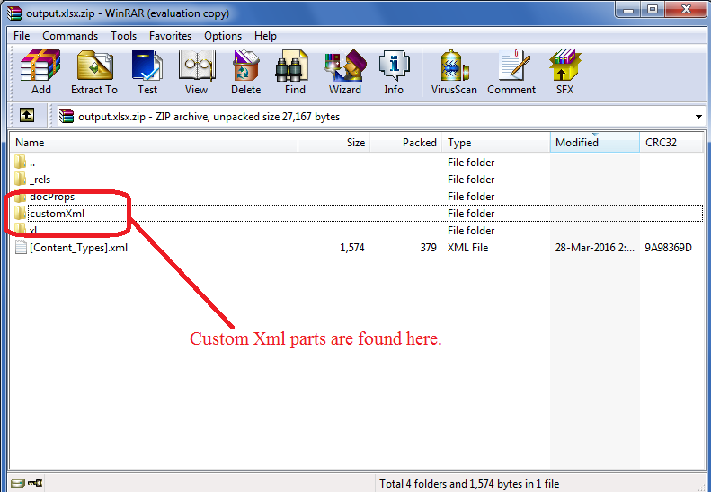

## Using Custom XML Parts in Aspose.Cells

Custom XML Parts are XML data stored by different applications like SharePoint inside an Excel file. This data is consumed by various applications that require it. Microsoft Excel does not use this data, so there is no GUI to add it. You can view this data by changing the extension of **.xlsx** to **.zip** and then opening it using **WinZip**. You can also open the ZIP file using any third‑party Windows ZIP utility such as WinRAR or WinZip. The data is present inside the **customXml** folder.

You can add custom XML parts using Aspose.Cells via the [**Workbook.ContentTypeProperties.Add()**](https://reference.aspose.com/cells/go-cpp/contenttypepropertycollection/add_string_string/) method.

The following sample code uses the [**Workbook.ContentTypeProperties.Add()**](https://reference.aspose.com/cells/go-cpp/contenttypepropertycollection/add_string_string/) method to add the **Book Catalog XML** and its name is **BookStore**. The following image shows the result of this code. As you can see, the Book Catalog XML is added inside the BookStore node, which is the name of this property.

## C++ Code to Use Custom XML Parts



## Related Article

- [Adding Custom Properties Visible Inside Document Information Panel](/cells/cpp/adding-custom-properties-visible-inside-document-information-panel/)