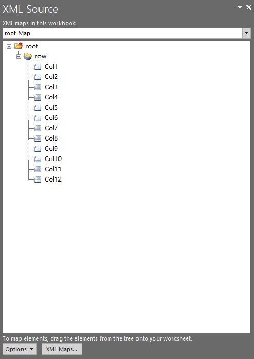

## **Possible Usage Scenarios**

Aspose.Cells provides [**XmlMapCollection.Add()**](https://reference.aspose.com/cells/go-cpp/xmlmapcollection/add/) method which you can use to import your XML Map inside the workbook.

## **Add XML Map inside the Workbook using XmlMapCollection.Add method**

The following sample code adds XML Map inside the workbook using the [**XmlMapCollection.Add()**](https://reference.aspose.com/cells/go-cpp/xmlmapcollection/add/) method and saves it as [output excel file](5115434.xlsx). The screenshot shows the XML Map that has been imported from the [sample.xml](5115433.xml) inside the output excel file.

