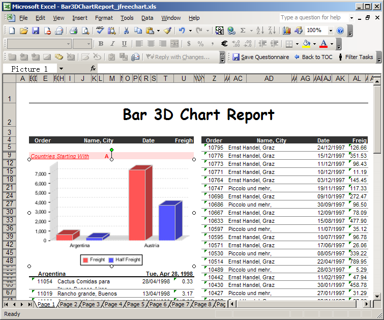

{}

Aspose.Cells for JasperReports allows you to deliver reports in the XLS and XLSX **formats** without loss of layout or formatting. To create spreadsheets in the Microsoft Excel formats, Aspose.Cells for JasperReports relies on a built‑in version of [Aspose.Cells for Java](https://products.aspose.com/cells/java/), a leading spreadsheet‑processing library from Aspose.

Microsoft Excel is not required to generate documents with Aspose.Cells.

**A sample XLS report exported using Aspose.Cells for JasperReports** 

{}
