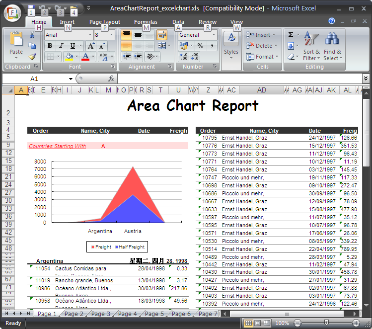

{}

### **Welcome to the Aspose.Cells for JasperReports Documentation!**

Aspose.Cells for JasperReports is a library **that** works as a replacement for [JasperReports](https://community.jaspersoft.com/project/jasperreports-library)'s original Microsoft Excel exporter, bundled with some great enhancements. It eliminates the dependency on the POI library, and uses Aspose.Cells for Java on the back-end to export reports in Microsoft Excel formats (XLS, XLSX).

{}

### **Product Description**

Aspose.Cells for JasperReports is a flexible solution that makes it easy to export reports from JasperReports and JasperServer to Microsoft Excel file formats. All the report features are converted to Microsoft Excel spreadsheets with the highest degree of precision.

Besides the functionality provided by the original POI-based **Microsoft** Excel exporter, this component **offers** some valuable features. The major innovations related to exporting to XLS include:

- **Provides** editable charts in Microsoft Excel **formats** rather than static pictures.

**A sample report is generated using Aspose.Cells for JasperReports** 

