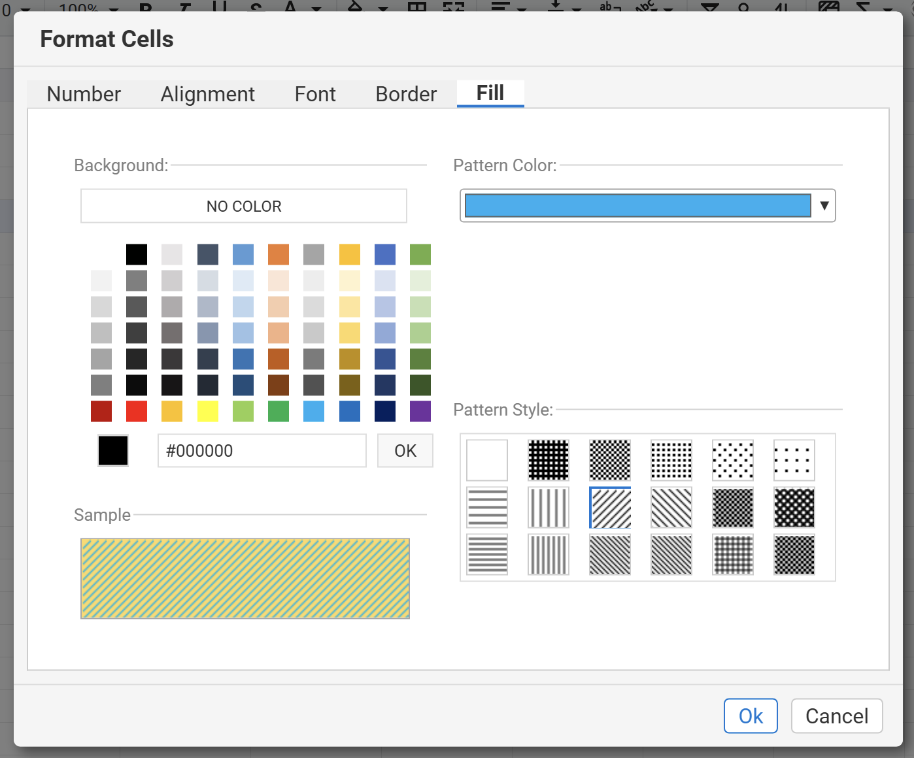

{}
The GridJS component applies background‑color changes instantly on the client. No additional confirmation step is required unless you open the **More Number Formats** modal, where you can preview the fill before committing.
{}

## Overview
Cell background colour (fill) enhances readability and visual grouping in a spreadsheet. GridJS provides several entry points—including a toolbar split‑button, context‑menu items, a dedicated modal, and a status‑bar indicator—to let users pick a colour or pattern and see the result immediately.

## UI Operations

### 1. Toolbar – Fill Color button
**How to start** – Click the **Background Color (bgcolor)** icon on the toolbar. The icon’s bottom border always shows the currently active fill colour (default `#ffff00` yellow).

**Steps**
1. Click the icon to expand the split‑button dropdown anchored to the toolbar.  
2. Choose a colour swatch (theme palette, recent custom colour, or **No Color**).  
3. The selected cells are filled instantly and the icon border updates to the new colour.
   
   

### 2. Table selection area
**How to start** – Select a cell or drag to highlight a range (merged cells count as a single unit).

**Steps**
1. Click or drag to create the selection rectangle.  
   
2. With the range selected, press the **Background Color** toolbar button again (or use the shortcut).  
3. Pick a colour from the same palette; the entire selection, including any merged region, receives the colour immediately.  
   

### 3. Modal – “More Number Formats” → Fill tab
**How to start** –  
a right‑click context menu


choose **Formats Cells** and then the **Fill** tab.


**Steps**
1. The modal displays two colour pickers: **Background Color** and, when a pattern other than *Solid* is chosen, **Pattern Color**.  
2. Select the desired background colour (and pattern colour if applicable).  
3. A live preview canvas updates in real time to show the combined effect.  
4. Click **OK** (or **Apply**) to commit the fill style to the currently selected cells and close the modal.



### 5. Other entry points
| Area | Path to colour picker |
|------|-----------------------|
| **Menubar** | *Format → Fill → Background Color* (opens the same dropdown as the toolbar) |
| **Context menu** (right‑click on a cell) | *Fill → Background Color* (shows the palette at the cursor) |
| **Toggle** | No dedicated toggle; colour changes are applied immediately upon selection. |
| **Programmatic** | See the JavaScript API section. |

## Options & Alerts
* **Immediate application** – All UI actions (toolbar, modal **OK**, status‑bar click) update the cell style instantly on the client.
* **Pattern fills** – When a pattern other than *Solid* is chosen in the modal, you can also set a **Pattern Color** to define the secondary colour of the fill.
* **No colour** – Selecting **No Color** removes any existing background fill from the target cells.


## JavaScript API
background colour changes can be achieved by setting the `bgcolor` attribute on a cell or range using the `setRangeAttr` method of the `data` object. After updating the attribute, call the `render` method to apply the changes visually.

```js
// Assume xs is your x_spreadsheet instance
xs = x_spreadsheet('#gridjs-demo-uid', option);
const range = {"sri":2,"sci":2,"eri":2,"eci":2}; // Define the cell range (row/col indices)
// Set the background color of a specific cell or range
xs.sheet.data.setRangeAttr(range, 'bgcolor', "red");
// Render the changes to update the UI
xs.sheet.table.render();
```

### Relevant functions (for reference only)

| Function | Description | Parameters | Returns |
|----------|-------------|------------|---------|
| `xs.sheet.data.setRangeAttr(range, attr, value)` | Modifies an attribute of the currently selected range. For background color, set `attr` to `'bgcolor'` and `value` to `red` (color name) or `#FF0000` (hex code). | `range` – **object** (contains `sri`, `sci`, `eri`, `eci` for start/end row/column).<br>`attr` – **string** (`'bgcolor'` only).<br>`value` – **string** (color name or hex code). | `undefined` (grid refreshes automatically). |
| `xs.sheet.table.render()` | Re-renders the table UI to reflect any data or style changes. | None. | `undefined`. |


## Tips & Best Practices
* **Consistent palette** – Use the toolbar colour picker for quick, consistent fills across the sheet; the modal is ideal when you need pattern fills or want to preview the effect first.
* **Batch updates** – When applying the same colour to many separate ranges, select each range and use the toolbar picker; the component batches style updates to reduce rendering overhead.
* **Performance** – The `getStylePreview` call involves a server round‑trip. Use it sparingly (e.g., only when a modal preview is required) to avoid unnecessary latency.
* **Merged cells** – Selecting any part of a merged region will apply the fill to the whole merged block. Ensure the intended area is selected before picking a colour.