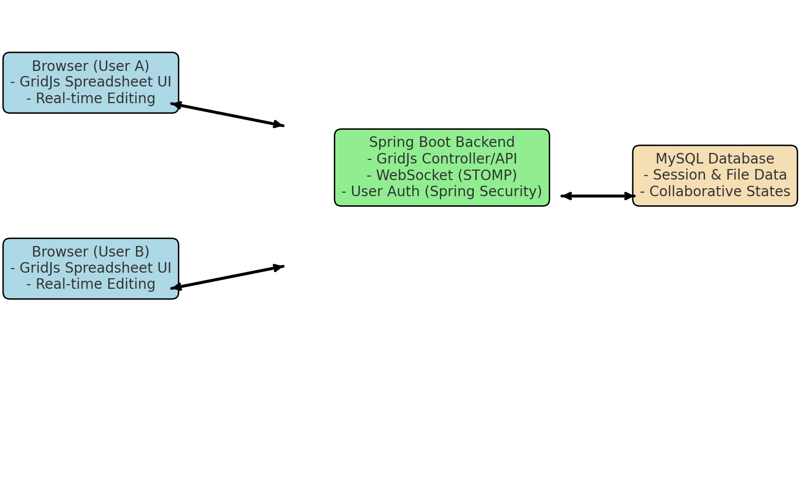

# Collaborative Excel Editor Guide

## Architecture Overview

The following diagram shows how GridJs enables collaborative editing with multiple users, 
a Spring Boot backend, WebSocket communication, and a MySQL database for state management.



## Prerequisites

Before starting, make sure you have the following installed:

- **Java 8+**  
- **Maven**  
- **MySQL** (or another supported SQL database)  
- (Optional) **Docker** if you prefer running in containers  
- A valid **Aspose.Cells license** (or [temporary license](https://purchase.aspose.com/temporary-license))  

---

## Step 1: Clone the Demo Project

Clone the official [Aspose.Cells GridJs demo repository](https://github.com/aspose-cells/Aspose.Cells-for-Java/tree/master/Examples.GridJs.Collaborative):

```bash
git clone https://github.com/aspose-cells/Aspose.Cells-for-Java.git
cd Aspose.Cells-for-Java/Examples.GridJs.Collaborative
```

---

## Step 2: Configure Collaborative Mode

Open the [`src/main/resources/application.properties`](https://github.com/aspose-cells/Aspose.Cells-for-Java/blob/master/Examples.GridJs.Collabrative/src/main/resources/application.properties) file and adjust the settings:

```properties
# Directory containing spreadsheet files
testconfig.ListDir=/app/wb

# Directory for storing cache files
testconfig.CachePath=/app/grid_cache

# Aspose.Cells license file
testconfig.AsposeLicensePath=/app/license

# Enable collaborative mode
gridjs.iscollabrative=true

# Database connection (example: MySQL)
spring.datasource.url=jdbc:mysql://localhost:3306/gridjsdemodb?createDatabaseIfNotExist=true&useUnicode=true&serverTimezone=UTC&useSSL=false
spring.datasource.username=root
spring.datasource.password=root
spring.sql.init.platform=mysql
```

This enables multiple users to edit the same spreadsheet simultaneously.  
Changes are stored in the database and synchronized across clients in real time.

---

## Step 3: Run the Application

Run with Maven:

```bash
mvn spring-boot:run
```

Or directly from the main class:

```
src/main/java/com/aspose/gridjsdemo/usermanagement/UserManagementApplication.java
```

---

## Step 4: Test Collaborative Editing

Open your browser and navigate to:  
👉 `http://localhost:8080/gridjsdemo/list`

Steps:

1. A login page appears. Click **Create User** to register User1 and log in. You will then see the file list.  
2. Open a file from the list. The spreadsheet editor will load.  
3. Copy the same URL into another browser window. It will redirect to the login page. Create User2 and log in.  
4. Both users now see the same spreadsheet.  
5. If User1 edits the spreadsheet, User2 will see the changes in real time.  
6. If User2 edits, User1 will see the changes as well.  
7. Users can also download and save the file.  

---

## Step 5: Run in Docker (Optional)

If running in Docker, edit line 10 of [`docker-compose.yml`](https://github.com/aspose-cells/Aspose.Cells-for-Java/blob/master/Examples.GridJs.Collabrative/docker-compose.yml) to map the license file.  

For example, if your license file is at `C:/license/aspose.lic`:

```yaml
volumes:
  - C:/license/aspose.lic:/app/license  # optional: set Aspose license file
```

This maps the local file into the container.

Then build and run:

```bash
docker-compose up --build
```

Access the app at:  
👉 `http://localhost:8080/gridjsdemo/list`

---

## Key Configuration Details

### 1. Enable Collaborative Mode

In [`/src/main/resources/application.properties`](https://github.com/aspose-cells/Aspose.Cells-for-Java/blob/master/Examples.GridJs.Collabrative/src/main/resources/application.properties):

```properties
gridjs.iscollabrative=true
```

In server-side config [`/src/main/java/com/aspose/gridjsdemo/filemanagement/FileConfig.java`](https://github.com/aspose-cells/Aspose.Cells-for-Java/blob/master/Examples.GridJs.Collabrative/src/main/java/com/aspose/gridjsdemo/filemanagement/FileConfig.java):

```java
@Bean
public GridJsOptions gridJsOptions() {
    //..... other options
    //here we shall set true for collaborative mode
    options.setCollaborative(true);
    return options;
}
```

Or globally:

```java
Config.setCollaborative(true);
```

In client-side load options [`/src/main/resources/templates/file/index.html`](https://github.com/aspose-cells/Aspose.Cells-for-Java/blob/master/Examples.GridJs.Collabrative/src/main/resources/templates/file/index.html):

```js
const option = {
    //..... other options
    //here we shall set true for collaborative mode
    isCollaborative: true
    //..... other options
};
```

---

### 2. User System Integration

The demo uses **Spring Security** for a simple user system.  

You must provide a `CoWorkUserProvider` implementation to connect GridJs with your user system:

In server-side config [`/src/main/java/com/aspose/gridjsdemo/filemanagement/FileConfig.java`](https://github.com/aspose-cells/Aspose.Cells-for-Java/blob/master/Examples.GridJs.Collabrative/src/main/java/com/aspose/gridjsdemo/filemanagement/FileConfig.java):

For example: here we defined MyCustomUser to implement all the interfaces in CoWorkUserProvider.

```java
@Bean
public CoWorkUserProvider currentUserProvider() {
    return new MyCustomUser();
}
```


In [`/src/main/java/com/aspose/gridjsdemo/filemanagement/MyCustomUser.java`](https://github.com/aspose-cells/Aspose.Cells-for-Java/blob/master/Examples.GridJs.Collabrative/src/main/java/com/aspose/gridjsdemo/filemanagement/MyCustomUser.java):

```java
public class MyCustomUser implements CoWorkUserProvider {
    //Get the current login user name
    @Override
    public String getCurrentUserName() {
        return getCurrentUser().getUsername();
    }

    //Get the current login user Id
    @Override
    public Long getCurrentUserId() {
        return getCurrentUser().getUserId();
    }

    //Get the current login user permission
    @Override
    public CoWorkUserPermission getPermission() {
        return CoWorkUserPermission.EDITABLE;
    }

    private static CustomUserDetails getCurrentUser() {
        Authentication authentication = SecurityContextHolder.getContext().getAuthentication();
        if (authentication != null && authentication.getPrincipal() instanceof CustomUserDetails) {
            return (CustomUserDetails) authentication.getPrincipal();
        }
        throw new IllegalStateException("User not authenticated");
    }
}
```

---

### 3. WebSocket Configuration

The demo uses **Spring WebSocket** with STOMP.  

Example config:

In [`/src/main/java/com/aspose/gridjsdemo/messages/WebSocketConfig.java`](https://github.com/aspose-cells/Aspose.Cells-for-Java/blob/master/Examples.GridJs.Collabrative/src/main/java/com/aspose/gridjsdemo/messages/WebSocketConfig.java):

```java
public class WebSocketConfig implements WebSocketMessageBrokerConfigurer {
    @Override
    public void configureMessageBroker(MessageBrokerRegistry config) {
        config.enableSimpleBroker("/topic");
        config.setApplicationDestinationPrefixes("/app");
        config.setUserDestinationPrefix("/user");
    }

    @Override
    public void registerStompEndpoints(StompEndpointRegistry registry) {
        registry.addEndpoint("/ws")
                .setAllowedOrigins("http://localhost:8080")
                .withSockJS();
    }
}
```

GridJs expects `messageTopic` to match "/topic/opr" which is the default:

```java
com.aspose.gridjs.Config.setMessageTopic("/topic/opr");
```

Or:

```java
@Bean
    public GridJsOptions gridJsOptions() {
	//.... other options
    	options.setMessageTopic("/topic/opr");
    	//.... other options
        return options;
    }
```

On the client side:

```js
xs.setCollaborativeSetting('/GridJs2/msg','/ws','/app/opr','/user/queue','/topic/opr');
```

Here, `/GridJs2/msg` corresponds to the route path defined in  
[`src/main/java/com/aspose/gridjsdemo/filemanagement/controller/GridJsOprController.java`](https://github.com/aspose-cells/Aspose.Cells-for-Java/blob/master/Examples.GridJs.Collabrative/src/main/java/com/aspose/gridjsdemo/filemanagement/controller/GridJsOprController.java):

```java
@RequestMapping("/GridJs2/msg")
```

#### Example with custom WebSocket paths

If your server uses a different configuration:

```java
public class WebSocketConfig implements WebSocketMessageBrokerConfigurer {
    @Override
    public void configureMessageBroker(MessageBrokerRegistry config) {
        config.enableSimpleBroker("/topic_gridjs");
        config.setApplicationDestinationPrefixes("/app_gridjs");
        config.setUserDestinationPrefix("/user_gridjs");
    }

    @Override
    public void registerStompEndpoints(StompEndpointRegistry registry) {
        registry.addEndpoint("/ws_gridjs")
                .setAllowedOrigins("http://localhost:8080")
                .withSockJS();
    }
}
```

Then you must set:

**Server side**:

```java
com.aspose.gridjs.Config.setMessageTopic("/topic_gridjs/opr");
```

or

```java
    @Bean
    public GridJsOptions gridJsOptions() {
	//.... other option
    	options.setMessageTopic("/topic_gridjs/opr");
    	//.... other option
        return options;
    }
```

**Client side**:

```js
xs.setCollaborativeSetting('/GridJs2/msg','/ws_gridjs','/app_gridjs/opr','/user_gridjs/queue','/topic_gridjs/opr');
```

the detail doc for setCollaborativeSetting can be find [here](https://docs.aspose.com/cells/java/aspose-cells-gridjs/how-to-use-gridjs-client-api/)

> ⚠️ Note: By default, the demo configuration works out-of-the-box.  
Extra configuration is only required if your app customizes WebSocket endpoints.  

Also remember: collaborative mode does **not** support lazy loading.  
Do not enable `Config.setLazyLoading(true)`.

---

## Additional Notes


- We can add **file uploads** to load and edit spreadsheet file from upload directory.  
- Integrate with **cloud storage** like AWS S3 or Azure Blob.  

---

## Conclusion

With Aspose.Cells.GridJs, you can quickly build a powerful **collaborative Excel editor**.  
The combination of Java backend, GridJs frontend, SQL storage, and WebSocket messaging ensures reliable real-time spreadsheet editing.

---

## Resources

- [Product Page](https://products.aspose.com/cells/java)  
- [Documentation](https://docs.aspose.com/cells/java/aspose-cells-gridjs/)  
- [API Reference](https://reference.aspose.com/cells/java/com.aspose.gridjs/)  
- [Support Forum](https://forum.aspose.com/c/cells)  
- [Free Online Apps](https://products.aspose.app/cells/family)  
