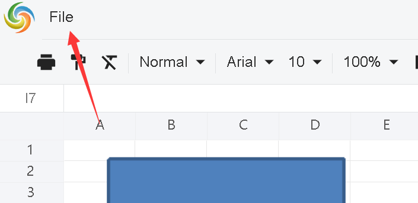
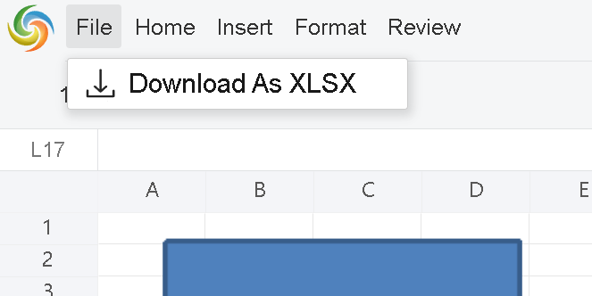
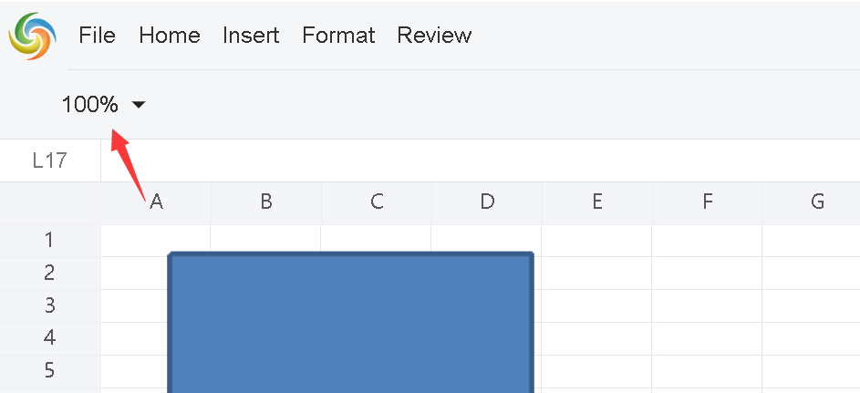

## about customize menus and toolbar buttons
we don't provide useful APIs directly .
however we can write some js function based on the dom structure to achieve it.

 
 
## customize menubar 
for example:to keep File menu only,assume the div id of GridJs is "gridjs-divid"
```javascript
   //get menubar parent dom
   const menubar=document.querySelector("#gridjs-divid > div > div:nth-child(1) > div > div.x-spreadsheet-banner-info-s > div.x-spreadsheet-toolbar.x-spreadsheet-menubar");
   var childs = menubar.childNodes;
   
  
   for (var i = childs.length - 1; i >= 0; i--)
   {  
     // keep File menu  only
     if(childs[i].childNodes[0].childNodes[0].textContent!=="File")
       {
         menubar.removeChild(childs[i]);
       }
   }


```
After call this function 


 
## customize items in menubar 
for example:to keep "Download As XLSX" menu item in File menu only,assume the div id of GridJs is "gridjs-divid"
```javascript
   //get menubar parent dom
   const menubar=document.querySelector("#gridjs-divid > div > div:nth-child(1) > div > div.x-spreadsheet-banner-info-s > div.x-spreadsheet-toolbar.x-spreadsheet-menubar");
   var childs = menubar.childNodes;
   
   // keep the first one ->File menu  only
   for (var i = childs.length - 1; i >= 0; i--)
   {  //find the File menu
     if(childs[i].childNodes[0].childNodes[0].textContent==="File")
       {
            var dropdownparent = childs[i].childNodes[0].childNodes[1];
            var menuitems = dropdownparent.childNodes;
            for (var ii = menuitems.length - 1; ii >=0; ii--)
            {   
	        //remove other menu item that is not "Download As XLSX"
                if (menuitems[ii].textContent !== 'Download As XLSX')
                {
                    dropdownparent.removeChild(menuitems[ii]);
                }
            }
       }
   }


```
After call this function 


## customize toolbar items 
for example:to keep zoom button only,assume the div id of GridJs is "gridjs-divid"
```javascript
   //get toolbar parent dom
   const toolbar=document.querySelector("#gridjs-divid > div > div.x-spreadsheet-toolbar > div.x-spreadsheet-toolbar-btns");
   var childs = toolbar.childNodes;
   
  
   for (var i = childs.length - 1; i >= 0; i--)
   {  
     // keep File menu  only
     if(childs[i].getAttribute("data-tooltip")!=="Zoom")
       {
         toolbar.removeChild(childs[i]);
       }
   }


```
After call this function 



 
