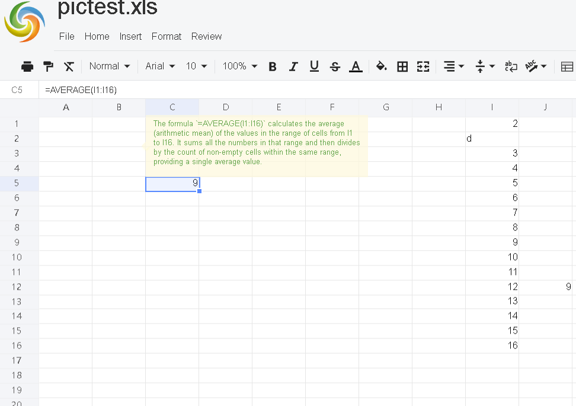

# To display formula explanation when hovering over a specific cell that contains a formula, follow these steps

## Set load options  
for example:
```javascript
 const option = {
     …
     // set showFormulaExplain to true
    showFormulaExplain: true,
 };
 xs = x_spreadsheet('#gridjs-demo', option);
```

## Set the action URL for **showFormulaExplain**  
for example:
```javascript
 const formulaExplainUrl = "/GridJs2/FormulaExplain";
 xs.setFormulaExplainUrl(formulaExplainUrl);
```
When the user moves the mouse over a cell that contains a formula, the display of the formula explanation is triggered automatically by the spreadsheet application.

## Implement the show formula explanation action API in the server‑side controller  
for example:
```java
 @PostMapping("/FormulaExplain")
 public ResponseEntity<?> formulaExplain(
            @RequestParam(name = "v", required = true) String formulaText,
            @RequestParam(name = "locale", required = false) String locale) {
        // Here, formulaText is the formula in the cell, e.g., "=SUM(B1:B10)"
        // Check if the formulaText is null or empty
        if (formulaText == null || formulaText.isEmpty()) {
            // Return a response indicating failure and an empty string for the corrected content
            return ResponseEntity.ok(Map.of("success", false, "v", ""));
        }

        // Call the syntax‑correction logic, which could be a third‑party library or custom code
        // This is a placeholder method that should be replaced with actual logic
        String correctedContent = getFormulaExplain(formulaText, locale);

        // Return a response indicating success and the corrected content
        return ResponseEntity.ok(Map.of("success", true, "v", correctedContent));
    }

    // Placeholder method for formula explanation
    // This should be replaced with the actual implementation
    private String getFormulaExplain(String formulaText, String locale) {
        // Implement your logic to get the detailed explanation for the formulaText
        // For demonstration, simply returning the input text
        return formulaText;
    }
```

