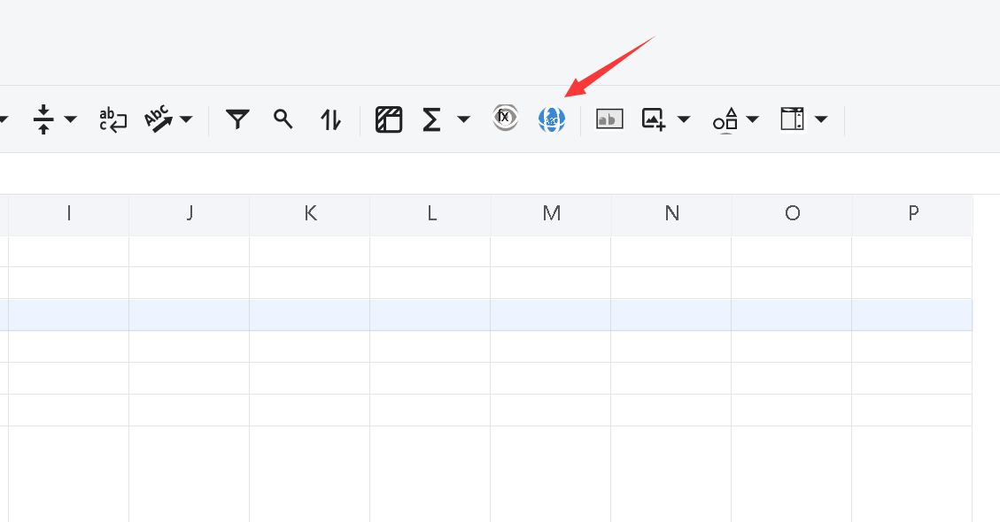

# How to Show the Translate Button in GridJs and Translate a Worksheet

This guide demonstrates how to enable the **Translate** button in the GridJs toolbar, configure the client‑side translation endpoint, and implement the server‑side translation logic using Aspose.Cells for Java.  
When the user clicks the Translate button, all string values in the active worksheet are translated to the target locale you specify.

## Introduction

GridJs provides a built‑in UI element – the **Translate** button – that can be activated via load options. The button sends a request to a server‑side translation service that you implement. In the example below we:

1. Enable the button on the client side.
2. Configure the URL of the translation endpoint.
3. Implement a mock `MyAITranslator` that conforms to Aspose.Cells’ `ITextTranslator`.
4. Expose a Spring MVC `POST` endpoint that receives the request, invokes the translator through `GridJsService`, and returns the translated workbook as plain text.

All code snippets are complete, compile‑ready, and include detailed comments.

## 1. Enable the Translate button in GridJs (client‑side)

Add `showTranslateButton: true` to the load options when initializing the spreadsheet component.

```javascript
// ./static/js/gridjs-init.js
const option = {
    // Existing options
    updateMode: 'server',
    updateUrl: '/GridJs2/UpdateCell',
    mode: 'edit',
    locale: 'en',               // UI language of GridJs
    showTranslateButton: true   // <<< Enables the Translate button in the toolbar
};

let xs = x_spreadsheet('#gridjs-demo-uid', option);

// Configure the server endpoint that will handle the translation request
xs.setTranslateUrl('/GridJs2/Translate');   // <-- replace with your actual URL
```

{}
The `setTranslateUrl` method must be called **after** the spreadsheet component is created; otherwise the button will not know where to send the request.
{}

## 2. Server‑side translation implementation

### 2.1. Create a mock translator that implements `ITextTranslator`

```java
// ./src/main/java/com/example/translator/MyAITranslator.java
package com.example.translator;

import com.aspose.cells.ITextTranslator;
import java.util.ArrayList;
import java.util.List;
import java.util.concurrent.CompletableFuture;
import java.util.concurrent.Future;

/**
 * Mock implementation of {@link ITextTranslator}.
 * In a real scenario you would call an external AI service (e.g., Azure Translator,
 * Google Translate, DeepL, etc.) inside {@link #translateAsync}.
 */
public class MyAITranslator implements ITextTranslator {

    /**
     * Translates a list of source texts to the target locale.
     *
     * @param sourceTexts  List of source strings to translate.
     * @param targetLocale Target locale code (e.g., "fr", "de").
     * @return A {@link Future} that completes with the translated strings.
     */
    @Override
    public Future<List<String>> translateAsync(ArrayList<String> sourceTexts, String targetLocale) {
        // Simulate an asynchronous call using CompletableFuture
        return CompletableFuture.supplyAsync(() -> {
            List<String> result = new ArrayList<>(sourceTexts.size());
            for (String text : sourceTexts) {
                // Mock translation – prepend the locale for demonstration
                result.add("[" + targetLocale + "] " + text);
            }
            return result;
        });
    }
}
```

### 2.2. Spring MVC controller that receives the translation request

```java
// ./src/main/java/com/example/controller/GridJsTranslationController.java
package com.example.controller;

import com.aspose.cells.GridJsService;
import com.example.translator.MyAITranslator;
import org.springframework.beans.factory.annotation.Autowired;
import org.springframework.http.ResponseEntity;
import org.springframework.web.bind.annotation.*;

import java.util.Objects;

/**
 * Handles GridJs translation requests.
 */
@RestController
@RequestMapping("/GridJs2")
public class GridJsTranslationController {

    /** Service that wraps Aspose.Cells GridJs functionality (registered as a Spring bean). */
    private final GridJsService _gridJsService;

    @Autowired
    public GridJsTranslationController(GridJsService gridJsService) {
        this._gridJsService = gridJsService;
    }

    /**
     * POST endpoint invoked by the client when the Translate button is clicked.
     *
     * @param sheet  Name of the worksheet to translate (e.g., "Sheet1").
     * @param uid    Unique identifier of the workbook instance.
     * @param locale Target locale code (e.g., "fr", "es").
     * @return Translated workbook content as plain text (UTF‑8).
     */
    @PostMapping("/Translate")
    public ResponseEntity<String> translate(
            @RequestParam(name = "sheet", required = true) String sheet,
            @RequestParam(name = "uid", required = true) String uid,
            @RequestParam(name = "locale", required = true) String locale) {

        // Validate parameters
        if (Objects.isNull(sheet) || sheet.isEmpty()
                || Objects.isNull(uid) || uid.isEmpty()
                || Objects.isNull(locale) || locale.isEmpty()) {
            return ResponseEntity.badRequest()
                    .body("Missing required query parameters: sheet, uid, or locale.");
        }

        // Instantiate the translator (mock implementation)
        MyAITranslator translator = new MyAITranslator();

        // Invoke the translation logic. The service returns a CompletableFuture<String>.
        // For simplicity we block here; in production you may want to return async response.
        String result = ((GridJsService) _gridJsService)
                .translateSheetAsync(uid, sheet, translator, locale)
                .join();   // blocks until the translation completes

        // Return the translated workbook as plain text with UTF‑8 encoding
        return ResponseEntity.ok()
                .header("Content-Type", "text/plain; charset=UTF-8")
                .body(result);
    }
}
```

> **Note:** `GridJsService.translateSheetAsync` is an Aspose.Cells helper that:
> * Loads the workbook identified by `uid`.
> * Retrieves all string cells from the specified `sheet`.
> * Calls the supplied `ITextTranslator` implementation.
> * Writes the translated text back into the workbook and returns the updated content as a `String`.

{}
The controller blocks on `CompletableFuture.join()`. For high‑traffic scenarios replace this with a fully async controller (`@Async` or WebFlux) to avoid thread‑pool starvation.
{}
 

## 3. Important Considerations

{}
* The mock `MyAITranslator` only prefixes the target locale; replace it with a real translation service for production use.
* Ensure the `uid` value matches the workbook instance stored on the server (e.g., session cache, database, or temporary storage).
* The endpoint must be reachable from the client’s domain; configure CORS if necessary.
{}

---
