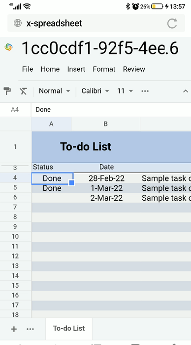

## Use GridJs in mobile device

You can use GridJs smoothly on the mobile device. 

GridJs client js can adapts the mobile screen.

Run the [demo of GridJs ](https://github.com/aspose-cells/Aspose.Cells.Grid-for-Java/tree/master/Examples_GridJs "demo of GridJs ")

The default port of the demo project is 8080. 

Open the browser in your mobile device and enter the url http://yourip:8080/gridjsdemo/index . 

Then we can do edit operations as in PC device.