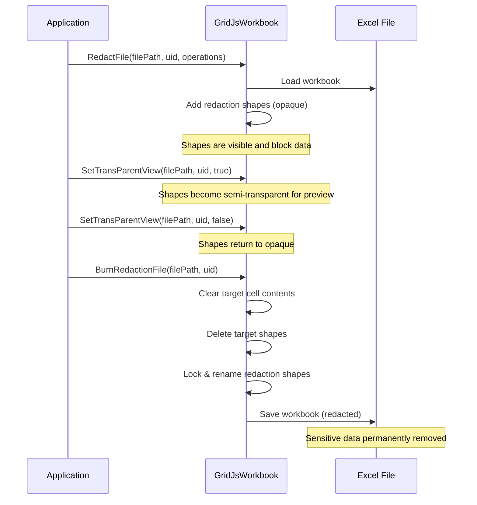

---  
title: How to Use Redaction Feature in GridJs  
type: docs  
weight: 260  
url: /java/aspose-cells-gridjs/how-to-use-redaction/  
description: This article explains how to apply redaction overlays on sensitive content in GridJs, covering client‑side CRUD operations, batch synchronization, and server‑side processing with Aspose.Cells.GridJs.  
keywords: GridJs,redaction,obscuring,blackout,redact,mask,masking,cover up,expunge,anonymize,desensitize,scrub,cover,redaction API,redaction overlay  
aliases:  
  - /java/aspose-cells-gridjs/redaction/  
  - /java/aspose-cells-gridjs/how-to-redact/  
  - /java/aspose-cells-gridjs/how-to-blackout/  
  - /java/aspose-cells-gridjs/apply-mask/  
  - /java/aspose-cells-gridjs/how-to-coverup/  
  - /java/aspose-cells-gridjs/apply-redaction/  
ai_search_scope: cells_java  
ai_search_endpoint: "https://docsearch.api.aspose.cloud/ask"  
---  

# Introduction  

The **Redaction** feature lets you hide sensitive information in a spreadsheet by drawing obscuring overlays on **cell ranges** or **shape/image objects**.  
All client‑side operations are asynchronous, and a set of server‑side APIs is provided to permanently apply (burn) the redactions.

This guide shows:

* How to create, update, delete and batch‑synchronize redactions from JavaScript.  
* How to listen to redaction‑related events.  
* How to finalize redactions on the server using Aspose.Cells (`GridJsWorkbook`).  

---  

## Client‑Side API Overview  

---  

### Enable the feature  

When initializing the spreadsheet component, set **enableRedactionShape** to `true` in the load options.

```javascript
// ./wwwroot/js/gridjs-init.js
const option = {
    // other options you may already use
    updateMode: 'server',
    updateUrl: '/GridJs2/UpdateCell',
    mode: 'edit',
    locale: 'en',                  // default UI language
    enableRedactionShape: true,   // <<< enables the feature
    redactionDefaultColor: 'green', // optional, default redaction colour
    redactionReasons: [            // optional, list of reasons
        'Personal Information',
        'Confidential',
        'Legal Privilege',
        'Trade Secret',
    ],
};

let xs = x_spreadsheet('#gridjs-demo-div', option);
```

All GridJs redaction APIs are `async` and must be awaited.

| API | Purpose |
|-----|---------|
| `insertRedactionForShape(reason, color, targetId, sheetName?)` | Add a redaction overlay on a shape or image. |
| `insertRedactionForRange(reason, color, range, sheetName?)` | Add a redaction overlay on a cell range. |
| `removeRedaction(id, sheetName?)` | Delete a redaction by its internal ID. |
| `syncRedactionOprClient(historyOprArray, isSyncToServer)` | Batch‑synchronize add / update / delete operations. |
| `burnAllRedactions()` | Permanently clear the underlying content and lock the redaction shapes. |

---  

## API Reference  

### 1. `insertRedactionForShape(reason, color, targetId, sheetName?)`

Adds a redaction overlay on a specified shape or image object.

**Parameters:**  

| Parameter | Type | Required | Description |
|-----------|------|----------|-------------|
| `reason` | `string` | Yes | The redaction reason/label text, displayed on the redaction area |
| `color` | `string` | Yes | Background colour of the redaction, supports CSS colour values like `'#000000'`, `'gray'`, `'#FF0000'` |
| `targetId` | `string` | Yes | The ID of the target shape or image (IDs are unique across shapes and images) |
| `sheetName` | `string` | No | The sheet name; defaults to the current active sheet if not provided |

**Examples:**  

```javascript
//iterate over shapes and images and print out its id
xs.sheet.data.shapes.forEach(d => console.log(d.id));
xs.sheet.data.images.forEach(d => console.log(d.id));

// Add a black redaction on the shape with ID "1" (sheet name not provided → current sheet)
await xs.insertRedactionForShape('Confidential', '#000000', '1');

// Add a gray redaction on the image with ID "2", specifying the sheet
await xs.insertRedactionForShape('Privacy Data', 'gray', '2', 'Sheet2');
```

**Notes:**  

* The target object must exist in `shapes` or `images`.  
* The target object must not already be a redaction (`isRedaction` is true).  
* The target object must not already have a redaction attached (`redactionShape` property exists).  
* Lazy loading is triggered automatically if the sheet is not yet loaded.  

---  

### 2. `insertRedactionForRange(reason, color, range, sheetName?)`

Adds a redaction overlay on a specified cell range. The redaction shape can be resized, and it will always snap to cell‑range boundaries and never cover partial cells.

**Parameters:**  

| Parameter | Type | Required | Description |
|-----------|------|----------|-------------|
| `reason` | `string` | Yes | The redaction reason/label text, displayed on the redaction area |
| `color` | `string` | Yes | Background colour of the redaction, supports CSS colour values like `'#000000'`, `'gray'` |
| `range` | `Object` | Yes | Cell range object, format: `{ sri, sci, eri, eci }` |
| `sheetName` | `string` | No | The sheet name; defaults to the current active sheet if not provided |

**`range` object:**  

| Property | Type | Description |
|----------|------|-------------|
| `sri` | `number` | Start Row Index (0‑based) |
| `sci` | `number` | Start Column Index (0‑based) |
| `eri` | `number` | End Row Index (inclusive) |
| `eci` | `number` | End Column Index (inclusive) |

**Examples:**  

```javascript
// Add a redaction on cell range B2:D5 (row 1, col 1 to row 4, col 3), sheet name not provided → current sheet
await xs.insertRedactionForRange('Confidential', '#000000', {
  sri: 1, sci: 1, eri: 4, eci: 3
});

// Add a redaction on a single cell A1, specifying the sheet
await xs.insertRedactionForRange('PII', '#333333', {
  sri: 0, sci: 0, eri: 0, eci: 0
}, 'Sheet1');
```

**Notes:**  

* Row and column indices are 0‑based.  
* `eri` and `eci` are inclusive boundaries.  
* Lazy loading is triggered automatically if the sheet is not yet loaded.  

---  

### 3. `removeRedaction(id, sheetName?)`

Removes a redaction by its ID.

**Parameters:**  

| Parameter | Type | Required | Description |
|-----------|------|----------|-------------|
| `id` | `string` | Yes | The ID of the redaction object to remove |
| `sheetName` | `string` | No | The sheet name; defaults to the current active sheet if not provided |

**Examples:**  

```javascript
// Remove the redaction with ID "42", sheet name not provided → current sheet
await xs.removeRedaction('42');

// Remove a redaction from a specific sheet
await xs.removeRedaction('42', 'Sheet2');
```

**Notes:**  

* The target ID must correspond to an object with `isRedaction` set to `true`.  
* Removal cleans up the redaction shape and associated Fabric canvas object.  
* Lazy loading is triggered automatically if the sheet is not yet loaded.  

---  

### 4. `syncRedactionOprClient(historyOprArray, isSyncToServer)`

Batch‑synchronizes redaction operations to the client, used for replaying add/delete/update operations from history records.  
The payload triggered from add/remove/update redaction via UI is the basic record.

**Parameters:**  

| Parameter | Type | Required | Description |
|-----------|------|----------|-------------|
| `historyOprArray` | `Array<Object>` | Yes | Array of redaction operation history records |
| `isSyncToServer` | `boolean` | Yes | Whether to sync changes to the server |

**History record format:**  

| Property | Type | Description |
|----------|------|-------------|
| `name` | `string` | Sheet name |
| `op` | `string` | Operation type, always `'syncRedactionSingle'` |
| `subopr` | `string` | Sub‑operation type: `'add'`, `'del'`, or `'update'` |
| `shape` | `Object` | Redaction shape data (see `shape` object below) |
| `id` | `string` | Server‑side ID of the redaction object |
| `originId` | `string` | Original ID of the redaction (differs from server ID on insert) |

**`shape` object:**  

| Property | Type | Description |
|----------|------|-------------|
| `id` | `string` | Redaction ID |
| `srcid` | `string` | Source ID (strid) |
| `left` | `number` | X coordinate position |
| `top` | `number` | Y coordinate position |
| `width` | `number` | Width |
| `height` | `number` | Height |
| `angle` | `number` | Rotation angle |
| `originAngle` | `number` | Original angle |
| `zorder` | `number` | Z‑order |
| `type` | `string` | Shape type, e.g., `'Rectangle'` |
| `bgColor` | `string` | Background colour |
| `isRedaction` | `boolean` | Whether this is a redaction object |
| `redactionReason` | `string` | Redaction reason text |
| `name` | `string` | Redaction name, format: `aspose.redaction-{id}-{target}` |
| `fontSetting` | `Object` | Font settings (includes wrap, lines, etc.) |
| `op` | `string` | Operation identifier |
| `isNewAdded` | `boolean` | Whether this is a newly added object |

**Examples:**  

```javascript
// Sync multiple redaction operations
const oprs = [
  {
    "name":"Sheet2",
    "op":"syncRedactionSingle",
    "subopr":"add",
    "shape":{
      "id":9,"left":144,"top":304,"width":95,"height":69,
      "angle":0,"zorder":7,"type":"Rectangle","bgColor":"green",
      "isRedaction":true,"redactionReason":"PII - Personal Information",
      "name":"aspose.redaction-1776848316091208-4","isNewAdded":true,
      "fontSetting":{"size":12.75,"color":"#FFFFFF","name":"sans-serif","bold":false,"italic":false}
    }
  },
  // ... additional records omitted for brevity ...
];

// Sync and also push changes to server
await xs.syncRedactionOprClient(oprs, true);
```

**Notes:**  

* Records where `op` is not `'syncRedactionSingle'` are skipped.  
* Records referencing non‑existent sheets are skipped.  
* Lazy loading is triggered automatically for unloaded sheets.  
* When `isSyncToServer` is `true`, all modified sheet data is batch‑synced to the server.  

---  

### 5. `burnAllRedactions()`

Clears cell‑range content and target shape covered by redaction shapes, then locks the redaction shapes.

**Examples:**  

```javascript
// Burn all redactions in the current workbook instance
xs.burnAllRedactions();
```

---  

## Redaction‑Related Events  

Listen to events via `xs.on(eventName, callback)`.

| Event | When it Fires | Callback Arguments |
|-------|----------------|--------------------|
| `redaction-inserted` | After a redaction is added (API or UI) | `sheetName`, `redactionData` |
| `redaction-deleted` | After a redaction is removed | `sheetName`, `redactionShape` |
| `redaction-updated` | After a redaction is moved, resized, or otherwise modified | `sheetName`, `shape` |
| `redaction-burned` | After `burnAllRedactions()` finishes | *none* |
| `redactionReason-inserted` | When a new reason is added via the UI dropdown | `reason` |


### `redaction-inserted`

```javascript
xs.on('redaction-inserted', (sheetName, redactionData) => {
  console.log(`Redaction added to ${sheetName}, server side response id: ${redactionData.id}, origin request id: ${redactionData.originId}`);
});
```

### `redaction-deleted`

```javascript
xs.sheet.on('redaction-deleted', (sheetName, redactionShape) => {
  console.log(`Redaction removed from ${sheetName}, id: ${redactionShape.id}`);
});
```

### `redaction-updated`

```javascript
xs.sheet.on('redaction-updated', (sheetName, shape) => {
  console.log(`Redaction updated on ${sheetName}, id: ${shape.id}`);
});
```

### `redaction-burned`

```javascript
xs.sheet.on('redaction-burned', () => {
  console.log('All redactions have been permanently burned');
});
```

### `redactionReason-inserted`

```javascript
xs.sheet.on('redactionReason-inserted', (reason) => {
  console.log(`New redaction reason added: ${reason}`);
});
```


---  

## General Usage – Enumerating Existing Redactions  

```javascript
/**
 * Visits every sheet and counts visible redaction shapes.
 * @param {Object} xsInstance The GridJs instance.
 * @returns {Promise<number>} Number of active redactions.
 */
async function countRedactions(xsInstance) {
  if (!xsInstance || !xsInstance.datas) return 0;

  let total = 0;
  for (const sheetData of xsInstance.datas) {
    // Ensure the sheet is loaded before accessing its shapes
    await xs.loadSheetDataLazily(sheetData);
    if (!sheetData.shapes) continue;

    for (const shape of sheetData.shapes) {
      // Skip deleted records (shape.op === 'del')
      if (shape.isRedaction && (!shape.op || shape.op !== 'del')) {
        console.log('Found redaction:', shape);
        if (shape.targetId) {
          console.log(' → Applied to shape/image ID:', shape.targetId);
        } else {
          console.log(' → Applied to cell range:', shape.targetCellRange);
        }
        total++;
      }
    }
  }
  return total;
}
```

---  

## Row/Column Index Reference  

| Index | Column | Example `range` object |
|-------|--------|------------------------|
| 0 | A | `{ sri: 0, sci: 0, eri: 0, eci: 0 }` → A1 |
| 1 | B | `{ sri: 1, sci: 1, eri: 3, eci: 2 }` → B2:D3 |
| 2 | C | … |
| 3 | D | … |
| … | … | … |

---  


## Server-Side API (Java) – Aspose.Cells `GridJsWorkbook`

The server side processes the redaction shapes generated by the client.

### 1. `RedactFile`

Applies a collection of redaction operations to an Excel workbook.

```java
import com.aspose.gridjs.GridJsWorkbook;

public class RedactionService {
    public void applyRedaction() {
        // Initialize the GridJs workbook helper
        GridJsWorkbook workbook = new GridJsWorkbook();

        // Path to the source Excel file
        String excelFilePath = "./Data/Confidential.xlsx";

        // Unique identifier for the workbook (used for caching)
        String uid = "doc-2024-04-27.xlsx";

        // JSON strings that describe each redaction operation.
        // Typically these are produced by xs.syncRedactionOprClient(..., false)
        String[] redactionOperations = new String[]{
            "{\"op\":\"syncRedactionSingle\",\"name\":\"Sheet1\",\"subopr\": \"add\",\"shape\":{\"id\":1,\"left\":100,\"top\":200,\"width\":120,\"height\":30,\"type\":\"Rectangle\",\"bgColor\":\"#FF0000\",\"isRedaction\":true,\"redactionReason\":\"PII\",\"name\":\"aspose.redaction-1-0.0.4.2\"}}",
            "{\"op\":\"syncRedactionSingle\",\"name\":\"Sheet2\",\"subopr\": \"add\",\"shape\":{\"id\":2,\"left\":300,\"top\":150,\"width\":80,\"height\":80,\"type\":\"Rectangle\",\"bgColor\":\"#000000\",\"isRedaction\":true,\"redactionReason\":\"Confidential\",\"name\":\"aspose.redaction-2-7\"}}"
        };

        // Apply the redactions – any failure throws an exception that contains the offending JSON
        try {
            workbook.redactFile(excelFilePath, uid, redactionOperations);
        } catch (GridCellException e) {
            System.err.println("GridCellException occurred: " + e.getMessage());
            e.printStackTrace();
        } catch (Exception e) {
            System.err.println("Exception occurred: " + e.getMessage());
            e.printStackTrace();
        }
    }
}
```

#### Exceptions

| Exception | When it is thrown |
|-----------|-------------------|
| `GridCellException` | A low-level Cells exception occurs while processing a redaction operation. |
| `Exception` | Any other error (e.g., invalid JSON, missing sheet). The message includes the JSON that caused the failure. |

---

### 2. `SetTransParentView`

Makes all redaction shapes semi-transparent (preview mode) or fully opaque.

```java
public void toggleTransparency(boolean makeTransparent) {
    GridJsWorkbook workbook = new GridJsWorkbook();

    String excelFilePath = "./Data/Confidential.xlsx";
    String uid = "doc-2024-04-27.xlsx";

    // true  → 0.89 opacity (semi-transparent)  
    // false → 0.0  opacity (fully opaque)
    workbook.setTransParentView(excelFilePath, uid, makeTransparent);
}
```

---

### 3. `BurnRedactionFile`

Finalizes the redaction workflow – underlying data is erased, target shapes are removed, and redaction shapes are locked.

```java
public void burnRedactions() {
    GridJsWorkbook workbook = new GridJsWorkbook();

    String excelFilePath = "./Data/Confidential.xlsx";
    String uid = "doc-2024-04-27.xlsx";

    // WARNING: This operation is irreversible!
    workbook.burnRedactionFile(excelFilePath, uid);
}
```

---

## Typical Redaction Workflow (Java)



### Step-by-Step Java Sample

```java
import com.aspose.gridjs.GridJsWorkbook;

public class RedactionDemo {
    public void main(String[] args) {
        GridJsWorkbook workbook = new GridJsWorkbook();

        String filePath = "./Data/Confidential.xlsx";
        String uid = "demo-2024-04-27.xlsx";

        // Example 1: Apply redactions (add shapes)
        String[] ops = new String[]{
            "{\"op\":\"syncRedactionSingle\",\"name\":\"Sheet1\",\"subopr\": \"add\",\"shape\":{\"id\":10,\"left\":120,\"top\":200,\"width\":30,\"height\":4000,\"type\":\"Rectangle\",\"bgColor\":\"#000000\",\"isRedaction\":true,\"redactionReason\":\"SSN\",\"name\":\"aspose.redaction-10-1.1.99.1\"}}",
            "{\"op\":\"syncRedactionSingle\",\"name\":\"Sheet1\",\"subopr\": \"add\",\"shape\":{\"id\":11,\"left\":500,\"top\":300,\"width\":150,\"height\":100,\"type\":\"Rectangle\",\"bgColor\":\"#444444\",\"isRedaction\":true,\"redactionReason\":\"Confidential Image\",\"name\":\"aspose.redaction-11-25\"}}"
        };
        workbook.redactFile(filePath, uid, ops);
        workbook.saveToXlsx("redact_output.xlsx");
        String ret = workbook.exportToJson("redact.xls");
        System.out.println(ret);

        // Example 2: Preview – make shapes semi-transparent
        workbook = new GridJsWorkbook();
        workbook.setTransParentView("redact_output.xlsx", uid, true);
        workbook.saveToXlsx("redact2.xlsx");
        ret = workbook.exportToJson("redact.xls");
        System.out.println(ret);

        // ... user inspects the preview ...
        workbook = new GridJsWorkbook();
        workbook.setTransParentView("redact_output.xlsx", uid, false);
        workbook.saveToXlsx("redact3.xlsx");
        ret = workbook.exportToJson("redact.xls");
        System.out.println(ret);

        // Example 3: Burn – permanently remove covered data and shape/image
        workbook = new GridJsWorkbook();
        workbook.burnRedactionFile("redact_output.xlsx", uid);
        workbook.saveToXlsx("redact_burned.xlsx");
        ret = workbook.exportToJson("redact.xls");
        System.out.println(ret);
    }
}
```

---

## Summary

* **Client side** – Use `insertRedactionForShape`, `insertRedactionForRange`, `removeRedaction`, `syncRedactionOprClient`, and `burnAllRedactions` to manage redactions interactively.
* **Events** – Subscribe to redaction events (`redaction-inserted`, `redaction-deleted`, `redaction-updated`, `redaction-burned`) to keep UI state in sync.
* **Server side** – Call `RedactFile`, optionally `SetTransParentView` for preview, and finalize with `BurnRedactionFile`.
