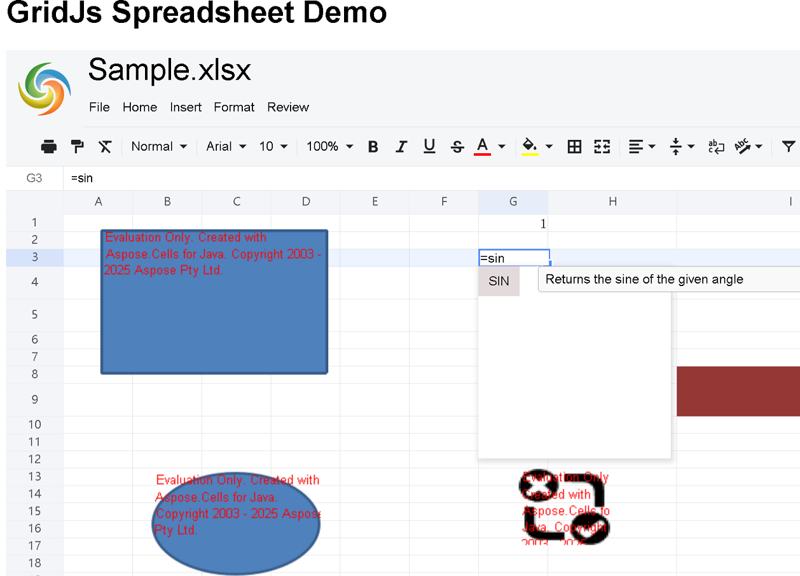
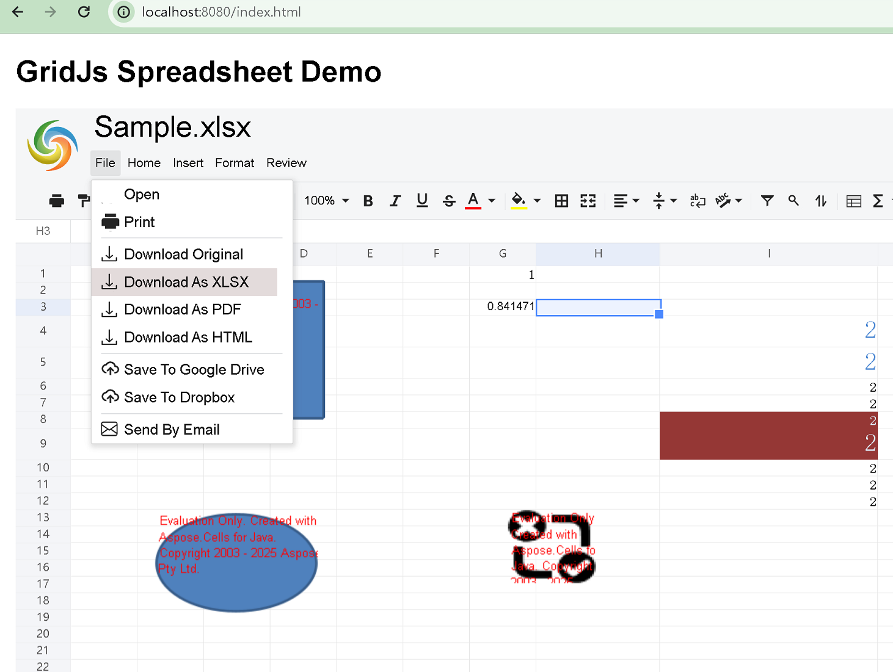

# Load a Spreadsheet with GridJs (Java)

## Introduction

This article walks you through creating a **Spring Boot 3.5.7** web application that serves an Aspose.Cells GridJs backend and a lightweight HTML/JavaScript front‑end. The demo demonstrates how to:

1. **Generate a Spring Boot project** with the required dependencies.  
2. **Configure GridJs server options** (`GridJsOptions`).  
3. **Expose GridJs controller endpoints** for loading spreadsheets, updating cells, handling images, OLE objects, and file download.  
4. **Build a client UI** using the `gridjs-spreadsheet` npm package and auxiliary libraries (jQuery, jQuery‑UI, JSZip).  
5. **Load a workbook**, interact with it, and persist changes back to the server.

All code snippets are complete, ready to compile, and can be run locally.

{}
**Prerequisite:** You must have a valid Aspose.Cells GridJs license (or use a 30‑day evaluation). Place the license file (`Aspose.Cells.GridJs.lic`) under `src/main/resources` and load it in the Spring Boot application startup (not shown here for brevity).  
{}

---

## 1. Project Setup – Spring Initializr

1. Open <https://start.spring.io/>.  
2. Select **Spring Boot 3.5.7** and **Java 17**.  
3. Fill the *Project Metadata* (e.g., `groupId: com.example`, `artifactId: gridjs-demo`).  
4. Add the **Spring Web** dependency.  
5. Click **Generate**, unzip the archive, and open it in your IDE.

> **Screenshot** – Spring Initializr configuration  
> 

The generated project already contains the basic Spring Boot starter class.

---

## 2. Add Required Maven Dependencies

Edit `pom.xml` and add the Aspose.Cells GridJs and Gson libraries:

```xml
<!-- pom.xml -->
<project>
    <!-- ... existing content ... -->

    <dependencies>
        <!-- Aspose.Cells core -->
        <dependency>
            <groupId>com.aspose</groupId>
            <artifactId>aspose-cells</artifactId>
            <version>25.11</version>
        </dependency>

        <!-- Aspose.Cells GridJs classifier -->
        <dependency>
            <groupId>com.aspose</groupId>
            <artifactId>aspose-cells</artifactId>
            <classifier>gridjs</classifier>
            <version>25.11</version>
        </dependency>

        <!-- Gson for JSON handling -->
        <dependency>
            <groupId>com.google.code.gson</groupId>
            <artifactId>gson</artifactId>
            <version>2.10.1</version>
        </dependency>

        <!-- Spring Web (already added by Spring Initializr) -->
        <dependency>
            <groupId>org.springframework.boot</groupId>
            <artifactId>spring-boot-starter-web</artifactId>
        </dependency>
    </dependencies>
   <!-- Aspose.Cells repository -->
    <repositories>
        <repository>
            <id>AsposeJavaAPI</id>
            <name>Aspose Java API</name>
            <url>https://repository.aspose.com/repo/</url>
        </repository>
    </repositories>
</project>
```


Run `mvn clean install` to download the new libraries.

---

## 3. Server‑Side Implementation

### 3.1 GridJs Configuration

Create a configuration class that registers a `GridJsOptions` bean.

```java
// src/main/java/com/example/gridjsdemo/config/GridJsConfig.java
package com.example.gridjsdemo.config;

import com.aspose.gridjs.GridJsOptions;
import org.springframework.context.annotation.Bean;
import org.springframework.context.annotation.Configuration;

/**
 * Configures Aspose.Cells GridJs options.
 */
@Configuration
public class GridJsConfig {

    @Bean
    public GridJsOptions gridJsOptions() {
        GridJsOptions options = new GridJsOptions();

        // Directory where temporary files (e.g., JSON cache) are stored
        options.setFileCacheDirectory("D:/storage/Aspose.Cells.GridJs/");

        // Base route used by the GridJs controller
        options.setBaseRouteName("/GridJs");

        return options;
    }
}
```

### 3.2 Spring Boot Main Application

Add component scanning for the Aspose GridJs package.

```java
// src/main/java/com/example/gridjsdemo/GridJsDemoApplication.java
package com.example.gridjsdemo;

import org.springframework.boot.SpringApplication;
import org.springframework.boot.autoconfigure.SpringBootApplication;
import org.springframework.context.annotation.ComponentScan;

/**
 * Entry point of the GridJs demo application.
 */
@SpringBootApplication
@ComponentScan(basePackages = {"com.example.gridjsdemo", "com.aspose.gridjs"})
public class GridJsDemoApplication {

    public static void main(String[] args) {
        SpringApplication.run(GridJsDemoApplication.class, args);
    }
}
```

### 3.3 GridJs Controller

Extend `GridJsControllerBase` to expose the required endpoints.

```java
// src/main/java/com/example/gridjsdemo/controller/GridJsController.java
package com.example.gridjsdemo.controller;

import com.aspose.gridjs.GridJsControllerBase;
import com.aspose.gridjs.GridJsService;
import org.springframework.beans.factory.annotation.Autowired;
import org.springframework.core.io.InputStreamResource;
import org.springframework.http.ResponseEntity;
import org.springframework.web.bind.annotation.*;
import org.springframework.web.multipart.MultipartFile;

import jakarta.servlet.http.HttpServletRequest;

/**
 * REST controller exposing GridJs operations.
 */
@RestController
@RequestMapping("/GridJs")
public class GridJsController extends GridJsControllerBase {

    @Autowired
    public GridJsController(GridJsService gridJsService) {
        super(gridJsService);
    }

    /**
     * Loads a spreadsheet (JSON representation) for the client.
     */
    @GetMapping("/LoadSpreadsheet")
    public ResponseEntity<String> loadSpreadsheet(
            @RequestParam String filename,
            @RequestParam String uid) {

        String fullFilePath = getFullFilePath(filename);
        StringBuilder result = _gridJsService.detailFileJsonWithUid(fullFilePath, uid);

        return ResponseEntity.ok()
                .header("Content-Type", "text/plain; charset=UTF-8")
                .body(result.toString());
    }

    /**
     * Helper to resolve the absolute file system path.
     * <p>
     * Adjust the base directory according to your environment.
     */
    private String getFullFilePath(String filename) {
        // Example: store all demo spreadsheets under src/main/resources/spreadsheets
        return System.getProperty("user.dir") + "/src/main/resources/spreadsheets/" + filename;
    }

    // -------------------------------------------------------------------------
    // The remaining endpoints simply delegate to the base implementation.
    // -------------------------------------------------------------------------

    @PostMapping("/UpdateCell")
    public ResponseEntity<String> updateCell(HttpServletRequest request) {
        try {
            return super.updateCell(request);
        } catch (Exception e) {
            e.printStackTrace();
            return ResponseEntity.internalServerError().body(e.getMessage());
        }
    }

    @PostMapping("/AddImage")
    public ResponseEntity<String> addImage(
            @RequestParam(value = "image", required = false) MultipartFile file,
            @RequestParam("uid") String uid,
            @RequestParam("p") String p,
            @RequestParam(value = "control", required = false) String isControl) {

        return super.addImage(file, uid, p, isControl);
    }

    @PostMapping("/CopyImage")
    public ResponseEntity<String> copyImage(HttpServletRequest request) {
        return super.copyImage(request);
    }

    @PostMapping("/AddImageByURL")
    public ResponseEntity<String> addImageByUrl(HttpServletRequest request) {
        return super.addImageByUrl(request);
    }

    @GetMapping("/Image")
    public ResponseEntity<InputStreamResource> getImage(HttpServletRequest request) {
        return super.getImage(request);
    }

    @GetMapping("/ImageUrl")
    public ResponseEntity<String> getImageUrl(@RequestParam String id, @RequestParam String uid) {
        return super.getImageUrl(id, uid);
    }

    @GetMapping("/Ole")
    public ResponseEntity<?> getOle(HttpServletRequest request) {
        return super.getOle(request);
    }

    @GetMapping("/GetFile")
    public ResponseEntity<?> getFile(@RequestParam("id") String id) {
        return super.getFile(id);
    }

    @PostMapping("/Download")
    public ResponseEntity<String> download(HttpServletRequest request) {
        return super.download(request);
    }

    @GetMapping("/Index")
    public ResponseEntity<String> index() {
        // Simple health endpoint or optional UI starter page.
        return ResponseEntity.ok("GridJs service is running.");
    }
}
```

> **Note:** Place any sample Excel files you wish to test under `src/main/resources/spreadsheets`.  
> Ensure the directory `D:/storage/Aspose.Cells.GridJs/` exists or update the path in `GridJsConfig`.

---

## 4. Client‑Side Implementation

All static resources are located under `src/main/resources/static`.

### 4.1 HTML Page (`index.html`)

```html
<!-- src/main/resources/static/index.html -->
<!DOCTYPE html>
<html lang="en">
<head>
    <meta charset="UTF-8">
    <title>GridJs Demo – Load Spreadsheet</title>

    <!-- jQuery and jQuery‑UI -->
    <script src="https://code.jquery.com/jquery-2.1.1.min.js"></script>
    <script src="https://code.jquery.com/ui/1.12.1/jquery-ui.min.js"></script>
    <link rel="stylesheet"
          href="https://code.jquery.com/ui/1.12.1/themes/base/jquery-ui.css"/>

    <!-- JSZip (required for export) -->
    <script src="https://cdnjs.cloudflare.com/ajax/libs/jszip/3.6.0/jszip.min.js"></script>

    <!-- GridJs Spreadsheet UI -->
    <link rel="stylesheet"
          href="https://unpkg.com/gridjs-spreadsheet/xspreadsheet.css"/>
    <script src="https://unpkg.com/gridjs-spreadsheet/xspreadsheet.js"></script>

    <!-- Demo specific script -->
    <script src="./gridjs-demo.js"></script>

    <style>
        body {font-family: Arial, sans-serif; margin: 20px;}
        #gridjs-demo-uid {width: 100%; height: 800px;}
    </style>
</head>
<body>
<h1>GridJs Spreadsheet Demo</h1>

<!-- Container for the GridJs UI -->
<div id="gridjs-demo-uid"></div>

<!-- Simple UI to pick a file from the server -->
<div style="margin-top:20px;">
    <label for="filename">Spreadsheet file (in server folder): </label>
    <input type="text" id="filename" value="Sample.xlsx"/>
    <button id="loadBtn">Load Spreadsheet</button>
</div>
</body>
</html>
```

### 4.2 JavaScript Logic (`gridjs-demo.js`)

```javascript
// src/main/resources/static/gridjs-demo.js
/**
 * GridJs Demo – client side logic.
 * Loads a workbook from the server, displays it, and enables server‑side updates.
 */

$(function () {
    // -------------------------------------------------------------
    // 1. Define URLs used by the demo
    // -------------------------------------------------------------
    const queryJsonUrl = "/GridJs/LoadSpreadsheet";
    const updateUrl = "/GridJs/UpdateCell";
    const fileDownloadUrl = "/GridJs/Download";
    const oleDownloadUrl = "/GridJs/Ole";
    const imageUrl = "/GridJs/ImageUrl";
    const imageUploadUrl1 = "/GridJs/AddImage";
    const imageUploadUrl2 = "/GridJs/AddImageByURL";
    const imageCopyUrl = "/GridJs/CopyImage";

    // -------------------------------------------------------------
    // 2. Global GridJs instance placeholder
    // -------------------------------------------------------------
    let xs; // will hold the x_spreadsheet instance

    // -------------------------------------------------------------
    // 3. Helper to generate a UUID (used as unique session id)
    // -------------------------------------------------------------
    function generateUUID() {
        // RFC4122 version 4 compliant UUID
        return ([1e7]+-1e3+-4e3+-8e3+-1e11).replace(/[018]/g, c =>
            (c ^ crypto.getRandomValues(new Uint8Array(1))[0] & 15 >> c / 4).toString(16)
        );
    }

    // -------------------------------------------------------------
    // 4. Load Spreadsheet button click handler
    // -------------------------------------------------------------
    $("#loadBtn").on("click", function () {
        const filename = $("#filename").val().trim();
        if (!filename) {
            alert("Please enter a file name.");
            return;
        }

        const uid = generateUUID(); // unique identifier for this session

        // Build request URL with query parameters
        const requestUrl = `${queryJsonUrl}?filename=${encodeURIComponent(filename)}&uid=${uid}`;

        // ---------------------------------------------------------
        // 5. AJAX request to obtain the JSON representation of the workbook
        // ---------------------------------------------------------
        $.ajax({
            url: requestUrl,
            method: "GET",
            dataType: "text", // server returns plain text JSON
            success: function (responseJsonString) {
                const jsondata = JSON.parse(responseJsonString);
                const option = {
                    updateMode: 'server',
                    updateUrl: updateUrl,
                    local: 'en' // UI language
                };
                loadWithOption(jsondata, option, uid);
            },
            error: function (xhr, status, err) {
                console.error("Failed to load spreadsheet:", err);
                alert("Error loading file: " + err);
            }
        });
    });

    // -------------------------------------------------------------
    // 6. Function that creates the GridJs UI and binds all URLs
    // -------------------------------------------------------------
    function loadWithOption(jsondata, option, uniqueId) {
        // Clear any previous instance
        $('#gridjs-demo-uid').empty();

        const sheets = jsondata.data;
        const filename = jsondata.filename;

        // Initialise the GridJs UI
        xs = x_spreadsheet('#gridjs-demo-uid', option)
            .loadData(sheets)
            .updateCellError((msg) => console.error(msg));

        // Hide sheet tabs if server says not to show them
        if (!jsondata.showtabs) {
            xs.bottombar.hide();
        }

        // Associate the unique identifier and file name
        xs.setUniqueId(uniqueId);
        xs.setFileName(filename);

        // ---------------------------------------------------------
        // Set the active sheet & cell (fallback to first sheet)
        // ---------------------------------------------------------
        let activeSheetName = jsondata.actname;
        if (xs.bottombar.dataNames.includes(activeSheetName)) {
            xs.setActiveSheetByName(activeSheetName)
                .setActiveCell(jsondata.actrow, jsondata.actcol);
        } else {
            // If the requested sheet is hidden or a chart sheet, use the first sheet
            activeSheetName = xs.bottombar.dataNames[0];
            xs.setActiveSheetByName(activeSheetName).setActiveCell(0, 0);
        }

        // ---------------------------------------------------------
        // Bind auxiliary URLs (image handling, OLE, file download, etc.)
        // ---------------------------------------------------------
        xs.setImageInfo(imageUrl, imageUploadUrl1, imageUploadUrl2, imageCopyUrl, true);
        xs.setFileDownloadInfo(fileDownloadUrl);
        xs.setOleDownloadInfo(oleDownloadUrl);
        xs.setOpenFileUrl("/"); // optional: opens home page
    }
});
```

**Explanation of the client flow**

| Step | Description |
|------|-------------|
| **1** | Define all server‑side endpoints (load, update, image, OLE, download). |
| **2** | Create a global variable `xs` that will hold the GridJs instance. |
| **3** | Generate a UUID per session – used by the server to cache workbook JSON. |
| **4** | When the *Load Spreadsheet* button is clicked, an AJAX GET request fetches the workbook JSON. |
| **5** | The returned JSON is parsed and fed to `x_spreadsheet(...).loadData(...)`. |
| **6** | After the UI is created, set the unique id, file name, active sheet/cell, and bind all ancillary URLs (image upload, download, …). |

---

## 5. Running the Demo

1. **Start the Spring Boot application**  

   ```bash
   ./mvnw spring-boot:run
   ```

2. **Open the UI** in a browser:  

   `http://localhost:8080/index.html`

3. **Enter the name of a spreadsheet** located under `src/main/resources/spreadsheets` (e.g., `Sample.xlsx`) and click **Load Spreadsheet**.

4. The workbook appears inside the `#gridjs-demo-uid` container. Edit cells, add images, or download the updated file – all changes are persisted on the server via the GridJs REST API.

{}
If you encounter a *404* on the JSON load request, verify that the file name is correct and that the `getFullFilePath` method points to the proper directory.
{}

---

## 6. Screenshots

| Step | Screenshot |
|------|------------|
| **A** – Application home page with file input |  |
| **B** – Loaded workbook displayed in GridJs UI |  |
| **C** – Editing a cell (server side update) |  |
| **D** – Downloading the modified file |  |

 

---

## 7. Additional Resources

- **Aspose.Cells GridJs Java API Reference** – <https://reference.aspose.com/cells/java/com.aspose.gridjs>
- **Aspose.Cells GridJs Client API Reference** – <https://docs.aspose.com/cells/java/aspose-cells-gridjs/how-to-use-gridjs-client-api/>
- **GridJs‑spreadsheet NPM package** – <https://www.npmjs.com/package/gridjs-spreadsheet>
- **Demo Source** – <https://github.com/aspose-cells/Aspose.Cells.Grid-for-Java/tree/main/Examples.GridJs.Simple>
- **Spring Boot Official Documentation** – <https://spring.io/projects/spring-boot>

---