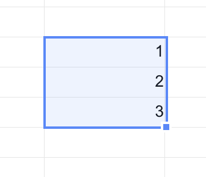
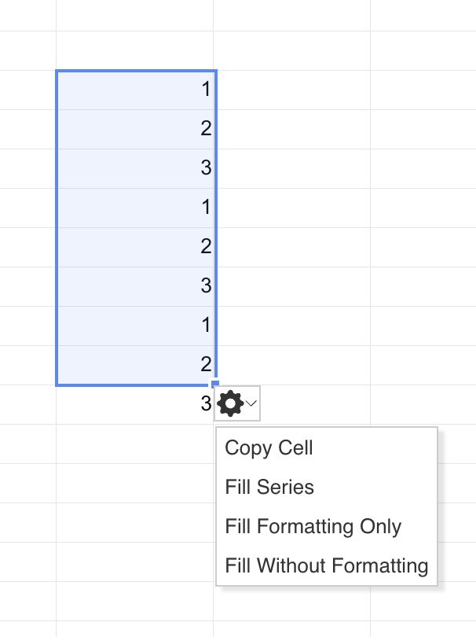

## Introduction

GridJs creates an `AutofillOption` popup after a successful autofill drag from the selection corner. The popup contains four actions: **Copy Cell**, **Fill Series**, **Fill Formatting Only**, and **Fill Without Formatting**. During the first drag release, the sheet runs `data.autofill(selector.arange, 'all', ...)`, stores the original target cells in `data.autofillCellInfo.history`, and stores the autofill result in `data.autofillCellInfo.series`.

## How to use

1. Select the source cell or source range in GridJs.

2. Drag the small selection corner to extend the autofill area. The selector code supports extending the target area to the left, top, right, or bottom of the current selection.

3. Release the mouse. When the sheet is not in read mode and the target range passes the paste validation check, GridJs runs `data.autofill(selector.arange, 'all', ...)`, redraws the table, and shows the Autofill Options button next to the filled area.




4. Click the Autofill Options button to open the menu.

5. Click **Copy Cell** to rewrite each target cell by repeating cells from the source range. The code calculates the source cell with row and column modulo offsets.

6. Click **Fill Series** to keep the autofill result that was generated during the drag operation.

7. Click **Fill Formatting Only** to restore each target cell from the saved history and then apply the autofill result style when a style exists in the generated series cell.

8. Click **Fill Without Formatting** to keep the generated autofill content and restore the original target style from history. If the original target cell does not have a style, GridJs creates a left-aligned style before writing the cell back.




## JavaScript API

```js
import { CellRange } from './core/cell_range';

const xs = x_spreadsheet('#gridjs-demo-uid', options);
const data = xs.sheet.data;
const targetRange = new CellRange(0, 1, 4, 1);

const ok = data.autofill(targetRange, 'all', msg => {
  console.log(msg);
});

if (ok) {
  xs.sheet.table.render();
}

// Internal option values used by the Autofill Options popup:
const autofillTypes = ['copyCell', 'series', 'format', 'withoutFormat'];
```

### Relevant functions
| Function | Description | Parameters | Returns |
|----------|-------------|------------|---------|
| `sheet.data.autofill(cellRange, what, error)` | Validates the target range, runs the autofill copy path, and records `history` and `series` data for later option changes. | `cellRange`: destination `CellRange`; `what`: paste mode such as `'all'`; `error`: callback for validation errors | `boolean` |
| `autofillOption.change(autofillType)` | Rewrites the autofilled cells according to the selected Autofill Options menu item. | `autofillType`: `'copyCell'`, `'series'`, `'format'`, or `'withoutFormat'` | `void` |

In the inspected UI flow, the sheet always starts autofill with `what === 'all'`. The option popup then changes the written cells by reading `data.autofillCellInfo.history`, `data.autofillCellInfo.series`, and `data.autofillCellInfo.srcCellRange`.

## Common Questions

Q: When does the Autofill Options button appear?
A: The button is shown only after dragging from the selection corner, completing `data.autofill(...)` successfully, and rendering the filled range. The code skips this flow when the sheet mode is `read`.

Q: Which directions can the autofill target area extend?
A: The selector code creates an autofill range only when the drag extends outside the current selection to the left, top, right, or bottom.

Q: What does **Fill Formatting Only** change?
A: The handler starts from the saved target cell in `history`, then replaces only its `style` with the generated series cell style when that style exists.

Q: What does **Fill Without Formatting** change?
A: The handler keeps the generated autofill cell content, restores the original target `style` from `history`, and creates a left-aligned style when the original target cell has no style.
