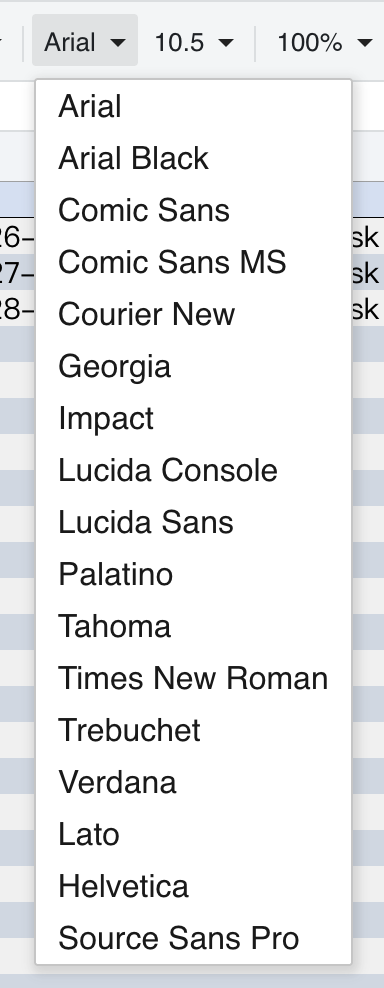

{}
The GridJs component ships with a **Font** dropdown in the default toolbar. Selecting a font from this list updates the **font‑family** of the currently selected cells in the browser. 
{}

## Overview
Changing the font family improves readability and lets you align the spreadsheet’s visual style with your application’s design language. This guide covers both the interactive UI workflow and the JavaScript API that can be used to set fonts from code.

## UI Operations
1. **Open the Toolbar** – The toolbar is displayed at the top of the spreadsheet by default.  
2. **Locate the Font dropdown** – It is shows the current font name.  
3. **Click the dropdown** to reveal the list of available fonts.  
4. **Select a font** from the list. The selected font is applied immediately to any cells that are highlighted in the grid.  
5. **Verify the change** – The cells should now display text in the chosen font family.



## Options & Alerts
- **Supported Fonts** – Only fonts recognized by the browser’s CSS engine are listed. If a desired font does not appear, ensure it is loaded on the page.
- **Multiple Selection** – When multiple cells are selected, the dropdown shows the font of the first cell in the range. Changing the font updates all selected cells.
- **Resetting Font** – Choose the default (usually “Arial”) to revert cells to the component’s base font.

## JavaScript API
text font family changes can be achieved by setting the `font-name` attribute on a cell or range using the `setRangeAttr` method of the `data` object. After updating the attribute, call the `render` method to apply the changes visually.

```js
xs = x_spreadsheet('#gridjs-demo-uid', option);
const range = {"sri":2,"sci":2,"eri":2,"eci":2}; // Define the cell range (row/col indices)
// Set the text font name of a specific cell or range
xs.sheet.data.setRangeAttr(range, 'font-name', "Arial");
// Render the changes to update the UI
xs.sheet.table.render();
```


### Relevant functions 

| Function | Description | Parameters | Returns |
|----------|-------------|------------|---------|
| `xs.sheet.data.setRangeAttr(range, attr, value)` | Modifies an attribute of the currently selected range. For font name, set `attr` to `'font-name'` and `value` to the desired font family (e.g., `"Arial"`). | `range` – **object** (contains `sri`, `sci`, `eri`, `eci` for start/end row/column).<br>`attr` – **string** (`'font-name'` only).<br>`value` – **string** (font family name). | `undefined` (grid refreshes automatically). |
| `xs.sheet.table.render()` | Re-renders the table UI to reflect any data or style changes. | None. | `undefined`. |


### Internal Logic
- The method updates the cell’s data proxy, which subsequently triggers a re‑render of the cell with the new CSS `font-family`.
- If the provided font name is unavailable, the browser falls back to its default font.

## Tips & Best Practices
- **Batch Styling** – For large ranges, loop over cells and call `setCellStyle` once per cell, or extend the API with a helper that applies the same style to a range.
- **Refresh After Styling** – In rare cases where the UI does not immediately reflect the change, call `render()` to force a redraw.
- **Consistency** – Keep the font list in sync with your design system to avoid mixing unsupported fonts.
