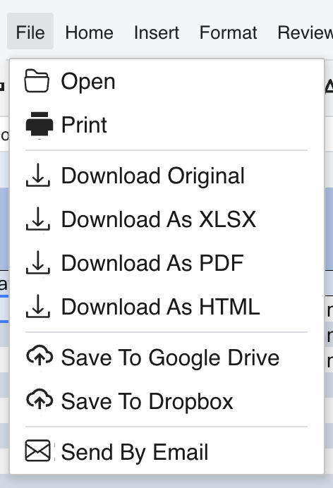

## Introduction

GridJs adds file export entries to the File menu through the `Download` menu item class. The File menu contains **Download Original**, **Download As XLSX**, **Download As PDF**, and **Download As HTML**. When the locale is not `ru` and not `zh`, the same File menu also adds **Save To Google Drive** and **Save To Dropbox** entries.

## How to use

1. Open GridJs and use the **File** menu.

2. Select **Download Original** to route the menu action as `download_Original` and call the download flow with save type `Original`.

3. Select **Download As XLSX**, **Download As PDF**, or **Download As HTML** to route the menu action as `download_XLSX`, `download_PDF`, or `download_HTML`. GridJs changes the exported file name suffix to `.xlsx`, `.pdf`, or `.html` before starting the download flow.


4. If the current locale is neither `ru` nor `zh`, use **Save To Google Drive** or **Save To Dropbox**. Both entries export the original file type and pass the device value as `GoogleDrive` or `Dropbox`.



5. If `beforeSaveFunc` is configured, GridJs calls it before starting the export. If it returns a false value, the export stops.

6. If `fileDownloadCallFunc` is configured, GridJs calls that function with the target file name, export type, and device value. If no custom callback is configured, GridJs sends a `POST` request to `fileDownloadUrl`.

7. When the `POST` response is JSON or text, GridJs treats the response as a file URL and downloads that URL as a blob. For other response content types, GridJs downloads the response blob directly.

The File menu has a generic `download` handler that opens `ModalDownload`, but the `new Download()` entry without a suffix is commented out in the inspected File menu code. The active File menu entries use the direct typed handlers listed above.

## JavaScript API

Configure the built-in download request URL with `setFileDownloadInfo(url)`.

```js
const xs = x_spreadsheet('#gridjs-demo-uid', options);

xs.setFileDownloadInfo('/GridJs2/Download');
```

Use `setFileDownloadCallFunction(fileDownloadCallFunc)` when you want to handle the export action yourself instead of using the built-in `POST` request.

```js
const xs = x_spreadsheet('#gridjs-demo-uid', options);

xs.setFileDownloadCallFunction((toFileName, type, device) => {
  // toFileName is the final file name selected by GridJs.
  // type is one of: 'Original', 'XLSX', 'PDF', or 'HTML'.
  // device is 'Device', 'GoogleDrive', or 'Dropbox'.
});
```

Use `setBeforeSaveFunction(beforeSaveFunc)` to run a guard before export starts.

```js
xs.setBeforeSaveFunction(() => {
  return true;
});
```

### Relevant functions
| Function / Location | Description | Parameters | Returns |
|----------|-------------|------------|---------|
| `Download(suffix)` (`component/toolbar/download.js`) | Builds a download menu item tag as `download_<suffix>` and uses the download icon, or the save-to-cloud icon for `GOOGLE` and `DROPBOX`. | `suffix`: export suffix such as `Original`, `XLSX`, `PDF`, `HTML`, `GOOGLE`, or `DROPBOX` | `Download` instance |
| `Menubar(data, widthFn, isHide, showPartToolbar, local)` (`component/menubar.js`) | Adds `Download("Original")`, `Download("XLSX")`, `Download("PDF")`, and `Download("HTML")` to the File menu, and conditionally adds cloud entries when `local !== 'ru' && local !== 'zh'`. | `data`, `widthFn`, `isHide`, `showPartToolbar`, `local` | `Menubar` instance |
| `toolbarChange(type, value)` (`component/sheet.js`) | Dispatches `download_Original`, `download_XLSX`, `download_PDF`, `download_HTML`, `download_GOOGLE`, and `download_DROPBOX` to `fileDownloadByType`. | `type`: menu tag; `value`: optional value | `void` |
| `fileDownloadByType(type, device = 'Device')` (`component/sheet.js`) | Runs `beforeSaveFunc`, builds the target file name, and either calls `downloadFile` or `fileDownloadCallFunc`. | `type`: save type; `device`: destination string | `void` |
| `downloadFile(toFileName, saveType)` (`component/sheet.js`) | Posts sheet state and requested output type to `fileDownloadUrl`, then downloads the returned file URL or response blob. | `toFileName`: target file name; `saveType`: output type | `Promise<void>` |
| `fileLinkToStreamDownload(url, fileName, authToken)` (`component/sheet.js`) | Downloads a returned file URL with `XMLHttpRequest` and forwards the blob to `downloadExportFile`. | `url`, `fileName`, `authToken` | `void` |
| `downloadExportFile(blob, tagFileName)` (`component/sheet.js`) | Creates an anchor element, sets `href` and `download`, clicks it, and revokes the object URL for non-string blobs. | `blob`: Blob or string URL; `tagFileName`: download name | `void` |
| `setFileDownloadInfo(url)` (`index.js`) | Stores the built-in download request URL on `this.sheet.fileDownloadUrl`. | `url`: download endpoint URL | `void` |
| `setFileDownloadCallFunction(fileDownloadCallFunc)` (`index.js`) | Stores a custom export callback on `this.sheet.fileDownloadCallFunc`. | `fileDownloadCallFunc`: function called with `(toFileName, type, device)` | `void` |
| `setBeforeSaveFunction(beforeSaveFunc)` (`index.js`) | Stores a guard callback on `this.sheet.beforeSaveFunc`. | `beforeSaveFunc`: function returning a truthy value to continue | `void` |

The inspected `index.d.ts` file does not declare `setFileDownloadInfo`, `setFileDownloadCallFunction`, or `setBeforeSaveFunction`, but the `index.js` implementation exposes these methods directly.

## Common Questions

Q: Which export entries are active in the File menu?
A: The inspected File menu code adds Download Original, Download As XLSX, Download As PDF, and Download As HTML.

Q: When are Google Drive and Dropbox entries shown?
A: They are added when the `local` value is not `ru` and not `zh`.

Q: How does GridJs choose the exported file extension?
A: For non-Original export types, GridJs replaces the current file name suffix with the lowercase export type, such as `.xlsx`, `.pdf`, or `.html`.

Q: Can application code intercept the File menu export?
A: Yes. If `fileDownloadCallFunc` is configured, GridJs calls it instead of the built-in `downloadFile` request.
