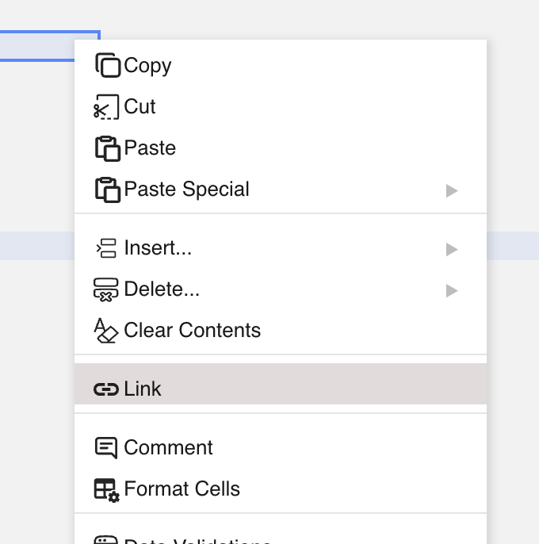
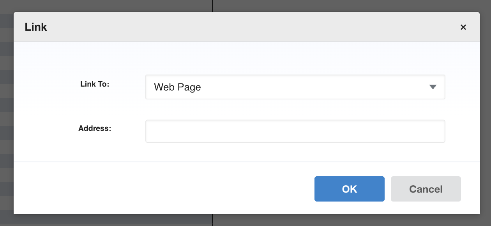
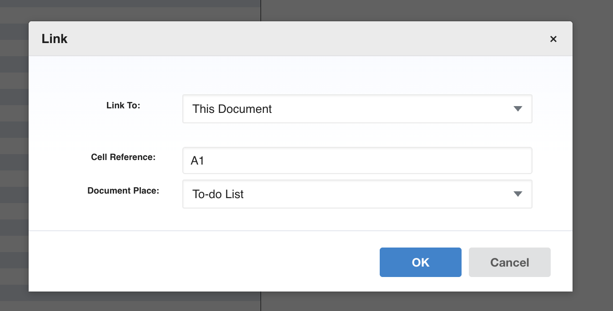
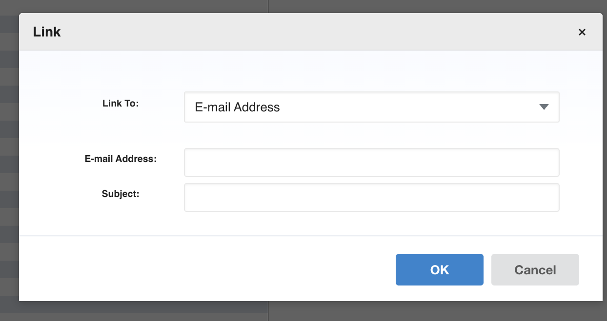
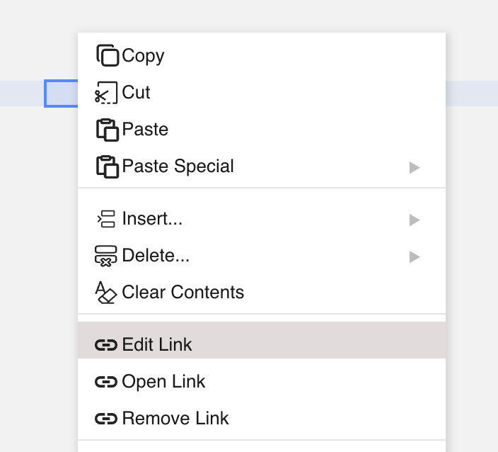

## Introduction

GridJs includes a hyperlink workflow for selected cells and ranges. The inspected toolbar exposes a `link` icon, and the context menu exposes `Link`, `Edit Link`, `Open Link`, and `Remove Link` actions depending on whether the selected cell already has a hyperlink.

The hyperlink dialog is implemented by `ModalLink`. It supports three link targets: `Web Page`, `This Document`, and `E-mail Address`. Added cell hyperlinks are stored in `data.hyperlinks`, and GridJs applies underline plus blue text color to the linked area.

## How to use

1. Select the cell or range that should receive a hyperlink.

2. Open the hyperlink dialog from the toolbar link icon, or right-click the selection and choose `Link`.



3. Choose `Web Page` in the `Link To` field to add a web link. Enter the `Address` value and click `OK`.

   GridJs normalizes a web address without a protocol by adding `http://`. The dialog accepts only `http:` and `https:` URLs for the Web Page option.



4. Choose `This Document` to link to a location inside the workbook. Select the `Document Place`, enter a `Cell Reference`, and click `OK`.

   GridJs stores this target as `sheetName!cellReference`. When the link is opened, GridJs switches to the target sheet and then sets the active cell to the target cell reference.



5. Choose `E-mail Address` to create an email link. Enter the email address and subject, then click `OK`.

   GridJs stores this target as a `mailto:` address with the subject value.



6. To open an existing hyperlink from the context menu, right-click a linked cell and choose `Open Link`.

   Web page and email links open with `window.open(address, "_blank")`. Document links navigate inside the current GridJs workbook.

7. To change or delete an existing hyperlink, right-click a linked cell and choose `Edit Link` or `Remove Link`.

   When a hyperlink is removed from a cell range, GridJs removes it from `data.hyperlinks` and clears the hyperlink style for that area.



## JavaScript API

The inspected code does not expose a declared public JavaScript method for adding hyperlinks. Hyperlink management is implemented inside the GridJs sheet, modal, context menu, and hyperlink helper classes.

### Relevant functions
| Function / Location | Description | Parameters | Returns |
|----------|-------------|------------|---------|
| `Link` (`component/toolbar/link.js`) | Creates the toolbar item with the `link` tag. | None | `IconItem` instance |
| `defaultMenuItems` (`component/contextmenu.js`) | Adds `link`, `editLink`, `openLink`, and `removeLink` entries to the context menu. | None | Menu item array |
| `toolbarChange(type, value)` branch for `link` (`component/sheet.js`) | Opens `ModalLink` for the selected cell range, or delegates to image hyperlink handling when an image is selected. | `type`, `value` | `void` |
| `contextMenu.itemClick(type)` branches for hyperlink actions (`component/sheet.js`) | Opens the hyperlink dialog, removes a hyperlink, or opens a hyperlink for the current selection. | `type` | `void` |
| `ModalLink.btnClick(action)` (`component/modal_link.js`) | Builds the hyperlink object for Web Page, This Document, or E-mail Address and calls the sheet change handler. | `action` | `void` |
| `ModalLink.ensureUrlProtocol(url)` (`component/modal_link.js`) | Adds `http://` when a non-empty web address has no URL scheme. | `url` | Normalized URL string |
| `ModalLink.isValidHttpUrl(string)` (`component/modal_link.js`) | Accepts only `http:` and `https:` URL protocols for web links. | `string` | Boolean |
| `modalLink.change(action, link, type)` (`component/sheet.js`) | Adds new cell hyperlinks to `data.hyperlinks`, updates the hyperlink style, and reloads hyperlink positions. | `action`, `link`, `type` | `void` |
| `hyperlink.setHyperlinkStyleByArea(area, sheet, type)` (`component/hyperlink.js`) | Applies or clears underline and link color for each cell in the hyperlink area. | `area`, `sheet`, `type` | `void` |
| `hyperlink.access(hyperlink)` (`component/hyperlink.js`) | Opens web and email links in a new browser context, or navigates to a sheet and cell for document links. | `hyperlink` | `null` or `undefined` |
| `DataProxy.getData()` and `DataProxy.getDataForSave()` (`core/data_proxy.js`) | Include `hyperlinks` in exported sheet data. | None | Sheet data object |

The hyperlink object used by the inspected code contains these fields when a cell hyperlink is added from the dialog:

```js
{
  area: 'A1:A1',
  text: 'cell text',
  type: 0,
  address: 'https://example.com'
}
```

The inspected code uses these `type` values:

| Type | Link target | Stored address format |
|----------|-------------|------------|
| `0` | Web Page | `http://...` or `https://...` |
| `2` | E-mail Address | `mailto:name@example.com?subject=Subject` |
| `3` | This Document | `Sheet1!A1` |

Type `1` appears in `hyperlink.access()` as a link to another file, but the inspected dialog does not create type `1` links.

## Common Questions

Q: Can GridJs create web, document, and email hyperlinks from the UI?
A: Yes. The inspected `ModalLink` dialog offers `Web Page`, `This Document`, and `E-mail Address` options.

Q: What happens when a web address has no protocol?
A: The dialog adds `http://` before validating the address. It then accepts only `http:` and `https:` URLs.

Q: How does GridJs display linked cells?
A: When a new cell hyperlink is added, GridJs calls `setHyperlinkStyleByArea`, which applies underline and blue text color to each cell in the linked area.

Q: Does the inspected code expose a public JavaScript method named `addHyperlink`?
A: No. No declared public `addHyperlink` method was found in the inspected source.
