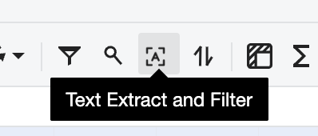
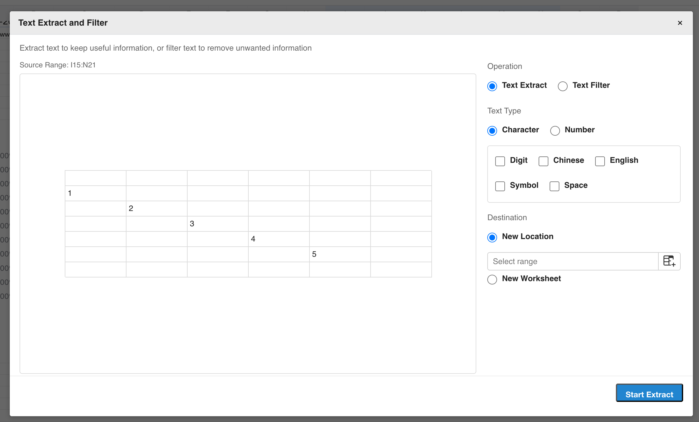

## Introduction

GridJs includes a **Text Extract and Filter** command in the toolbar and menubar.

The command opens `ModalTextExtractFilter` (`component/modal_text_extract_filter.js`) for the currently selected range. The modal can extract selected character types from cell text, or filter selected character types out of cell text. The implementation recognizes five character types in `core/text_extract_filter.js`: `digit`, `chinese`, `english`, `symbol`, and `space`.

## How to use

1. Select the source cell or range in the worksheet.

2. Open **Text Extract and Filter**.

   The command is available from both toolbar and menubar code paths:
   - `Toolbar` creates `textExtractFilterEl` with the tag `text-extract-filter`.
   - `Banner` adds the same command to the Edit menu.
   - `toolbarChange(...)` opens the modal with `modalTextExtractFilter.show(data, data.selector.range)`.

3. Choose the operation.

   The modal provides two operations:
   - **Text Extract** keeps only selected character types.
   - **Text Filter** removes selected character types.

4. Choose the text type.

   When **Character** is selected, choose one or more character types:
   - Digit
   - Chinese
   - English
   - Symbol
   - Space

   When **Number** is selected, the code uses `digit` as the character type.

5. Choose the destination.

   The modal supports two destination modes:
   - **New Location** writes the result to the selected destination range.
   - **New Worksheet** creates a new worksheet and writes the result starting at row `0`, column `0`.

6. Start the operation.

   If no character type is selected, the modal shows `Select at least one text type.` If **New Location** is selected and no destination range is entered, it shows `Select a destination range.` If the destination range is invalid, `toolbarChange(...)` shows `Invalid destination range.`

7. Review the result.

   GridJs builds output cells with `buildTextExtractFilterCells(...)`, writes each generated text value to the target cells, updates batch cell operations, resets the sheet, and closes the modal.

## JavaScript API

The inspected code does not expose a dedicated public `Spreadsheet` method for Text Extract and Filter. The behavior is driven by the toolbar or menubar command and internal helper functions.

### Relevant functions

| Function / Location | Description | Parameters | Returns |
|----------|-------------|------------|---------|
| `TextExtractFilter` (`component/toolbar/text_extract_filter.js`) | Creates the toolbar icon item with tag `text-extract-filter`. | None | `TextExtractFilter` instance |
| `ModalTextExtractFilter.show(data, sourceRange)` (`component/modal_text_extract_filter.js`) | Opens the modal for a source range and refreshes the preview. | `data`, `sourceRange` | `void` |
| `ModalTextExtractFilter.getOptions()` (`component/modal_text_extract_filter.js`) | Reads operation, text type, selected character types, destination, and destination range from modal inputs. | None | `options` object |
| `ModalTextExtractFilter.submit()` (`component/modal_text_extract_filter.js`) | Validates options and calls `change('ok', { options, sourceRange })`. | None | `void` |
| `transformTextExtractFilterValue(value, options)` (`core/text_extract_filter.js`) | Extracts or filters characters from a single text value. | `value`, `options` | `string` |
| `buildTextExtractFilterCells({ sourceRange, targetStart, options, getCellText })` (`core/text_extract_filter.js`) | Builds target cell updates for every cell in the selected source range. | `sourceRange`, `targetStart`, `options`, `getCellText` | `{ cells, targetRange }` |
| `hasValidTextExtractFilterOptions(options)` (`core/text_extract_filter.js`) | Checks whether normalized options contain at least one character type. | `options` | `boolean` |

## Common Questions

Q: Which character types can Text Extract and Filter process?
A: The code defines `digit`, `chinese`, `english`, `symbol`, and `space`.

Q: What is the difference between Text Extract and Text Filter?
A: `extract` keeps selected character types, while `filter` removes selected character types.

Q: What happens when Number is selected?
A: `normalizeOptions(...)` sets the character type to `digit`.

Q: Can the result be written to a new worksheet?
A: Yes. When the destination is `newWorksheet`, GridJs creates a sheet named from `textExtractFilter.newWorksheetName` and writes the output starting at row `0`, column `0`.
