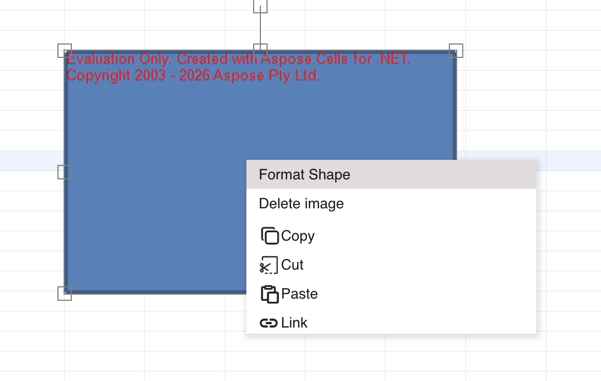
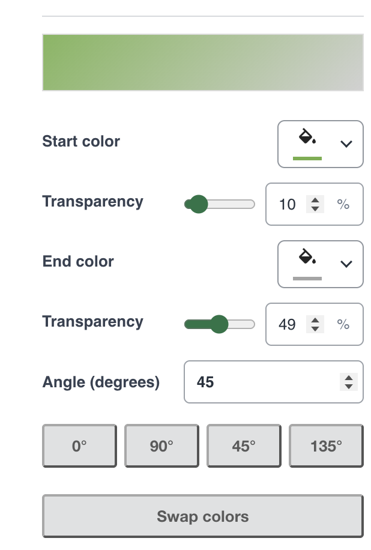
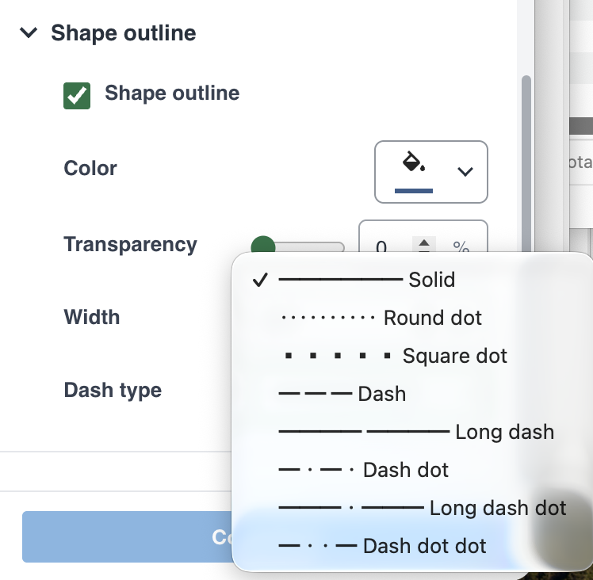
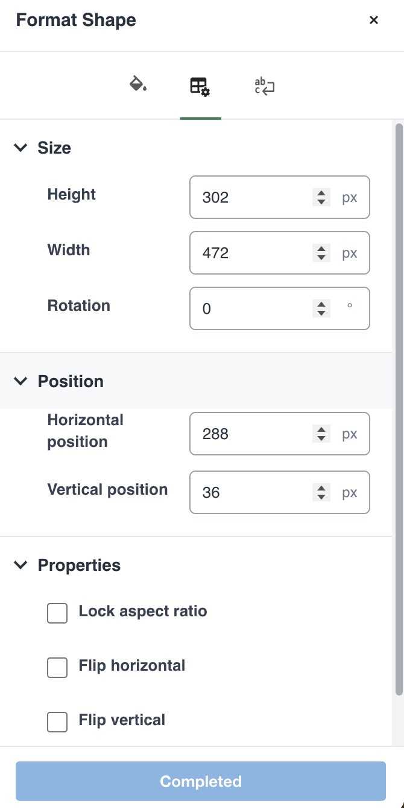
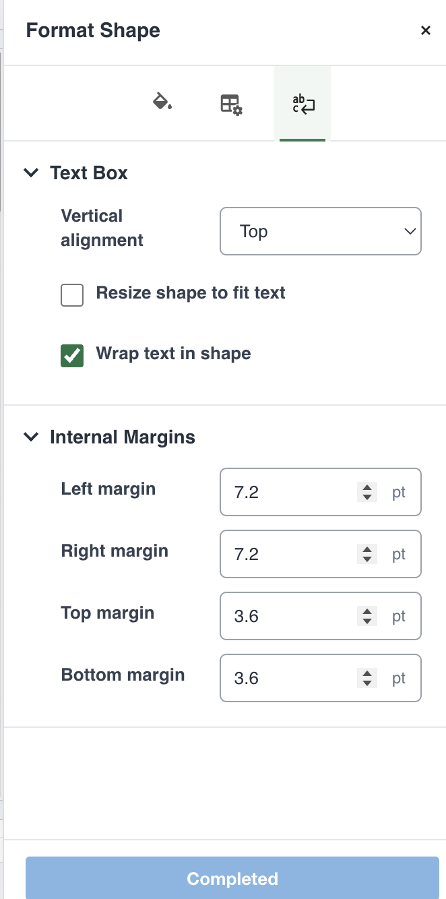

## Introduction

GridJs provides a **Format Shape** panel for supported worksheet shapes. Use it to change fills, outlines, size, position, rotation, flipping, and supported text-layout settings. Changes remain pending until you click **Apply**, and the available options depend on the selected shape's capabilities.

The Format Shape command is not provided for charts, OLE objects, check boxes, radio buttons, combo boxes, spinners, spin buttons, or redaction shapes.

## How to use

1. Select a supported shape, right-click it, and choose **Format Shape**.

   

2. Open **Fill & Line**, expand **Fill**, and choose a fill type.

   | Fill type | Available settings |
   | --- | --- |
   | **No fill** | Remove the shape fill. |
   | **Solid fill** | Choose a color and transparency from 0 to 100 percent. |
   | **Gradient fill** | Edit a supported two-color linear gradient as described below. |
   | **Texture fill** | Choose a preset texture from the texture gallery. |
   | **Pattern fill** | Choose a pattern and its foreground and background colors. |

   Fill types that the shape does not support can be omitted. Gradient fill is offered only when the selected shape supports gradient editing. An unsupported existing fill is identified as not editable instead of being treated as a different editable fill.

   For a two-color linear gradient, choose **Start color** and **End color**, and set the transparency of each endpoint independently from 0 to 100 percent. Set **Angle (degrees)** from 0 up to, but not including, 360, or use the 0°, 90°, 45°, and 135° preset buttons. **Swap colors** exchanges the two endpoint colors and their transparency settings. The panel shows a gradient preview; click **Apply** to update the worksheet shape.

   If an existing gradient cannot be edited as a two-color linear gradient, it is preserved. Click **Replace with two-color linear gradient** only when you want to replace it with an editable two-color gradient, then configure the replacement and click **Apply**.

   

3. Expand **Shape outline** in **Fill & Line**.

   - Enable **Shape outline** to edit it, or disable it to remove the outline.
   - Choose **Color**, set **Transparency** from 0 to 100 percent, and enter a positive width up to 100 px.
   - When line-style editing is supported, select **Dash type**: Solid, Round dot, Square dot, Dash, Long dash, Dash dot, Long dash dot, or Dash dot dot.
   - For a shape that supports arrows, set **Begin arrow** and **End arrow** independently. Available types are None, Triangle, Stealth, Diamond, Oval, and Open.
   - For each enabled arrowhead, choose **Arrow width** (Narrow, Medium, or Wide) and **Arrow length** (Short, Medium, or Long). Width and length controls are disabled when that endpoint's arrow type is None.

   Click **Apply** to submit the outline and arrow changes. Arrow controls are shown only for shapes that report arrow support; they are not available for every shape.

   

4. Open **Size & Properties**.

   - In **Size**, set positive pixel values for **Height** and **Width**, and degrees for **Rotation**.
   - In **Position**, set pixel values for **Horizontal position** and **Vertical position**.
   - In **Properties**, use **Lock aspect ratio** to preserve the shape's current proportions when changing one dimension. Use **Flip horizontal** or **Flip vertical** to flip the shape.

   Geometry values are rounded to whole numbers, and rotation is normalized to 0 through 359 degrees. Empty or non-numeric values, and non-positive dimensions, are rejected. Press **Enter** or leave a field to finish editing its pending value, then click **Apply**. Enter and focus changes alone do not submit the shape changes.

   

5. For a shape with supported text-layout editing, open **Text Options**.

   | Section | Setting | How to use it |
   | --- | --- | --- |
   | **Text Box** | **Vertical alignment** | Choose Top, Middle, or Bottom. |
   | **Text Box** | **Resize shape to fit text** | Enable sizing the shape to fit its text. |
   | **Text Box** | **Wrap text in shape** | Enable or disable text wrapping inside the shape. |
   | **Internal Margins** | Left, Right, Top, and Bottom margin | Set each inset independently, from 0 to 720 pt. |

   Click **Apply** to submit the text-layout changes. Text Options is disabled for TextBox objects and for shapes that explicitly report text-style editing as unsupported.

   

6. Wait for **Applying…** to change to **Completed** before closing the panel. Application errors are shown in the panel and pending edits are retained. If the result cannot be confirmed, reload to check before applying again. Correct any invalid field before submitting.

   Apply is disabled when there are no pending edits, while an application is in progress, or when formatting is locked. Closing the panel or selecting a different object discards unapplied edits. When sheet protection prevents formatting, **Formatting is locked** is displayed and the settings are disabled.

## JavaScript API

This guide describes the context-menu and panel workflow. No dedicated public `Spreadsheet` method for opening this panel was found in the inspected implementation.

For maintainers, `DrawingFormatPanel.commitFill`, `commitShapeOutline`, `commitShapeFormat`, `commitShapeTextStyle`, and `commitNumber` stage pending edits. `applyChanges()` validates the pending input and submits it through the panel's change callback. These internal handlers are not presented as a public application API.

## Common Questions

Q: Why are gradient, dash, or arrow controls missing?
A: These controls depend on the selected shape's supported formatting capabilities. Arrow settings are available only when arrow editing is supported; enable the outline before editing its settings.

Q: Will opening the panel replace an existing complex gradient?
A: No. It is preserved until you explicitly choose **Replace with two-color linear gradient** and apply the replacement.

Q: Why is Text Options unavailable?
A: Text Options is disabled for TextBox objects or when the shape reports text-style editing as unsupported.

Q: Why did my edits disappear when I selected another shape?
A: Unapplied edits are discarded when the target changes. Click **Apply** and wait for **Completed** before changing the selection.
