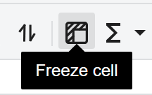

## Introduction

Freeze is a toolbar toggle (`Freeze cell`) that locks the top rows and left columns relative to the current selected cell. When enabled, GridJs stores freeze coordinates in sheet data and resets scroll to the freeze origin. When disabled, freeze is cleared by setting coordinates to `(0, 0)`.

## How to use

1. Select a cell where both row index and column index are greater than zero (for example, `C3`).
2. Click **Freeze cell** on the toolbar.

3. Scroll the sheet and verify that rows above and columns to the left of the freeze position stay fixed.

4. Click **Freeze cell** again to unfreeze.


## JavaScript API
```js
xs = x_spreadsheet('#gridjs-demo-uid', option);

// Freeze by row/column index (zero-based): freeze top 2 rows and left 2 columns.
xs.sheet.freeze(2, 2);

// Unfreeze.
xs.sheet.freeze(0, 0);

// Persist freeze through sheet data (A1-style reference).
const data = xs.getData();
data[0].freeze = 'C3';
xs.loadData(data);
```

### Relevant functions

| Function | Description | Parameters | Returns |
|----------|-------------|------------|---------|
| `sheet.freeze(ri, ci, raiseServerOpr = true)` | Applies or clears freeze on the current sheet. Internally updates freeze data and triggers sheet reset/render. | `ri` (row index), `ci` (column index), `raiseServerOpr` (optional boolean) | `sheet` |
| `data.setFreeze(ri, ci)` | Sets freeze coordinates in data and resets scroll state. | `ri` (row index), `ci` (column index) | `void` |
| `data.freezeIsActive()` | Checks whether freeze is active. | None | `boolean` |
| `xs.loadData(data)` | Loads sheet data; `freeze` supports A1-style value (for example `C3`). | `data` (sheet array/object) | `xs` |

`sheet.freeze(...)` is the same freeze path used by the toolbar toggle.
A freeze state is active only when `ri > 0` or `ci > 0`.

## Common Questions

Q: Why did clicking Freeze not create a frozen pane when A1 is selected?
A: Freeze is active only when row index or column index is greater than zero. Selecting A1 maps to `(0, 0)`.

Q: How do I unfreeze?
A: Toggle the Freeze button again, or call `sheet.freeze(0, 0)`.

Q: Does toolbar state follow the current freeze status?
A: Yes. Toolbar reset reads `data.freezeIsActive()` and updates the Freeze button active state.

Q: Can I freeze on a protected sheet?
A: No. Freeze is blocked by the protected-sheet operation guard in the toolbar change flow.
