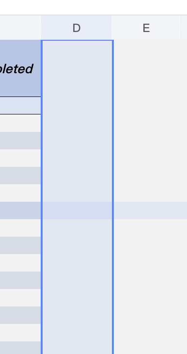
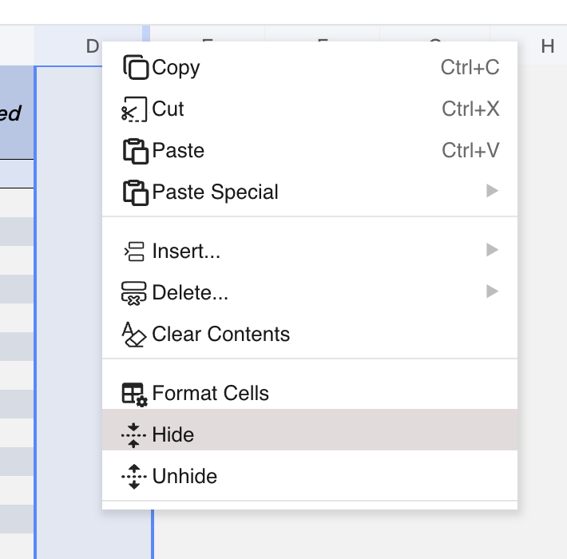
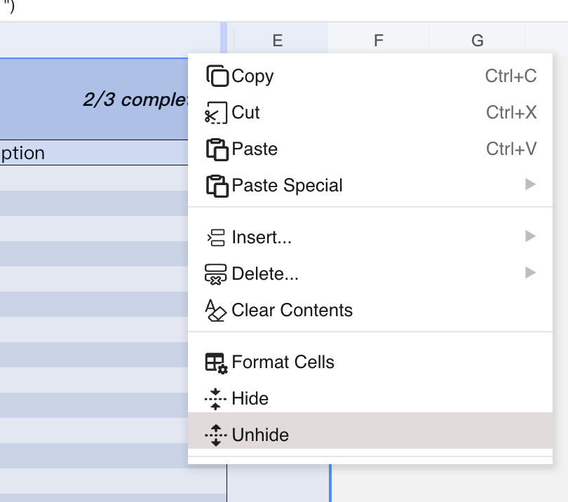

## Introduction
GridJS exposes `Hide` and `Unhide` in the context menu, using the row/column context mode rather than the normal cell-range menu.
When you select row headers or column headers, the context menu switches to whole-row or whole-column mode, and the `Hide` / `Unhide` commands operate on that selected range.
GridJS also wires an unhide callback to the row and column resizers, so the header area can show a dedicated unhide hover target near hidden lines.
In read mode, the context menu is reduced to `Copy`, so the UI hide/unhide commands are not available there.

## How to use 
1. Select entire rows or entire columns.
Use the row headers on the left or the column headers at the top so GridJS enters row/column context mode.


2. Hide the selected rows or columns.
Right-click the selected headers and choose `Hide`.
In the current implementation, `Hide` works only when the selection covers whole rows or whole columns.


3. Unhide from the context menu.
Select the row-header range or column-header range where you want hidden items to be restored, right-click, and choose `Unhide`.


4. Review the updated sheet.
After hide or unhide runs, GridJS resets the sheet view. Row and column image positions are also updated together with the hide state.


## JavaScript API
Based on the current source code, the sheet instance exposes direct methods for hiding and unhiding row and column ranges.
These methods call the shared hide/unhide workflow internally, so you do not need an extra `table.render()` call in this flow.
```js
const xs = x_spreadsheet('#gridjs-demo-uid', option);

// Hide rows 3 through 5.
xs.sheet.hideRows(3, 5);

// Hide columns 2 through 4.
xs.sheet.hideColumns(2, 4);

// Unhide the same rows.
xs.sheet.unhideRows(3, 5);

// Unhide the same columns.
xs.sheet.unhideColumns(2, 4);
```

### Relevant functions
| Function | Description | Parameters | Returns |
|----------|-------------|------------|---------|
| `xs.sheet.hideRows(sri, eri)` | Hides the row range by routing to the shared hide/unhide handler with `type = 'row'` and `isunhiden = false`. | `sri:number`, `eri:number` | `void` |
| `xs.sheet.unhideRows(sri, eri)` | Unhides the row range through the same shared handler. | `sri:number`, `eri:number` | `void` |
| `xs.sheet.hideColumns(sci, eci)` | Hides the column range by routing to the shared hide/unhide handler with `type = 'col'` and `isunhiden = false`. | `sci:number`, `eci:number` | `void` |
| `xs.sheet.unhideColumns(sci, eci)` | Unhides the column range through the same shared handler. | `sci:number`, `eci:number` | `void` |

## Common Questions
Q: Can I hide a normal cell range from the context menu?
A: No. The current context-menu hide flow checks for whole-row or whole-column selection.

Q: Where do the `Hide` and `Unhide` menu items come from?
A: They are defined in the GridJS context menu as `contextmenu.hide` and `contextmenu.unhide`.

Q: Why can I not see `Hide` or `Unhide` in read mode?
A: In read mode, the context menu is reduced to a single `Copy` item.

Q: Is there a JavaScript API for this feature?
A: Yes. The current sheet instance exposes `hideRows`, `unhideRows`, `hideColumns`, and `unhideColumns`.
