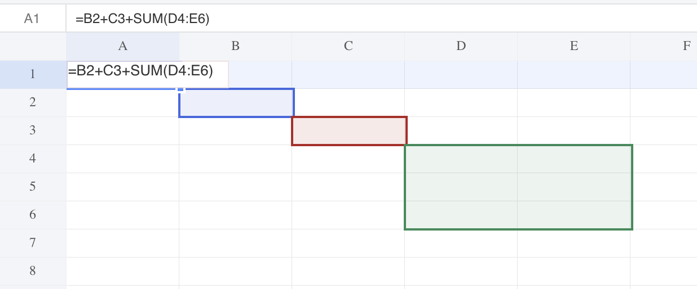

## Introduction

GridJs highlights formula references through the selector layer. When a formula is edited, the inspected code extracts cell references such as `A1` and range references such as `A1:B2`, then draws colored selector areas over the referenced cells.

The highlighting is not exposed as a separate toolbar command in the inspected implementation. It is triggered by formula editing flows in the cell editor and the formula bar.

## How to use

1. Select a cell that contains a formula with cell or range references.

   When the cell editor opens for a cell with `cell.f`, GridJs sets `editFormula` for the edited cell and calls `selector.setSelectorsByLocates(cell.f)`.

2. Edit the cell directly.

   The editor reads the cell formula into the edit area. GridJs extracts uppercase references that match the formula-reference pattern used by `extractCellReferences`, including single cells such as `A1` and ranges such as `A1:B2`.

3. Review the highlighted referenced ranges on the sheet.

   Each extracted reference is drawn as a selector area in `formulaRangeEl`. GridJs uses a rotating color sequence for the range borders and translucent background colors.

4. Focus the formula bar while the selected cell contains a formula.

   The formula bar focus handler also sets `editFormula` and calls `selector.setSelectorsByLocates(cell.f)`, so the same referenced cells and ranges are highlighted from the formula bar workflow.

5. While editing a formula, click or drag-select another cell or range on the sheet.

   If formula editing is active, the mouse selection is converted to a reference with `this.selector.range.toString()`. GridJs inserts or replaces the current formula reference with that selected cell or range, updates the formula bar text, reopens the editor for the formula cell, and refreshes the highlighted references.

6. Finish editing the formula.

   When the selector resets or the formula update flow clears formula editing, GridJs hides `formulaRangeEl`.

## JavaScript API

The inspected code does not expose a declared public JavaScript API for enabling or disabling formula referenced range highlighting. The behavior is implemented internally by the editor, formula bar, sheet mouse handling, and selector.

### Relevant functions
| Function / Location | Description | Parameters | Returns |
|----------|-------------|------------|---------|
| `FormulaBar` (`component/formula-bar.js`) | Renders the formula bar and raises `inputChange`, `enter`, `tab`, and `focuson` callbacks from the editable formula input. | `data`, `mode` | `FormulaBar` instance |
| `formulaBar.focuson` (`component/sheet.js`) | Sets `editFormula` when the selected cell has a formula and calls `selector.setSelectorsByLocates(cell.f)`. | None | `void` |
| `editorSet(focus)` (`component/sheet.js`) | Opens the cell editor, sets `editFormula` for a formula cell, and highlights formula references with `selector.setSelectorsByLocates(cell?.f)`. | optional `focus` | `void` |
| `inputEventHandler(evt)` (`component/editor.js`) | Sets `sheet.editFormula` when cell editor input starts with `=`, shows formula suggestions, and sends the input text through the editor change handler. | `evt` | `void` |
| `overlayerMousedown(evt)` (`component/sheet.js`) | Stores the editor caret position when formula editing is active before processing sheet selection. | `evt` | `void` |
| `mouseMoveUp` completion branch (`component/sheet.js`) | During formula editing, converts the selected range to text and calls `appendFormulaWithCellName` when the selection is not the formula cell itself. | mouse event callbacks | `void` |
| `appendFormulaWithCellName(formulaCell, appendCellName)` (`component/sheet.js`) | Updates the formula text with the selected cell or range, updates the formula bar, reopens the editor, and refreshes highlighted references. | `formulaCell`, `appendCellName` | `void` |
| `updateFormula(formula, position, appendCellName, selectedText)` (`component/sheet.js`) | Replaces selected text, replaces the reference around the caret, or inserts the selected reference into the formula. | `formula`, `position`, `appendCellName`, `selectedText` | Updated formula string or original formula |
| `extractCellReferences(formula)` (`component/selector.js`) | Extracts uppercase single-cell and range references with `/[A-Z]+\\d+(:[A-Z]+\\d+)?/g`. | `formula` | Array of reference strings |
| `Selector.setSelectorsByLocates(locates)` (`component/selector.js`) | Converts references to cell rectangles, creates colored selector areas, and shows `formulaRangeEl`. | formula string or locate array | `void` |
| `Selector.resetAreaOffset()` (`component/selector.js`) | Hides `formulaRangeEl` when the selector area resets. | None | `void` |

## Common Questions

Q: Is formula referenced range highlighting controlled by a toolbar button?
A: No. The inspected code does not expose a separate toolbar command for this behavior. It appears from formula editing flows.

Q: Which references are highlighted?
A: The inspected extractor matches uppercase references like `A1` and `A1:B2`.

Q: What colors are used for referenced ranges?
A: The selector uses a seven-color sequence with colored borders and translucent background colors, then loops back to the first color.

Q: What happens when users select a cell range while editing a formula?
A: GridJs converts the current selector range to a reference string, updates the formula text, updates the formula bar, reopens the editor for the formula cell, and redraws the referenced range highlights.
