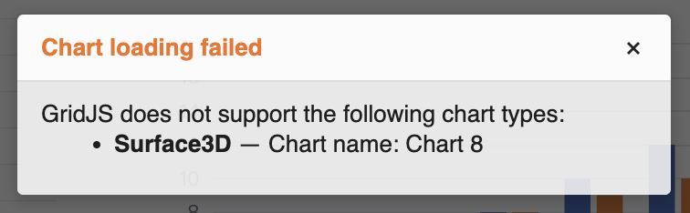

## Introduction

GridJs can report chart load errors after a worksheet finishes loading. When the loaded worksheet contains entries with the `UNSUPPORTED_CHART_TYPE` code, GridJs displays a **Chart loading failed** message that identifies each unsupported chart by its chart type and chart name.

The message is informational. The inspected user interface reports the unsupported charts but does not provide an action for converting or displaying them.

## How to use

1. Open a workbook that contains charts in GridJs.

2. Wait until the worksheet finishes loading.

   GridJs checks the worksheet's chart load errors after the sheet-loaded event is triggered.

3. If the worksheet contains unsupported chart types, review the **Chart loading failed** message.

4. Read each item in the message.

   - The bold value is the chart type reported by GridJs.
   - **Chart name** identifies the affected chart.
   - If the chart does not have a name, GridJs displays **Unnamed chart**.
   - If the chart type is missing from the error data, GridJs displays **Unknown**.

5. Record the reported chart type and chart name before modifying the source workbook or investigating the unsupported chart.

   The current GridJs interface does not include a command in this message for converting, replacing, or rendering the unsupported chart.

## JavaScript API

The inspected code does not expose a dedicated public `Spreadsheet` method for requesting or dismissing unsupported-chart notifications. The notification is driven by chart load error data during workbook loading.

### Internal presentation flow

| Function or property | Verified behavior |
| --- | --- |
| `data.chartLoadErrors` | Supplies chart load error entries for the loaded worksheet. |
| `Sheet.showChartLoadErrors(data)` | Filters entries to the `UNSUPPORTED_CHART_TYPE` code and displays previously unseen errors. |
| `buildUnsupportedChartMessage(errors, labels)` | Builds a list containing each chart type and chart name. |
| `shownChartLoadErrors` | Prevents the same sheet, error code, chart type, and chart name combination from being shown repeatedly during one workbook load. |
| `Spreadsheet.loadData(...)` | Clears the previously shown error keys when another workbook load starts. |

## Common Questions

Q: Why does the message list several charts at once?
A: GridJs combines the unseen unsupported-chart entries for the loaded worksheet into one message.

Q: Why is the same unsupported chart not reported again while I continue using the workbook?
A: GridJs stores a key made from the worksheet name, error code, chart type, and chart name and suppresses that same entry until another workbook load starts.

Q: Does the message make an unsupported chart visible?
A: No. The inspected interface reports the chart type and chart name but does not expose a rendering or conversion action in the message.

