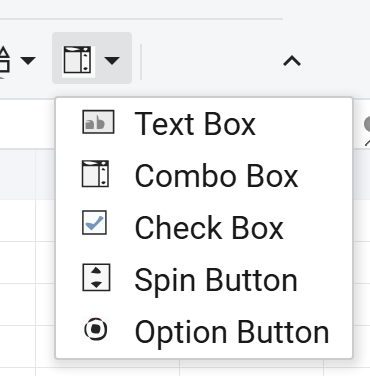
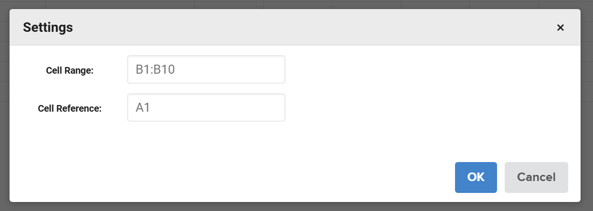
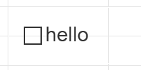
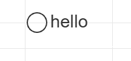
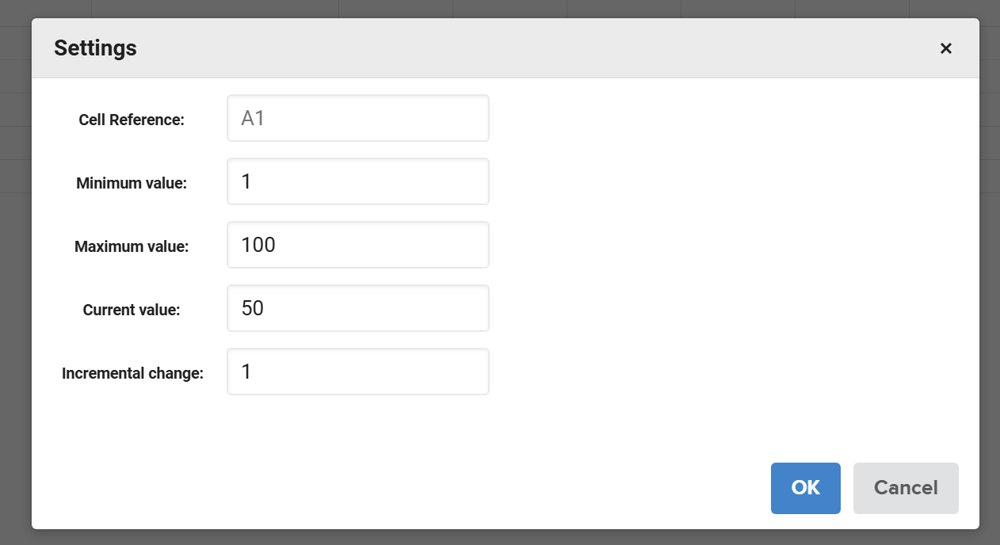

## Introduction
Insert Controls provides a toolbar dropdown for adding form-like controls to the grid. The available options are Text Box,
Combo Box, Check Box, Spin Button, and Option Button. Each option opens a dialog with the required fields for that control,
and the control is inserted at the current selection after you confirm.

## How to use 
1. Select a target cell, then click Insert Controls on the toolbar.
2. Choose a control type from the dropdown.

3. Text Box: adds a Text Box control at the selected cell.  
Label text: required input for creating the control (placeholder: "Please enter text").  


4. Combo Box: adds a Combo Box control at the selected cell with values from a range.  
Cell Reference: linked cell updated when the selection changes.  
Cell Range: source range for dropdown options (for example, B1:B10).  


5. Check Box: adds a Check Box control at the selected cell.  
Cell Reference: linked cell updated with TRUE or FALSE when toggled.  
Label text: shown next to the checkbox.  


6. Option Button: adds an Option Button (Radio Button) control at the selected cell.  
Cell Reference: linked cell updated when the option is selected.  
Label text: shown next to the option button.  


7. Spin Button: adds a Spin Button control at the selected cell.  
Cell Reference: linked cell updated with the current value.  
Minimum value: lower bound for the value.  
Maximum value: upper bound for the value.  
Current value: initial value.  
Incremental change: step size for each click.  



## JavaScript API
```js
xs = x_spreadsheet('#gridjs-demo-uid', option);

// Open the Insert Controls dialog for a specific type.
xs.sheet.modelControl.show('TextBox');
xs.sheet.modelControl.show('ComboBox');
xs.sheet.modelControl.show('CheckBox');
xs.sheet.modelControl.show('SpinButton');
xs.sheet.modelControl.show('RadioButton');
```

### Relevant functions
| Function | Description | Parameters | Returns |
|----------|-------------|------------|---------|
| sheet.modelControl.show(type) | Show the Insert Controls dialog for the given control type. | type ('TextBox', 'ComboBox', 'CheckBox', 'SpinButton', 'RadioButton') | void |
| sheet.modelControl.hide() | Close the Insert Controls dialog. | None | void |

sheet.modelControl.show(type) displays the control dialog configured for the requested type.
sheet.modelControl.hide() closes the dialog without inserting a control.

## Common Questions
Q: What control types are available in Insert Controls?
A: Text Box, Combo Box, Check Box, Spin Button, and Option Button.

Q: What inputs are required for Combo Box?
A: Cell Reference and Cell Range. The range uses a spreadsheet reference like B1:B10.

Q: Why does the dialog reject my values for Spin Button?
A: The dialog validates Minimum value, Maximum value, Current value, and Incremental change. If the values are out of
range (for example, Current value outside min/max), the dialog blocks submission.
