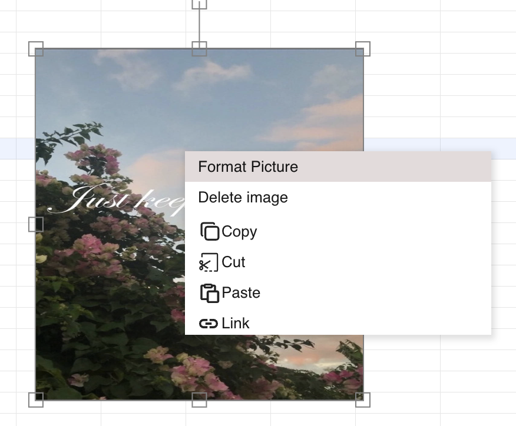
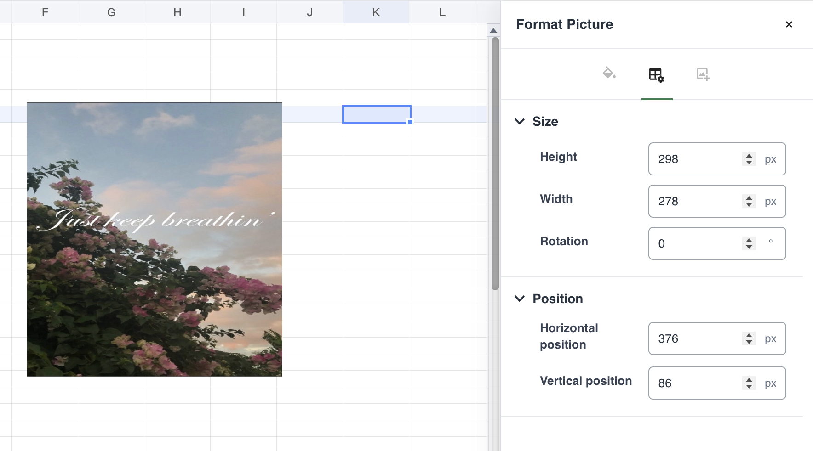

## Introduction

GridJs provides a **Format Picture** command for worksheet pictures. The currently enabled **Size & Properties** tab can set the picture height, width, rotation, horizontal position, and vertical position.

The **Fill & Line** and **Picture** tabs are displayed as unavailable for pictures in the inspected implementation. This guide therefore covers only the enabled size and position settings.

## How to use

1. Select a picture in the worksheet.

2. Right-click the selected picture and choose **Format Picture**.

3. Use the enabled **Size & Properties** tab.

   - Enter a positive pixel value for **Height**.
   - Enter a positive pixel value for **Width**.
   - Enter the required angle in **Rotation**.
   - Enter pixel values for **Horizontal Position** and **Vertical Position**.

4. Press **Enter**, or move focus away from a changed field, to apply the value.

   GridJs rounds entered values to whole numbers. Rotation is normalized to a value from 0 through 359. Empty values, non-numeric values, and non-positive width or height values are rejected.

5. Close the format panel after the picture has the required size, position, and rotation.

   If formatting is locked, GridJs displays a locked message and disables the settings.

## JavaScript API

The inspected code does not expose a dedicated public `Spreadsheet` method for opening the **Format Picture** panel or applying its geometry settings. The feature is driven by the picture context menu and internal drawing-format handlers.

### Internal format flow

| Function or component | Verified behavior |
| --- | --- |
| `getDrawingFormatMenuItem(obj)` | Adds **Format Picture** when the selected drawing type is `Picture`. |
| `DrawingFormatPanel.showFor(target, "picture")` | Opens the format panel with **Size & Properties** as the active picture tab. |
| `DrawingFormatPanel.commitNumber(key, input)` | Validates and submits the changed picture geometry value. |
| `Sheet.applyDrawingFormatChange(...)` | Applies the geometry change and synchronizes the selected picture. |

## Common Questions

Q: Why are Fill & Line and Picture unavailable?
A: The inspected implementation enables only **Size & Properties** for picture targets.

Q: Why was my width or height rejected?
A: Width and height must be numeric values greater than zero.

Q: What happens when I enter a rotation greater than 359 degrees or a negative rotation?
A: GridJs normalizes the entered angle to a value from 0 through 359.

Q: Can I change picture settings while formatting is locked?
A: No. GridJs displays a locked notice and disables the format controls.

