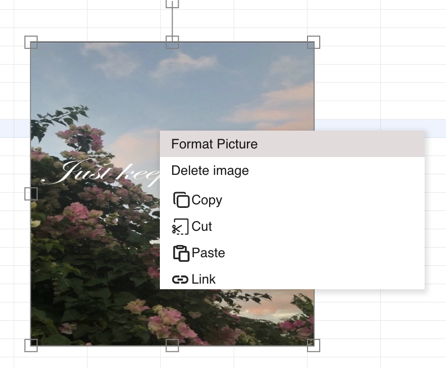
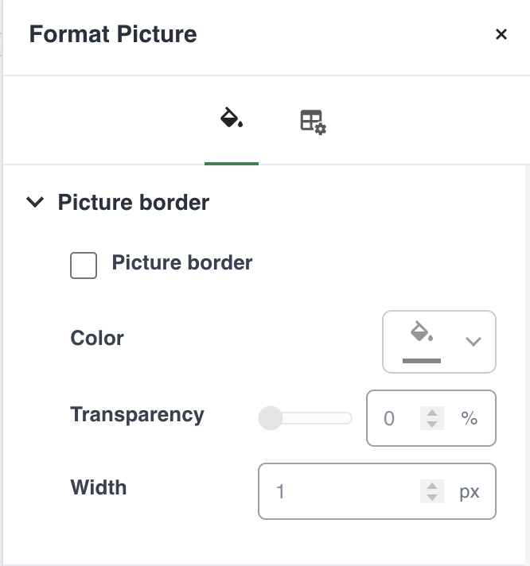
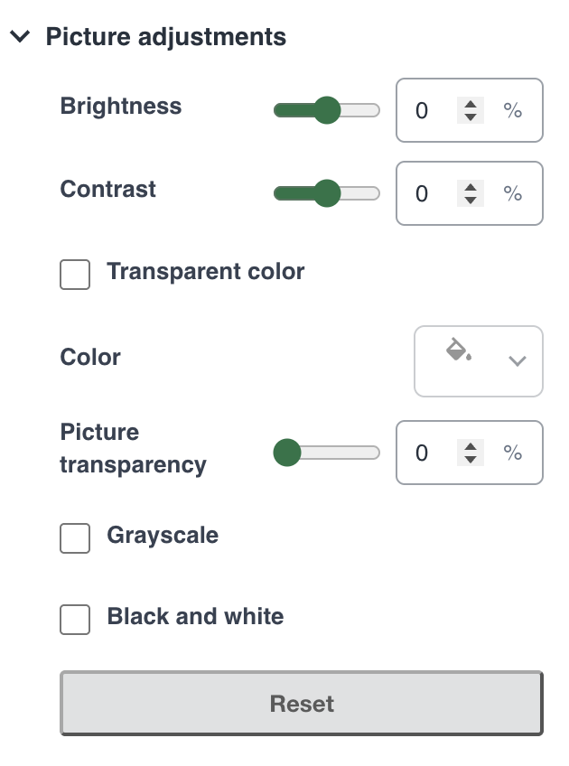
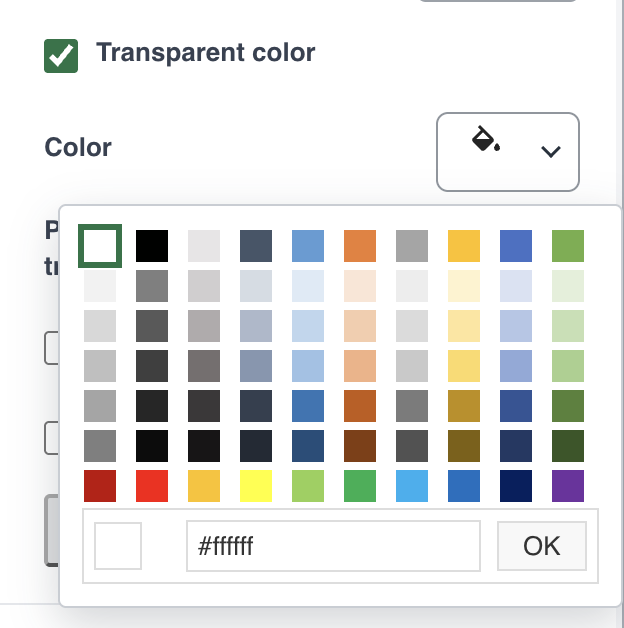
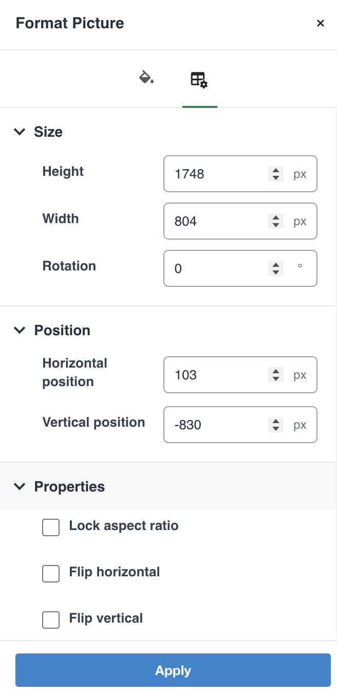

## Introduction

GridJs provides a **Format Picture** panel for worksheet pictures. Use **Fill & Line** to change the border and picture adjustments, and **Size & Properties** to change dimensions, position, rotation, aspect-ratio locking, and flipping. Changes remain pending in the panel until you click **Apply**.

## How to use

1. Select a picture, right-click it, and choose **Format Picture**.

   

2. Open **Fill & Line** and expand **Picture border**.

   - Enable **Picture border** to edit its settings, or disable it to remove the border.
   - Choose a **Color**, set **Transparency** from 0 to 100 percent, and enter a positive border width up to 100 px.
   - When the selected picture supports line-style editing, choose **Dash type**: Solid, Round dot, Square dot, Dash, Long dash, Dash dot, Long dash dot, or Dash dot dot.
   - Border transparency affects the border; **Picture transparency** affects the picture itself. Arrowhead settings are not provided for picture borders.

   Click **Apply** to apply the border changes.

   

3. Expand **Picture adjustments** in **Fill & Line**.

   | Setting | How to use it |
   | --- | --- |
   | **Brightness** | Use the slider or numeric field to adjust from -100 to 100. The reset value is 0. |
   | **Contrast** | Use the slider or numeric field to adjust from -100 to 100. The reset value is 0. |
   | **Picture transparency** | Set a value from 0 to 100 percent. The reset value is 0. |
   | **Grayscale** | Enable grayscale rendering. Enabling it disables Black and white. |
   | **Black and white** | Enable black-and-white rendering. Enabling it disables Grayscale. |

   Click **Apply** to apply the selected adjustments. You can use **Reset** to return brightness, contrast, and picture transparency to 0, disable Grayscale and Black and white, and clear the transparent color. Reset leaves border, size, position, rotation, aspect-ratio, and flip settings unchanged; click **Apply** to submit the reset.

   

4. To make a particular picture color transparent, enable **Transparent color** in **Picture adjustments**, then choose the color below it. The initial selection when enabling this option is white. Disable **Transparent color** to clear the setting, or use **Reset** to clear it together with the other picture adjustments. Click **Apply** after making the change.

   

5. Open **Size & Properties**.

   | Section | Available settings |
   | --- | --- |
   | **Size** | Enter positive pixel values for **Height** and **Width**, and an angle in degrees for **Rotation**. |
   | **Position** | Enter pixel values for **Horizontal position** and **Vertical position**. |
   | **Properties** | Enable **Lock aspect ratio**, **Flip horizontal**, or **Flip vertical** as required. |

   With **Lock aspect ratio** enabled, changing one dimension also updates the other to preserve the picture's current proportions. Geometry values are rounded to whole numbers; rotation is normalized to 0 through 359 degrees. Empty or non-numeric values, and non-positive dimensions, are rejected.

   Press **Enter** or leave a field to finish editing its pending value, then click **Apply** to update the picture. Enter and focus changes alone do not submit the picture changes.

   

6. Wait for **Applying…** to change to **Completed** before closing the panel. If application fails, the panel shows an error and retains the pending changes. If the message says the result could not be confirmed, reload to check the picture before applying again. Invalid fields must be corrected before application can proceed.

   Apply is disabled when there are no pending edits, while a request is being applied, or when formatting is locked. Closing the panel or selecting a different object discards unapplied edits. When sheet protection prevents formatting, the panel displays **Formatting is locked** and disables its settings.

## JavaScript API

This guide describes the context-menu and panel workflow. No dedicated public `Spreadsheet` method for opening this panel was found in the inspected implementation.

For maintainers, the internal `DrawingFormatPanel` methods `commitPictureBorder`, `commitPictureFormat`, and `commitNumber` stage pending changes. `applyChanges()` validates the pending input and submits it through the panel's change callback. These internal methods are not presented as a public application API.

## Common Questions

Q: Where are the picture effects?
A: Open **Fill & Line**, then expand **Picture adjustments**. Brightness, contrast, transparency, transparent color, grayscale, and black-and-white settings are in this section; there is no separate Picture tab in this panel.

Q: Why can I not enable Grayscale and Black and white together?
A: These settings are mutually exclusive. Enabling one disables the other.

Q: Does Reset restore the picture's original size and border?
A: No. Reset only resets the picture adjustments listed above. Geometry, border, aspect-ratio, and flip settings remain unchanged.

Q: Why has the worksheet picture not changed after editing a field?
A: Field edits are pending until you click **Apply**. Check for invalid fields or a formatting-lock notice if Apply cannot complete.
