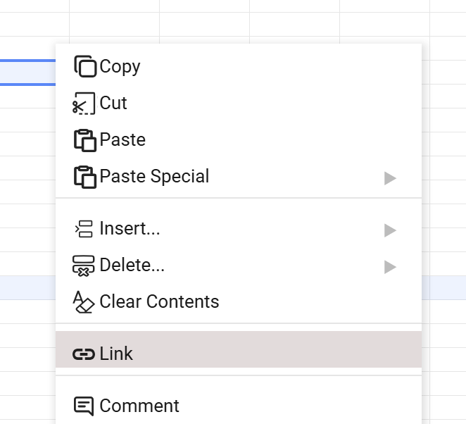
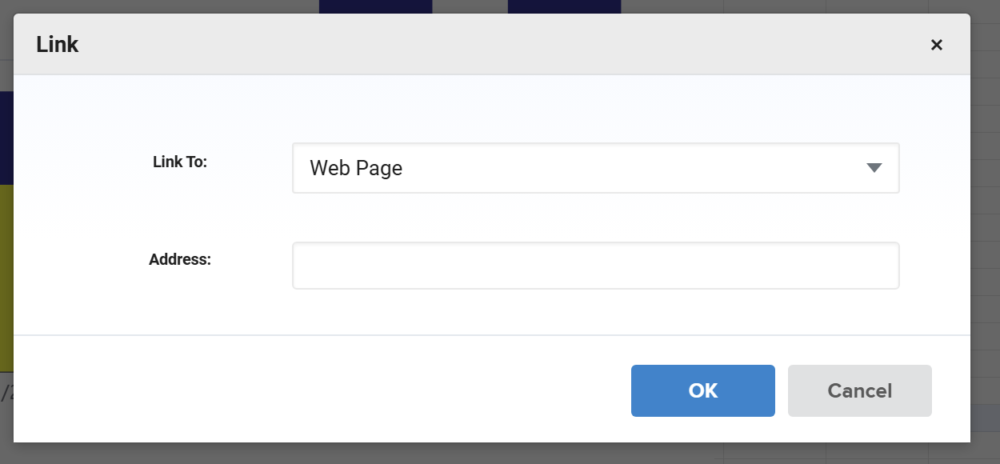
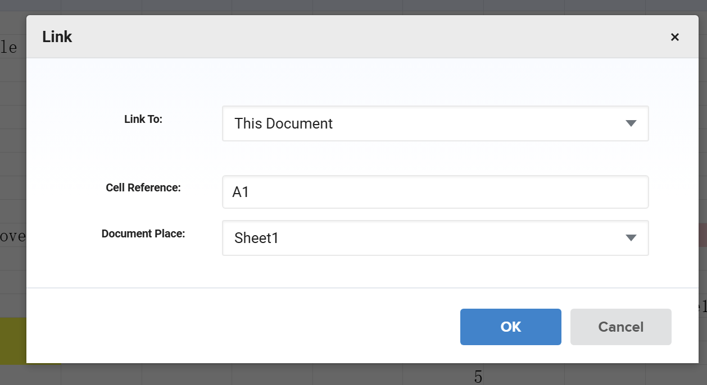
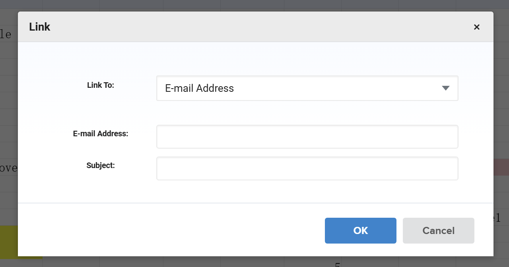
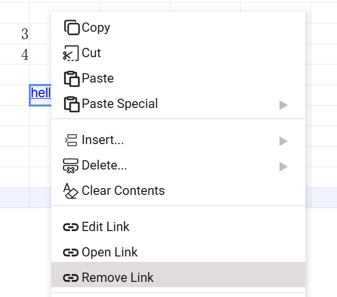

## Introduction

GridJS provides a `Link` entry in the **Insert** menu and in the cell context menu.
The link dialog supports three target types: `Web Page`, `This Document`, and `E-mail Address`.
When adding a cell link, GridJS stores link objects in `data.hyperlinks`, applies hyperlink style (`underline: true`, `color: #0000ff`), and updates clickable link positions on the sheet.
For web links, the dialog auto-adds `http://` when protocol is missing, and accepts only `http` or `https` URLs.

## How to use

1. Select the target cell or range.

2. Open the link dialog.
Use either:
- Insert menu: `Link`
- Right-click menu: `Link`


3. Choose `Link To` type and fill fields.
- `Web Page`: set `Address`.

- `This Document`: set `Document Place` and `Cell Reference` (for example `Sheet2!A1`).

- `E-mail Address`: set `E-mail Address` and `Subject`.


Click `OK`.


For a new range, GridJS adds a link object with `area`, `type`, `address` (and keeps cell text in `text`), then refreshes hyperlink style and hit-testing.

1. Open, edit, or remove the link.
- If the selected cell has a link, the context menu switches from `Link` to `Edit Link`, `Open Link`, and `Remove Link`.
- Clicking a linked cell opens the link (non-right-click path).
- `Remove Link` removes the link from `data.hyperlinks` and clears hyperlink style for that range.


## JavaScript API

You can set links through sheet data and reload it, because `hyperlinks` is part of `getData()` / `loadData()` payload.

```js
const xs = x_spreadsheet('#gridjs-demo', options);

const data = xs.getData();
const sheet = data[0];

sheet.hyperlinks = sheet.hyperlinks || [];
sheet.hyperlinks.push({
  area: 'B2:B2',
  type: 0, // 0=web, 2=email, 3=this document
  address: 'https://example.com',
  text: 'Example',
});

xs.loadData(data);
```

For runtime updates on the current sheet without rebuilding all data, you can mutate `xs.sheet.data.hyperlinks` and refresh link style/positions:

```js
const link = {
  area: 'C3:C3',
  type: 3,
  address: 'Sheet2!A1',
  text: 'Jump to Sheet2',
};

xs.sheet.data.hyperlinks.push(link);
xs.sheet.hyperlink.setHyperlinkStyleByArea(link.area, xs.sheet, true);
xs.sheet.hyperlink.loadLinkPosition(xs.sheet);
xs.sheet.table.render();
```

### Relevant functions

| Function | Description | Parameters | Returns |
|----------|-------------|------------|---------|
| `xs.getData()` | Gets workbook data including each sheet's `hyperlinks`. | none | `Array<sheetData>` |
| `xs.loadData(data)` | Loads workbook data; `hyperlinks` in payload is applied through data proxy. | `data:Array|Object` | `xs` |
| `xs.sheet.hyperlink.getSelectArea(range)` | Converts current range to `A1:B2` area string. | `range:{sri,sci,eri,eci}` | `string` |
| `xs.sheet.hyperlink.setHyperlinkStyleByArea(area, sheet, type)` | Applies or clears hyperlink style for all cells in area. | `area:string`, `sheet:Sheet`, `type:boolean` | `void` |
| `xs.sheet.hyperlink.loadLinkPosition(sheet)` | Rebuilds clickable hyperlink hit regions after data changes. | `sheet:Sheet` | `void` |
| `xs.sheet.hyperlink.access(hyperlink)` | Opens a hyperlink by type (`web/email` opens URL, `this document` jumps to sheet/cell). | `hyperlink:{type,address,...}` | `null|undefined` |

## Common Questions

Q: Why is my web link rejected?
A: The dialog only accepts `http://` or `https://` URLs. If protocol is missing, GridJS first normalizes it to `http://...`.

Q: Why do I see `Edit Link / Open Link / Remove Link` instead of `Link`?
A: Context menu visibility is switched by whether the selected cell already has a hyperlink.

Q: Why can't I add links on a locked sheet from context menu?
A: In locked mode, context-menu actions are hidden except copy-related actions and `Open Link`.

Q: How does `This Document` link navigate?
A: GridJS stores address as `SheetName!CellRef`; on open, it activates target sheet and then activates the target cell.
