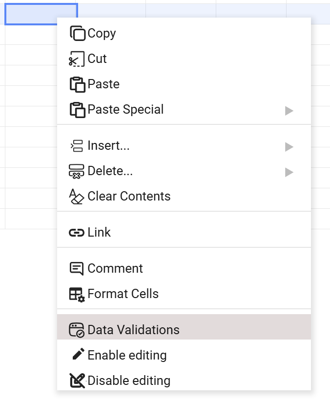
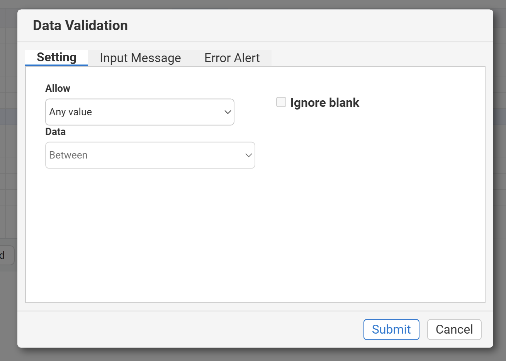
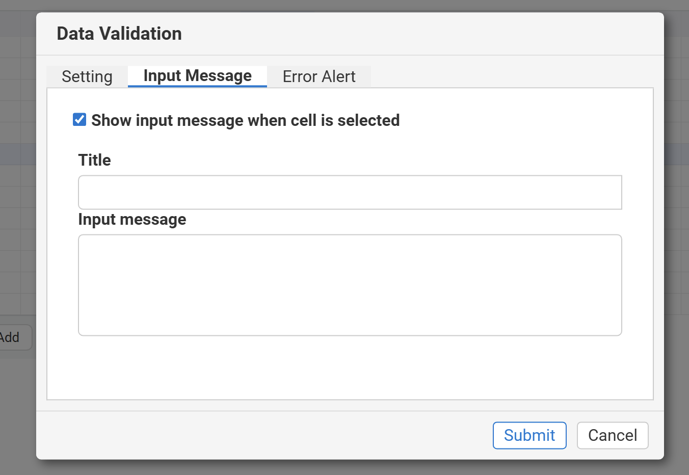
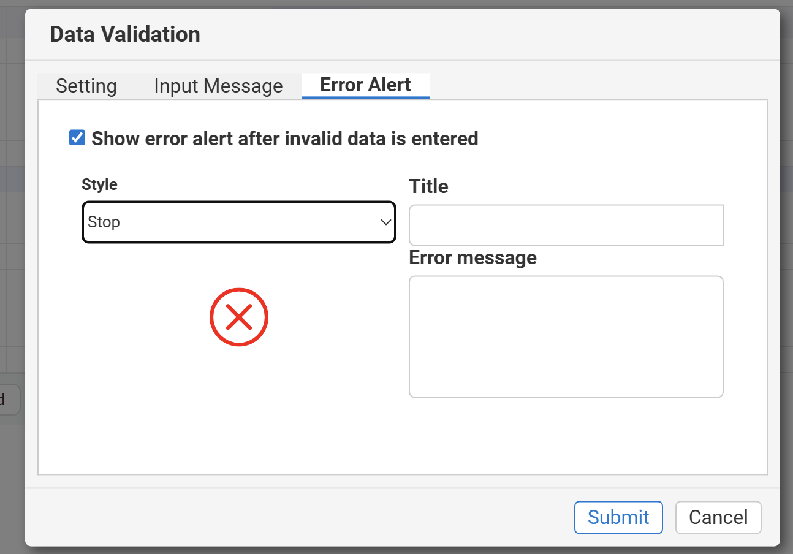

## Introduction
GridJS provides Data Validation entry points from both the top menu and the context menu, labeled `Data Validation` and `Data Validations`.
The Data Validation dialog contains three tabs: `Setting`, `Input Message`, and `Error Alert`.
In the `Setting` tab, you can configure `AnyValue / WholeNumber / Decimal / List / Date / Time / TextLength / Custom`, and the `Value1/Value2` (or `Source`) inputs are shown dynamically based on the selected `Allow` and `Data` options.
When `Allow` is set to `Date` or `Time`, the selected cells are also formatted as date/time after submission.

## How to use 
1. Select the target cell or range where you want to apply validation.

2. Open the Data Validation dialog.
Use either the context menu item `Data Validations` or the toolbar item `Data Validation`.


3. Configure rules in the `Setting` tab.
Set `Allow`, `Data`, and `Value1/Value2`; if `Allow = List`, enter the source in `Source`, and optionally enable `Allow multiple selection`.


4. Configure the `Input Message` tab.
Enable `Show input message when cell is selected`, then set the title and message.


5. Configure the `Error Alert` tab.
Enable `Show error alert after invalid data is entered`, then set `Style` (Stop/Warning/Information), title, and message.


6. Click `Submit` to save, then test input values in the target range.


## JavaScript API
Based on the current source code, you can apply validation rules programmatically through `xs.sheet.modalDataValidation.change(index, validation)`.

```js
xs = x_spreadsheet('#gridjs-demo-uid', option);

(async () => {
  // Select B2:B10 (0-based indexes)
  xs.sheet.selector.set(1, 1);
  xs.sheet.selector.setEnd(9, 1);

  await xs.sheet.modalDataValidation.change(-1, {
    allowtype: 'List',
    operatorfull: 'Between',
    ignoreblank: true,
    value1: '=D2:D6',
    value2: '',
    f1: '=D2:D6',
    f2: '',
    showinput: true,
    inputtitle: 'Allowed values',
    inputmessage: 'Please pick from the list, comma-separated for multiple values',
    showerror: true,
    alertstyle: 'warning',
    errortitle: 'Invalid input',
    errormessage: 'The value is not in the allowed list',
    ismultiple: true,
  });

  xs.sheet.table.render();
})();
```

### Relevant functions
| Function | Description | Parameters | Returns |
|----------|-------------|------------|---------|
| `xs.sheet.selector.set(ri, ci, indexesUpdated)` | Sets the selection start cell. | `ri:number`, `ci:number`, `indexesUpdated?:boolean` | `void` |
| `xs.sheet.selector.setEnd(ri, ci, moving)` | Sets the selection end cell to form the target range. | `ri:number`, `ci:number`, `moving?:boolean` | `void` |
| `xs.sheet.modalDataValidation.change(index, validation)` | Applies or updates Data Validation settings for the current selection. | `index:number` (use `-1` for new settings), `validation:object` | `Promise<void>` |
| `xs.sheet.data.checkValidation(ri, ci)` | Triggers server-side validation (used when formulas/custom conditions are involved). | `ri:number`, `ci:number` | `Promise<boolean>` |
| `xs.sheet.table.render()` | Re-renders the sheet view. | none | `void` |

## Common Questions
Q: Why is no input message shown when I select a validated cell?
A: `showinput` must be enabled, and both `inputtitle` and `inputmessage` must be non-empty.

Q: How does multiple selection work for `List` validation?
A: Enable `Allow multiple selection`; values are comma-separated and each item is validated against the list.

Q: What is the behavior difference among error alert styles?
A: `stop` shows `Retry`; `warning` shows `Yes/No`; `information` shows `OK`.

Q: Why does the cell display format change after choosing `Date` or `Time`?
A: Current implementation sets selected cell format to `date` or `time` when the validation is submitted.
