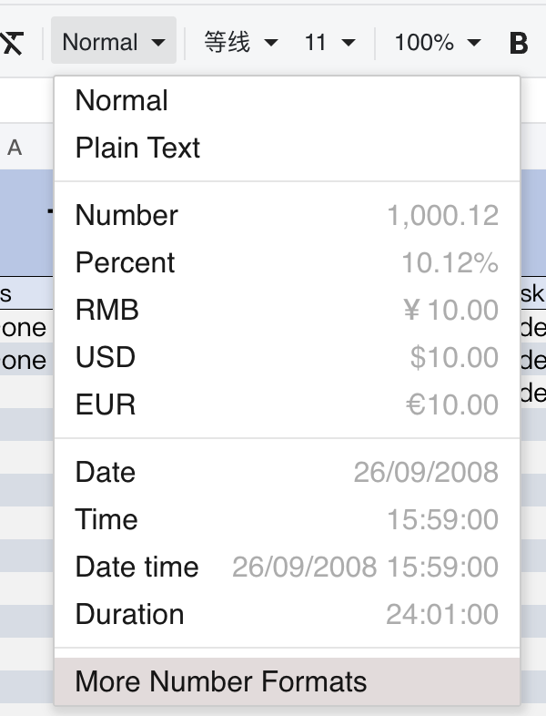
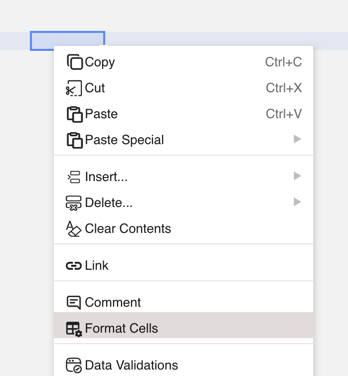
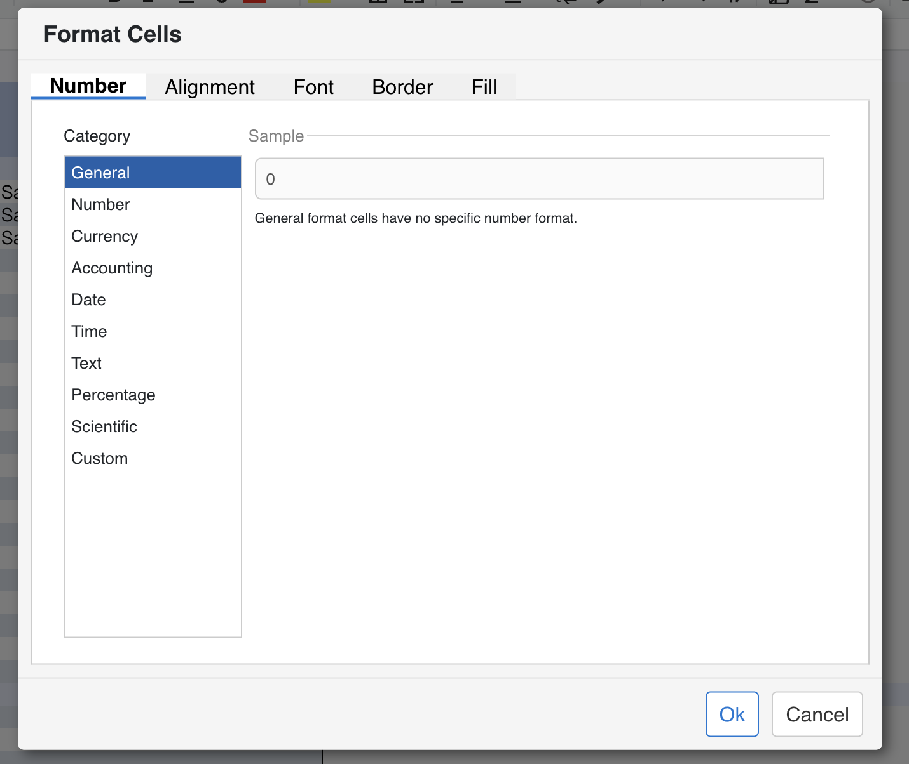
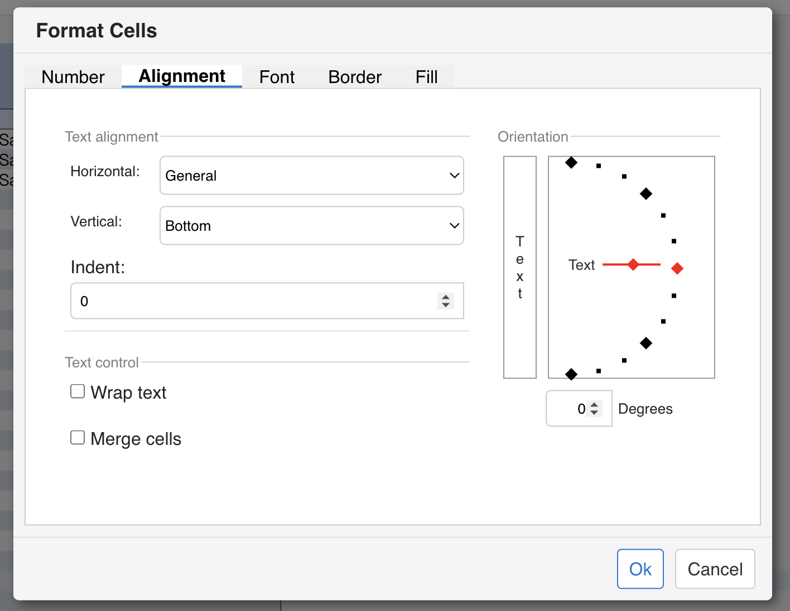
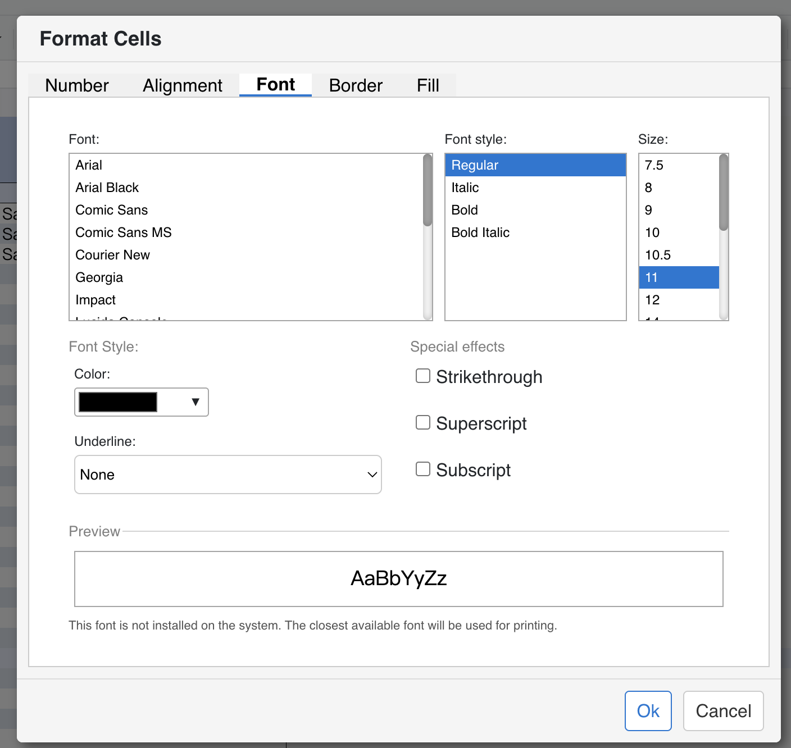
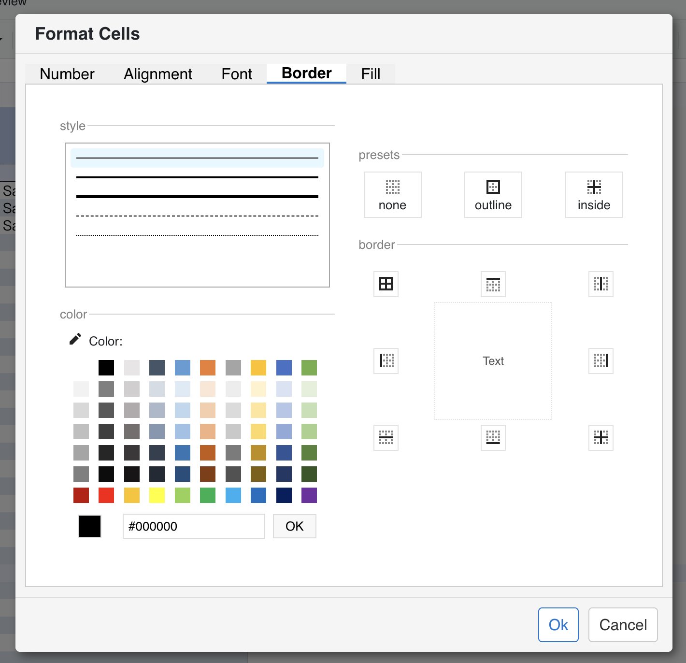
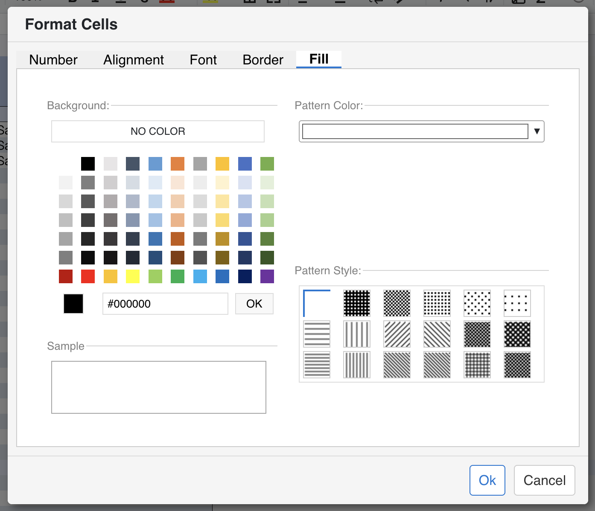

## Introduction
GridJS provides two related formatting entry points for cells.
The format dropdown offers built-in formats such as `Normal`, `Plain Text`, `Number`, `Percent`, `RMB`, `USD`, `EUR`, `Date`, `Time`, `Date time`, and `Duration`.
For more detailed formatting, GridJS opens the `Format Cells` dialog from the `More Number Formats` dropdown entry, the context-menu item `Format Cells`, or the `Ctrl+1` shortcut.
In the current source code, this dialog contains five tabs: `Number`, `Alignment`, `Font`, `Border`, and `Fill`.
The dialog does not submit everything through one identical path: number, alignment, font, and fill settings are collected into a style object, while merge and border actions are sent separately.

## How to use 
1. Select the target cell or range.
Both the quick format dropdown and the `Format Cells` dialog apply to the current selection.

3. Open `Format Cells`.
Use one of these entry points:
the `More Number Formats` item in the format dropdown, the context-menu item `Format Cells`, or `Ctrl+1`.



4. Use the `Number` tab.
The `Category` dropdown chooses the active number-format group.
The read-only `Sample` box previews the current format result for the selected cell value.
`Decimal places` is a numeric input limited to `0` through `99`, and changing it refreshes the sample.
`Use 1000 Separator` is shown for the `Number` category and toggles the generated custom format between grouped and ungrouped thousands.
`Symbol` is shown for `Currency` and `Accounting` and changes the currency symbol used by the generated format.
`Type` changes by category:
for `Number` and `Currency`, it selects the negative-number pattern;
for `Date` and `Time`, it selects one of the predefined date/time display patterns;
for `Custom`, it becomes editable so you can type or select a custom format string.
`General` and `Text` do not show format pickers; they display explanatory text instead.


5. Use the `Alignment` tab.
`Horizontal` selects `General`, `Left`, `Center`, or `Right`.
`Vertical` selects `Top`, `Center`, or `Bottom`.
`Indent` is a numeric input limited to `0` through `250`; when it becomes greater than `0`, the dialog forces horizontal alignment to `Left` unless the current alignment is already `Left` or `Right`.
`Wrap text` toggles the stored `textwrap` state.
`Merge cells` toggles the merge state for the selected range and is submitted separately from the style object.
The orientation area has three interactive parts:
the vertical-text button with stacked `Text` letters switches the dialog into vertical-text mode;
the angle diagram lets you drag the pointer or click near snap points;
the degrees input accepts values from `-90` through `90`.


6. Use the `Font` tab.
The `Font` list selects the font family from `baseFonts`.
The `Font style` list switches between `Regular`, `Italic`, `Bold`, and `Bold Italic`.
The `Size` list changes the font size.
The color button opens the font color palette; selecting a color updates the stored font color and refreshes the preview.
The `Underline` dropdown supports `None`, `Single`, `Double`, `Single Accounting`, and `Double Accounting`.
The `Strikethrough`, `Superscript`, and `Subscript` checkboxes toggle those effects; `Superscript` and `Subscript` are mutually exclusive in the current implementation.
The preview box redraws `AaBbYyZz` each time these controls change.


7. Use the `Border` tab.
The line-style list chooses the border stroke style such as `thin`, `medium`, `thick`, `dashed`, or `dotted`.
The border color palette changes the color used for the next border action.
The preset buttons work as follows:
`none` removes all borders,
`outline` applies borders to the outside of the selection,
`inside` applies borders to the inside edges of a multi-cell selection.
The preview action buttons around the sample grid apply specific modes:
top, left, right, and bottom apply one side;
`all` applies all sides;
`vertical` applies internal vertical borders;
`horizontal` applies internal horizontal borders;
`inside` applies both internal directions.
The sample preview updates immediately so you can see the active border state before pressing `Ok`.


8. Use the `Fill` tab.
The `NO COLOR` button clears the stored background color by setting it to the special `NO_COLOR` state.
The background color palette sets the base fill color.
The `Pattern Color` dropdown chooses the color used to draw the selected pattern.
Each pattern box in the pattern grid selects one pattern style such as `Solid`, `Gray75`, `Gray50`, stripe patterns, and crosshatch patterns.
The sample preview canvas redraws after every fill change.
When the selected pattern is `Solid`, the pattern color becomes the final visible fill color; otherwise the preview combines background color, pattern color, and pattern style.


9. Click `Ok` to apply the changes.
`Ok` collects the Number, Alignment, Font, and Fill settings into one style object, then applies merge and border actions separately.
`Cancel` restores the original number-format state from `currentStyle`, clears temporary dialog state, and closes the dialog.


## JavaScript API
Based on the current source code, you can use a quick built-in format through `setSelectedCellAttr('format', ...)`, or open the full dialog and apply the same tab-level updates programmatically.
For Number, Alignment, Font, and Fill, GridJS uses `formatUpdate`. For merge and borders, it uses separate range updates.
```js
const xs = x_spreadsheet('#gridjs-demo-uid', option);

// Select B2:D4.
xs.sheet.selector.set(1, 1);
xs.sheet.selector.setEnd(3, 3);

// Apply a built-in quick format.
xs.sheet.data.setSelectedCellAttr('format', 'number');

// Open the full dialog.
xs.sheet.modalMoreNumberFormats.show(1, 1);

// Open the Font tab.
const fontTabIndex = xs.sheet.modalMoreNumberFormats.tabComponent.tabs.findIndex(
  tab => tab.id === 'tabFont'
);
if (fontTabIndex >= 0) {
  xs.sheet.modalMoreNumberFormats.tabComponent.openTab(fontTabIndex);
}

// Apply Number / Alignment / Font / Fill style data.
xs.sheet.data.setRangeAttr(xs.sheet.data.selector.range, 'formatUpdate', {
  custom: '#,##0.00',
  align: 'right',
  valign: 'middle',
  textwrap: true,
  angle: 0,
  font: {
    name: 'Arial',
    size: 12,
    bold: true,
    italic: false,
  },
  color: '#c00000',
  underline: 'Single',
  strike: false,
  bgcolor: '#fff2cc',
});

// Apply merge from the Alignment tab.
xs.sheet.data.setRangeAttr(xs.sheet.data.selector.range, 'merge', true);

// Apply border actions from the Border tab.
xs.sheet.data.setRangeAttr(xs.sheet.data.selector.range, 'border', {
  mode: 'outside',
  style: 'thin',
  color: '#000000',
});

xs.sheet.table.render();
```

### Relevant functions
| Function | Description | Parameters | Returns |
|----------|-------------|------------|---------|
| `xs.sheet.data.setSelectedCellAttr('format', value)` | Applies one of the built-in format keys handled by the quick format workflow. | `value: 'normal' | 'text' | 'number' | 'percent' | 'rmb' | 'usd' | 'eur' | 'date' | 'time' | 'datetime' | 'duration'` | `void` |
| `xs.sheet.modalMoreNumberFormats.show(ri, ci, onFormatApplyCallback?)` | Opens the `Format Cells` dialog for the selected cell. | `ri?: number`, `ci?: number`, `onFormatApplyCallback?: function` | `void` |
| `xs.sheet.modalMoreNumberFormats.tabComponent.openTab(index)` | Switches the dialog to a specific tab after it is opened. | `index: number` | `void` |
| `xs.sheet.data.setRangeAttr(range, 'formatUpdate', style)` | Applies the style data used by the Number, Alignment, Font, and Fill tabs. The current implementation checks fields such as `custom`, `number`, `font`, `bgcolor`, `align`, `valign`, `pattern`, `pbgcolor`, `angle`, `textwrap`, `indent`, `color`, `strike`, and `underline`. | `range: CellRange`, `style: object` | `void` |
| `xs.sheet.data.setRangeAttr(range, 'merge', value)` | Applies the merge toggle used by the `Merge cells` checkbox in the Alignment tab. | `range: CellRange`, `value: boolean` | `void` |
| `xs.sheet.data.setRangeAttr(range, 'border', action)` | Applies one border action such as `outside`, `inside`, `top`, `bottom`, `left`, `right`, `all`, `horizontal`, `vertical`, or `none`. | `range: CellRange`, `action: { mode: string, style: string, color: string }` | `void` |

## Common Questions
Q: What is the difference between `Format` and `More Number Formats`?
A: `Format` applies a built-in format key such as `number`, `usd`, `date`, or `time`. `More Number Formats` opens the full `Format Cells` dialog and can submit richer tab-based changes.

Q: How can I open the full format dialog quickly?
A: The current code supports three entry points: the format dropdown item `More Number Formats`, the context-menu item `Format Cells`, and `Ctrl+1`.

Q: How many tabs does `Format Cells` currently have?
A: The current dialog contains five tabs: `Number`, `Alignment`, `Font`, `Border`, and `Fill`.

Q: Are border changes stored in the same style object as the other tabs?
A: No. In the current implementation, border actions are applied separately through `setRangeAttr(range, 'border', action)`.

Q: Which categories are available in the `Number` tab?
A: The current category list is `General`, `Number`, `Currency`, `Accounting`, `Date`, `Time`, `Text`, `Percentage`, `Scientific`, and `Custom`.
