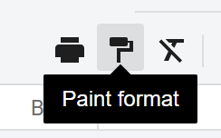
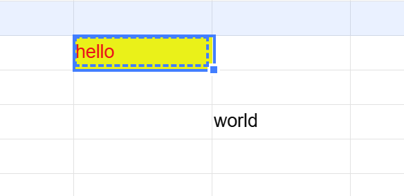
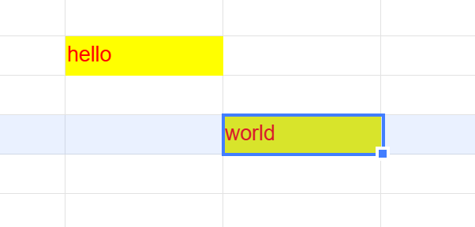

## Introduction

GridJs includes a **Paint format** toolbar button for copying formatting from the current selection and applying it to another target. When the button is turned on, the current selection is copied to the internal clipboard. After you click a target cell or range, GridJs performs a format-only paste, clears the clipboard, and turns the Paint format button off.

## How to use

1. Select the source cell or range that already has the formatting you want to reuse.

2. Click **Paint format** on the toolbar to turn it on.


3. Click the target cell or drag to the target range in the sheet. GridJs applies only the copied formatting to that selection.


4. After the format is applied once, the Paint format button is turned off automatically.

5. If you want to cancel before applying the format, click **Paint format** again to turn it off. GridJs clears the internal clipboard when the button is turned off.

6. Format paste does not run in read mode, and it also stops when the current target is locked.


## JavaScript API

```js
xs = x_spreadsheet('#gridjs-demo-uid', option);

// Copy the current selection into the internal clipboard.
xs.sheet.data.copy();

// Paste only the copied formatting into the current target selection.
await xs.sheet.data.pasteFromInternal('format');

// Toggle the toolbar button state if needed.
xs.sheet.toolbar.paintformatToggle();
```

### Relevant functions
| Function | Description | Parameters | Returns |
|----------|-------------|------------|---------|
| `sheet.data.copy()` | Copies the current selection into the internal clipboard. | None | `void` |
| `sheet.data.pasteFromInternal(what)` | Pastes from the internal clipboard into the current selection. The Paint format flow uses `format` so only formatting is pasted. | `what` (`'format'`, `'all'`, or other supported paste mode) | `Promise<boolean>` |
| `sheet.toolbar.paintformatActive()` | Returns whether the Paint format button is currently active. | None | `boolean` |
| `sheet.toolbar.paintformatToggle()` | Toggles the Paint format button state. | None | `void` |

The toolbar handler for Paint format first copies the current selection, and the next target selection triggers `paste('format')`, which internally calls `sheet.data.pasteFromInternal('format')`.

## Common Questions

Q: Does Paint format copy cell values too?
A: No. The Paint format flow calls a format-only paste, so it applies formatting without using the normal all-content paste path.

Q: How many times does Paint format stay active?
A: The code turns the Paint format button off after one format-only paste and clears the clipboard immediately after that paste finishes.

Q: Can I cancel Paint format before applying it?
A: Yes. Clicking the Paint format button again turns it off and clears the internal clipboard.

Q: When will Paint format not apply?
A: The paste handler returns immediately in read mode, and it also stops when the current target is locked.
