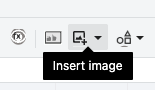
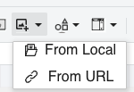

## Overview
You can place a picture inside any cell so that your data looks richer and easier to understand.  
For example, you can insert a product photo next to its price or add a company logo to the header row.

## How to use

#### Step-by-Step Instructions
**Step 1: Open the Insert Image menu**  
**Action**: Click the **Insert Image** dropdown button (it looks like a small picture icon) on the **Toolbar**.  
**You'll see**: A small menu appears with options such as **Upload Image** and **From URL**.  

**Step 2: Choose the source**  
**Action**: Select **From Local** to pick a file from your computer **or** select **From URL** to paste a web address.  
**You'll see**:  
- For **From Local** – a file‑picker dialog opens.  
- For **From URL** – a small **Insert Image URL** modal appears.  

**Step 3: Provide the image**  
- **From Local**: In the file‑picker, navigate to the picture file, click **Open**.  
- **From URL**: In the modal, paste the image URL into the text field.  
**You'll see**: The selected file name or the entered URL displayed in the dialog.  

**Step 4: Confirm insertion**  
**Action**: Click **Insert** (or **OK**) in the dialog.  
**You'll see**: The image appears inside the currently selected cell, scaled to fit the cell size.  

### 💡 Tips & Shortcuts
- **Quick tip**: After inserting, drag the cell’s corner to resize the image together with the cell.  
- **Watch out**: Only direct image URLs (ending with `.png`, `.jpg`, `.gif`, etc.) work in the **From URL** option.  
- **Pro move**: Use **Upload Image** for high‑resolution pictures; the sheet automatically compresses them for faster loading.  

## Common Questions
**Q: My picture looks stretched inside the cell.**  
**A**: The image scales to fit the cell dimensions. Resize the cell (drag the column/row borders) to adjust the picture’s aspect ratio.

**Q: Why does the image disappear after I save and reopen the file?**  
**A**: Images are stored as embedded data. Ensure you save the workbook using the **Save** button; the picture will be retained.

**Q: Is there a limit to the image size?**  
**A**: Images larger than 5 MB may be loading by long time. Resize large pictures before uploading.

**Q: Where can I find the Insert Image button if I don’t see it?**  
**A**: It’s on the main **Toolbar** near the **Fill Color** and **Border** icons. If the toolbar is collapsed, click the **≫** arrow to expand it.