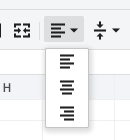
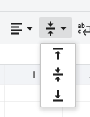

## Overview
Changing text alignment decides where the content sits inside a cell – left, center, right for horizontal positioning, and top, middle, bottom for vertical positioning. This helps make reports easier to read and gives a professional look.  
For example, you can align column headings to the center while keeping data rows left‑aligned.

## How to use

### Method A: Toolbar buttons (quickest way)

#### Step-by-Step Instructions

#### Step 1: Select the cells
**Action**: Click and drag the mouse over the cells you want to align.

**You'll see**: The selected range is highlighted with a blue border.


#### Step 2: Open the horizontal alignment menu
**Action**: Click the **Horizontal Align** button in the toolbar (icon shows three horizontal lines).

**You'll see**: A small dropdown appears with options **Left**, **Center**, **Right**.


#### Step 3: Choose a horizontal option
**Action**: Click **Center** (or **Left / Right** as needed).

**You'll see**: The text inside the selected cells moves to the chosen horizontal position.



#### Step 4: Open the vertical alignment menu
**Action**: Click the **Vertical Align** button in the toolbar (icon shows three vertical bars).

**You'll see**: A dropdown with options **Top**, **Middle**, **Bottom**.


#### Step 5: Choose a vertical option
**Action**: Click **Middle** (or **Top / Bottom** as needed).

**You'll see**: The text shifts vertically inside each cell to the selected position.



### Method B: Format Cells dialog (full control)

#### Step-by-Step Instructions

#### Step 1: Select the cells
**Action**: Click and drag to highlight the range you want to format.

**You'll see**: The cells are surrounded by a blue outline.


#### Step 2: Open the Format Cells dialog
**Action**: Right‑click the selection and choose **Format Cells…** from the context menu, or press **Ctrl + 1**.

**You'll see**: A modal window titled **Format Cells** with several tabs.


#### Step 3: Switch to the Alignment tab
**Action**: Click the **Alignment** tab at the top of the dialog.

**You'll see**: Sections for **Horizontal**, **Vertical**, and additional text‑control options.


#### Step 4: Set horizontal alignment
**Action**: In the **Horizontal:** dropdown, pick **Center** (or **Left / Right / General**).

**You'll see**: The dropdown shows the chosen value.


#### Step 5: Set vertical alignment
**Action**: In the **Vertical:** dropdown, pick **Middle** (or **Top / Bottom**).

**You'll see**: The dropdown updates to the selected vertical option.


#### Step 6: Apply the changes
**Action**: Click the **OK** button at the bottom of the dialog.

**You'll see**: The selected cells instantly reflect the new alignment settings.


### 💡 Tips & Shortcuts
- **Quick tip**: Press **Alt + H** then **A** to jump straight to the Horizontal Align toolbar dropdown.  
- **Quick tip**: Press **Alt + H** then **V** for the Vertical Align toolbar dropdown.  
- **Watch out**: Alignment changes only affect the view; they do not alter the underlying data.  
- **Pro move**: Use the Format Cells dialog if you also need to adjust text rotation or wrap settings at the same time.

## For Developers: JavaScript API
You can change alignment programmatically with GridJs’s public API.

### Quick Example
```javascript
// xs is the GridJs instance already attached to the sheet
// Align the currently selected range to center horizontally and middle vertically

// Horizontal alignment
xs.sheet.data.setRangeAttr(
  xs.sheet.data.selector.range,   // the range that is currently selected
  'align',                        // property name for horizontal alignment
  'center'                        // possible values: 'left', 'center', 'right'
);

// Vertical alignment
xs.sheet.data.setRangeAttr(
  xs.sheet.data.selector.range,
  'valign',                       // property name for vertical alignment
  'middle'                        // possible values: 'top', 'middle', 'bottom'
);
```

### API Reference
| Method | Parameters | Description |
|--------|------------|-------------|
| `setRangeAttr(range, property, value)` | `range: object` – the cell range (e.g., `xs.sheet.data.selector.range`)<br>`property: string` – `'align'` or `'valign'`<br>`value: string` – alignment value (`'left'`, `'center'`, `'right'`, `'top'`, `'middle'`, `'bottom'`) | Sets the specified alignment attribute for the given cell range. |
| `xs.sheet.data.selector.range` | *none* | Returns the currently selected cell range object used in `setRangeAttr`. |

*Note*: The API works on any selected range, not just a single cell.

## Common Questions

**Q: My text isn’t aligning the way I selected. Why?**  
**A**: Make sure the cells are still selected when you click the alignment button or OK in the dialog. Changing the selection clears the pending alignment command.

**Q: Can I align text diagonally or at a custom angle?**  
**A**: The built‑in alignment options cover only horizontal (left/center/right) and vertical (top/middle/bottom). Diagonal or custom angles are not supported in this version.

**Q: Will alignment affect printing?**  
**A**: Yes. Alignment settings are preserved in the printed output, just like they appear on the screen.

**Q: I want to align a whole column quickly. Is there a shortcut?**  
**A**: Click the column header to select the entire column, then use the toolbar alignment buttons or the Format Cells dialog as described above.

**Q: How do I reset a cell to the default alignment?**  
**A**: Open the Format Cells dialog → Alignment tab → set **Horizontal** to **General** and **Vertical** to **Bottom**, then click **OK**. Or programmatically set `'align'` to `'general'` and `'valign'` to `'bottom'`.