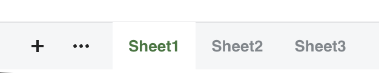
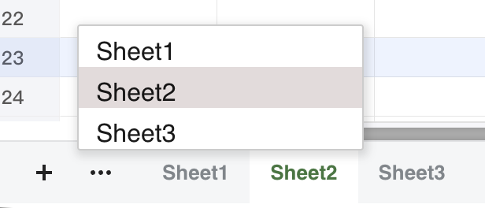
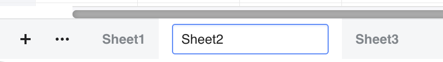
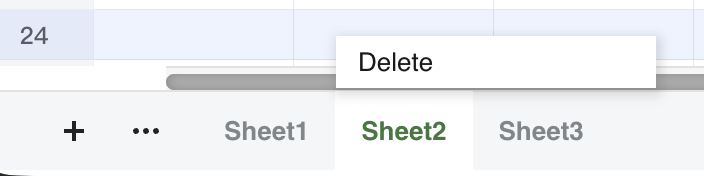

## Introduction

GridJs manages worksheets through the bottom bar. In edit mode, the bottom bar shows an add button, lets you click a tab to switch sheets, lets you double-click a tab to rename it inline, and provides a tab context menu with **Delete Sheet**. The worksheet actions are blocked when the workbook is protected, and adding a sheet is also blocked for `.csv`, `.tsv`, and workbooks that already have 50 sheet names in the bottom bar.

## How to use

1. Open GridJs in edit mode if you want to add, rename, or delete worksheets. In read mode, the bottom bar still supports clicking tabs to switch sheets, but the add button and edit-only tab events are not attached.
2. 


1. Click the add button in the bottom bar to create a worksheet. If no name is supplied by the caller, GridJs generates the first unused name in the `Sheet1`, `Sheet2`, `Sheet3` sequence.

2. Click a worksheet tab to switch to that sheet. GridJs triggers `sheet-selected`, switches the sheet page, resets the active sheet data, resets pagination, moves the vertical scrollbar to the top, and reapplies the target sheet zoom level.

3. If the target sheet uses lazy loading and a lazy-loading URL is configured, GridJs loads that sheet first and then switches to it.



5. Double-click a worksheet tab to rename it. GridJs replaces the tab text with an inline input and commits the rename when the input loses focus.


6. Use a valid worksheet name when you rename a tab. The code rejects names longer than 31 characters, duplicate worksheet names, and names that contain any of these characters: `:`, `\`, `/`, `?`, `*`, `[`, `]`.



7. Right-click a worksheet tab and choose **Delete Sheet** to remove it. The delete action runs only when more than one worksheet tab exists.



8. If you delete the active sheet, GridJs activates the first remaining worksheet tab and resets the sheet view to that sheet.

## JavaScript API

```js
const xs = x_spreadsheet('#gridjs-demo-uid', options);

// Add a worksheet and make it active.
const summarySheet = xs.addSheet('Summary', true, '#dbeafe', '#1e3a8a');

// Switch to a worksheet by tab name.
xs.setActiveSheetByName('Summary');

// Rename the worksheet at index 0.
xs.renameSheet(0, 'Input');

// Delete the current sheet.
xs.deleteSheet();

// The implementation also accepts a sheet name.
xs.deleteSheet('Summary');
```

### Relevant functions
| Function | Description | Parameters | Returns |
|----------|-------------|------------|---------|
| `addSheet(name, active = true, tabcolor, fontcolor)` | Creates a new `DataProxy`, adds a new bottom-bar tab, and sends an `op: 'add'` request when the workbook is not in the initial loading path. | `name`: worksheet name or `null`; `active`: whether the new tab is active; `tabcolor`: tab background color; `fontcolor`: tab text color | `DataProxy` |
| `setActiveSheetByName(sheetname)` | Finds the matching bottom-bar tab and switches to it through the same tab-click flow used by the UI. | `sheetname`: worksheet name | `Spreadsheet` |
| `renameSheet(index, value)` | Replaces the worksheet name in `datas[index]` and sends an `op: 'rename'` request. | `index`: worksheet index; `value`: new worksheet name | `void` |
| `deleteSheet(sheetname)` | Removes a worksheet tab, sends an `op: 'del'` request for the removed sheet, and resets the active sheet when needed. | `sheetname`: optional worksheet name; when omitted, the current tab context target is used | `void` |

The inspected `index.d.ts` file declares `deleteSheet(): void`. The `index.js` implementation also includes `addSheet(...)`, `setActiveSheetByName(...)`, `renameSheet(index, value)`, and an optional `sheetname` parameter for `deleteSheet(sheetname)`.

## Common Questions

Q: Can I add, rename, or delete worksheets when the workbook is protected?
A: No. The add, rename, and delete handlers check `wprotected` and stop with an error toast when workbook protection is active.

Q: Can I add worksheets to a CSV or TSV file?
A: No. The add-button handler stops immediately and shows a warning when `uniqueid` ends with `.csv` or `.tsv`.

Q: What name validation does GridJs apply when I rename a worksheet tab?
A: The rename code rejects names longer than 31 characters, duplicate names, and names that contain `:`, `\`, `/`, `?`, `*`, `[`, or `]`.

Q: What happens when I delete the active worksheet tab?
A: If more than one tab exists, GridJs removes the tab, selects the first remaining tab, and resets the sheet data to that remaining worksheet.
