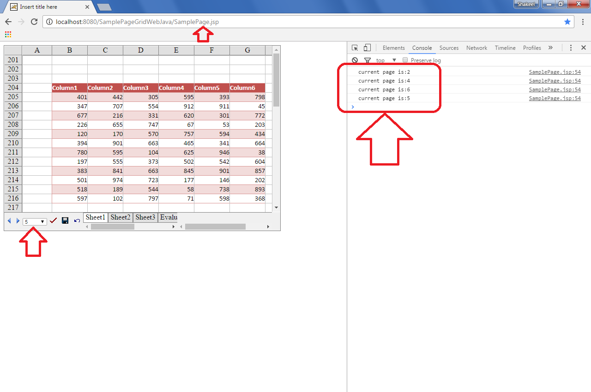

## **Possible Usage Scenarios**
Sometimes you need to execute your client-side function when the GridWeb page changes. Aspose.Cells.GridWeb provides the OnPageChangeClientFunction property for this purpose. Please set this property with the client-side function you want to execute.

## **Execute client-side function on GridWeb page change**
The following Java code explains how to make use of the `GridWebBean.setOnPageChangeClientFunction()` property. It sets the property with the client-side function named `MyOnPageChange`. Please note, this property is valid only if you have enabled paging, i.e., `GridWebBean.setEnablePaging(true)`. Now, whenever you change the GridWeb page, it will call the client-side function `MyOnPageChange` which prints the **current page index** on the **console** as shown in this screenshot.

## **Sample Code**
This is the code of the client-side function `MyOnPageChange` that will be executed because of this line, i.e., `GridWeb.setOnPageChangeClientFunction("MyOnPageChange");`


function MyOnPageChange(index) {
    console.log("current page is:" + (index + 1));
}


The following code explains how to enable paging and set the `OnPageChangeClientFunction` property.


GridWebBean gridweb = BeanManager.getBean(request);
gridweb.setEnablePaging(true);
gridweb.setOnPageChangeClientFunction("MyOnPageChange");

