## **Basics of GridWeb**
Aspose.Cells.GridWeb is a GUI‑based web control that can be embedded in JSP web pages or any HTML page in a Java server.  

It is easy and simple to use.  

It helps you to build an online web editor for spreadsheet files quickly.  

It also supports importing and exporting all kinds of spreadsheet format files, which are 100% compatible with Microsoft Excel files.

## **Aspose.Cells.GridWeb - Demos**

To get you up and running quickly, we provide a number of code examples and demos that show how to use the Aspose.Cells.GridWeb API.

Please download the demos from the below link:  
[Aspose.Cells.GridWeb Demos](https://github.com/aspose-cells/Aspose.Cells.Grid-for-Java/tree/master/Examples.GridWeb)

## **How to run Aspose.Cells for GridWeb Java Demos**
{} 

Aspose.Cells for GridWeb Java demos are easy to run. You just need to deploy **gridwebdemo.war** in your web server. Please download the demos from this [link](https://forum.aspose.com/uploads/discourse_instance3/22292).

This article describes how to run Aspose.Cells for GridWeb Java Demos in Apache Tomcat Server.

{} 
### **Step by Step Guide to Run GridWeb Java Demos**
1. Extract **apache-tomcat-7.0.52.zip** in any directory, e.g., `C:\Tomcat`  

   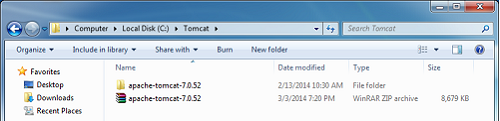

2. The following snapshot shows the extracted directories and files of the Apache Tomcat server  

   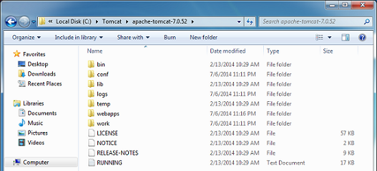

3. You might also need to set the environment variable **CATALINA_HOME**  

   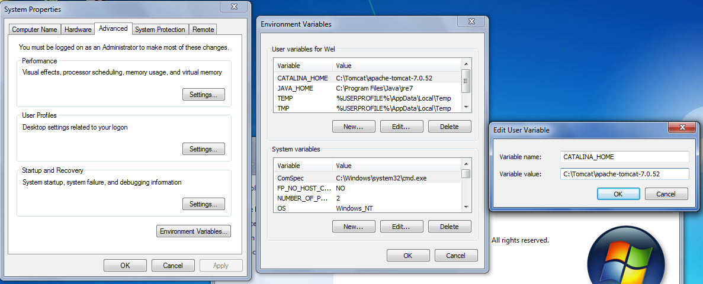

4. Open the **tomcat‑users.xml** file.  

   

5. Add this user:

   
   <role rolename="manager-gui"/>
   <user username="tomcat" password="secret" roles="manager-gui"/>
   

   **Here, the username is `tomcat` and the password is `secret`.**  

   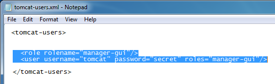

6. Run the **startup.bat** file. It will start the Apache Tomcat Server.  

   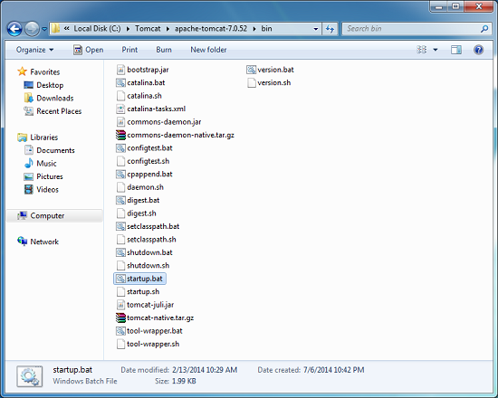

   **Tomcat server running in a command window**  

   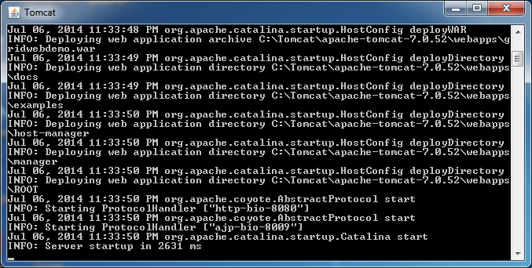

7. Now open the browser and type **localhost:8080**. The Apache Tomcat web page is displayed.  

   **The Apache Tomcat web page**  

   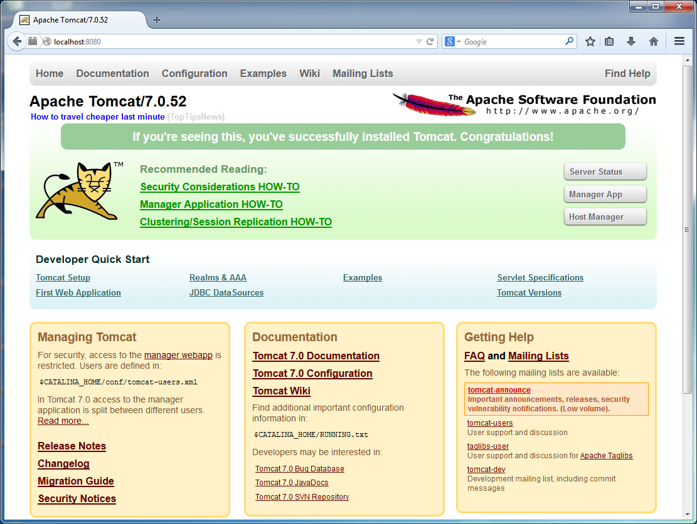

8. Click **Manager App** and type the username and password. (As above: `tomcat`, `secret`)  

   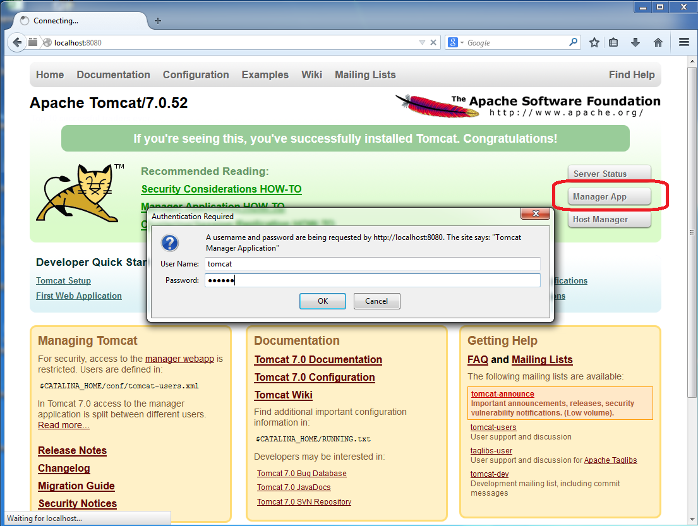

9. Scroll down to the section **WAR file to deploy** and browse to the **gridwebdemo.war** file.  

10. Click **Deploy**.  

    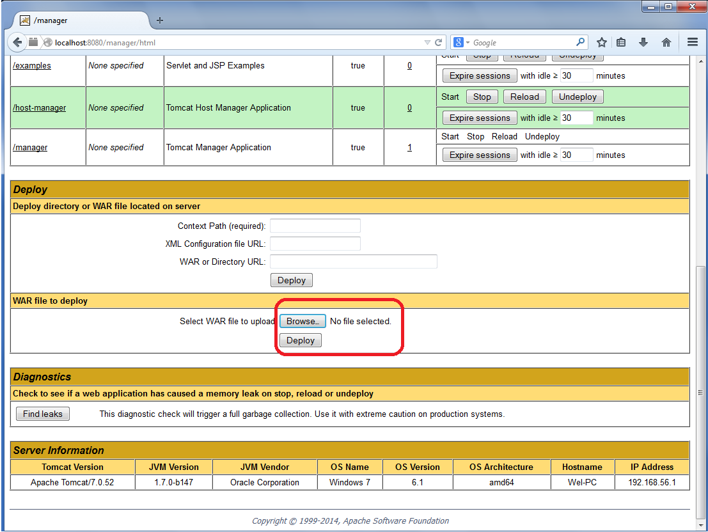

11. Browse the **gridwebdemo.war** file.  

    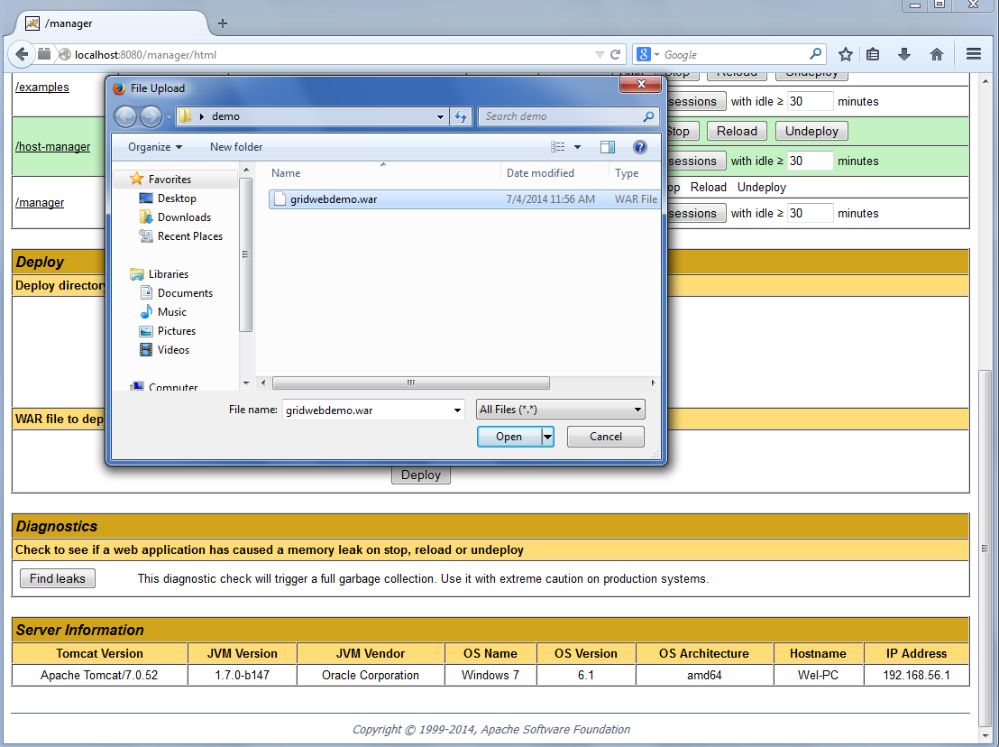

12. Click **Deploy**.  

    

13. Once it is deployed, click **/gridwebdemo** and start running demos.  

    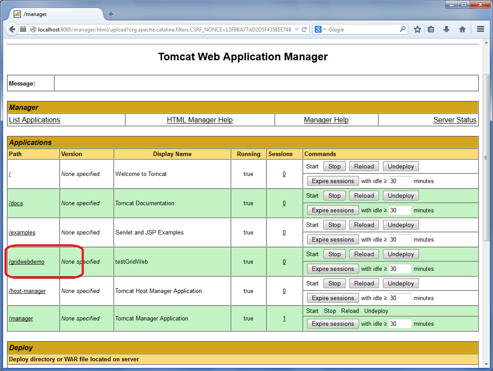

    The GridWeb Demo page is displayed.  

    **The GridWeb Demo page**  

    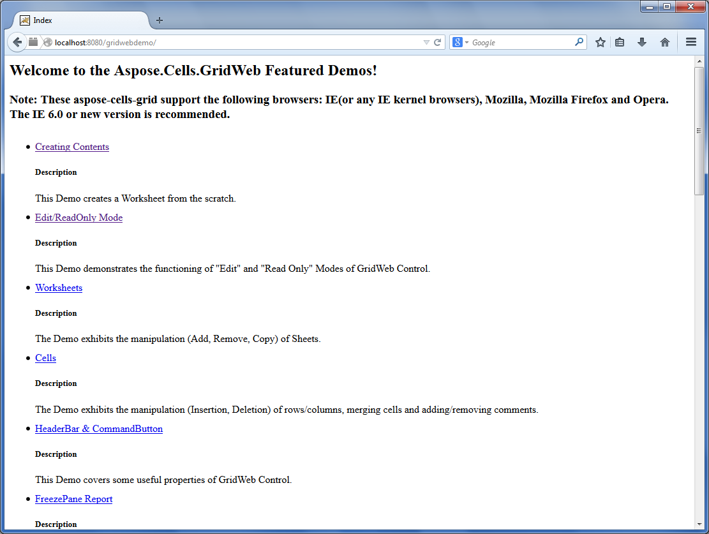

14. Click any demo and run it.  

    **Creating contents demo running**  

    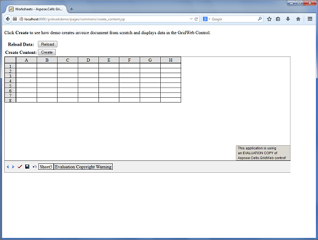

    **Worksheets demo running**  

    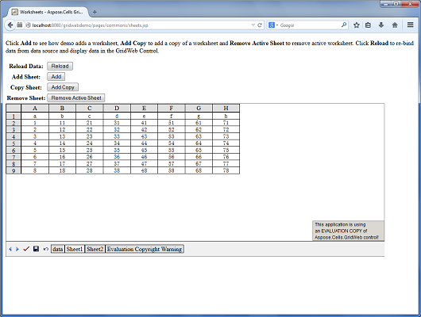

    **HeaderBar and CommandButton demo running**  

    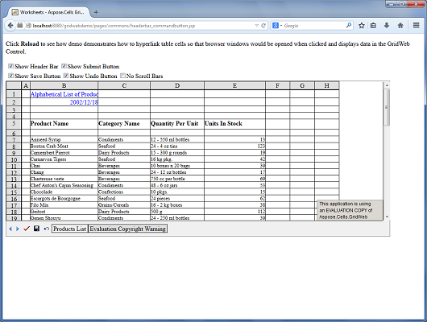

## **Browsers Capabilities and Aspose.Cells.GridWeb**
Aspose.Cells.GridWeb is a GUI‑based web control that can be embedded in JSP web pages like other web controls. The most important aspect of a web control is providing cross‑browser support. Aspose.Cells.GridWeb provides cross‑browser support.
### **Comparison**
Aspose.Cells.GridWeb is fully supported on Microsoft’s Internet Explorer (IE). However, on other browsers, it has minor limitations. This topic provides a detailed comparison of which features are supported by different browsers.

| **Client Side Features** | **Microsoft Internet Explorer** | **Google Chrome** | **Mozilla Firefox** | **Opera** |
| :- | :- | :- | :- | :- |
| Context Menu of Cell |  |  |  |  |
| Client Side Validation |  |  |  |  |
| Double Click Event |  |  |  |  |
| DropDownList (*ComboBox Mode*) |  |  |  |  |
| DropDownList (*Popup Menu Mode*) |  |  |  |  |
| Formula Input/Edit |  |  |  |  |
| Freeze or Unfreeze Rows/Columns |  |  |  |  |
| Hyperlinks (*CellCommand Mode*) |  |  |  |  |
| Hyperlinks (*URL Mode*) |  |  |  |  |
| Merge or Unmerge Cells |  |  |  |  |
| Multiple Cells Copy/Paste |  |  |  |  |
| Multiple Cells Input/Edit, Single Postback |  |  |  |  |
| Number Format |  |  |  |  |
| Sheet Paging |  |  |  |  |
| Read‑only Cells |  |  |  |  |
| Read‑only Rows/Columns |  |  |  |  |
| Data Validation using Regular Expressions |  |  |  |  |
| Resize Column Width |  |  |  |  |
| Resize Row Height |  |  |  |  |
| Insert/Delete Rows & Columns |  |  |  |  |
| Scroll Content |  |  |  |  |
| Scroll Sheet Tabs |  |  |  |  |
| Set Borders of Cells |  |  |  |  |
| Set Font Settings of Cells |  |  |  |  |
 Context menu of a cell can only be activated by clicking the client‑side menu button.
