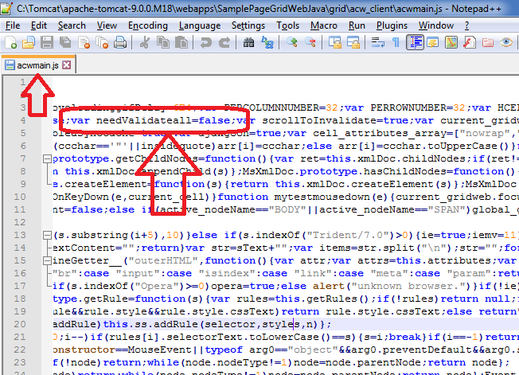

## **Possible Usage Scenarios**
By default, GridWeb validates only the updated cells and does not validate the entire worksheet. However, if you want to validate the entire worksheet on the client side before GridWeb posts a request to the server, then you should set the needValidateall variable inside the acwmain.js to true.

## **Validate entire worksheet instead of only the updated cells**
The following screenshot displays the needValidateall variable in acwmain.js. Please set it to true, and now GridWeb will validate the entire worksheet, not just the updated cells.

