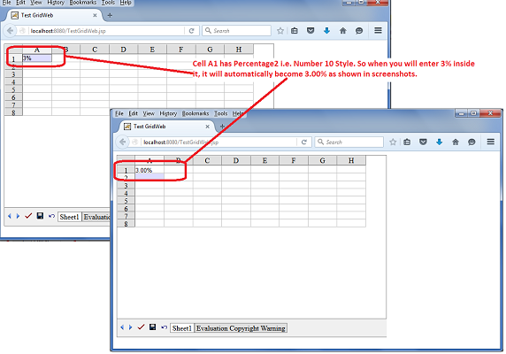

---  
title: Working with Cells GridWeb  
type: docs  
weight: 50  
url: /java/working-with-cells-gridweb/  
ai_search_scope: cells_java
ai_search_endpoint: "https://docsearch.api.aspose.cloud/ask"
---  

## **Accessing Cells in the Worksheet**  
This topic discusses cells, looking at GridWeb's most basic feature: accessing cells.  

Each worksheet contains a GridCells object, a collection of GridCell objects. A GridCell object represents a cell in Aspose.Cells.GridWeb. It is possible to access any cell using GridWeb. There are two preferred methods:  

- [Accessing the cell by name](/cells/java/working-with-cells-gridweb/).  
- [Accessing the cell by row and column indices](/cells/java/working-with-cells-gridweb/).  

Below, each approach is discussed.  

### **Using Cell Name**  
All cells have a unique name. For example, A1, A2, B1, B2, etc. Aspose.Cells.GridWeb allows developers to access any desired cell by using the cell name. Simply pass the cell name (as an index) to the GridCells collection of the GridWorksheet.  

  

### **Using Row & Column Indices**  
A cell can also be recognized by its location in terms of row and column indices. Just pass a cell's row and column indices to the GridCells collection of the GridWorksheet. This approach is faster than the above one.  

  

## **Accessing and Modifying the Value of a Cell**  
[Accessing Cells in the Worksheet](/cells/java/working-with-cells-gridweb/#workingwithcellsgridweb-accessingcellsintheworksheet) discussed accessing cells. This topic extends that discussion to show how to access and modify cell values using the GridWeb API.  

### **Accessing & Modifying a Cell's Value**  

#### **String Values**  
Before accessing and modifying the value of a cell, you need to know how to access cells. For details about the different approaches for accessing cells, refer to [Accessing Cells in the Worksheet](/cells/java/working-with-cells-gridweb/#workingwithcellsgridweb-accessingcellsintheworksheet).  

Each cell has a property named `getStringValue()`. Once a cell is accessed, developers can use the `getStringValue()` method to obtain the cell's string value.  

{}  

**IMPORTANT:** Five types of values (Boolean, int, double, DateTime and string) can be stored in cells, but the `getValue()/setValue()` method(s) can only be used to access/modify object values.  

{}  

  

#### **All Types of Values**  
Aspose.Cells.GridWeb also provides a special method, the `putValue` method, for each cell. With this method, it is possible to insert or modify any type of value (Boolean, int, double, DateTime and string) in a cell.  

  

There is also an overloaded version of the `putValue` method that can take any kind of value in string format and convert it to a proper data type automatically. To make it happen, pass the Boolean value `true` to another parameter of the `putValue` method as shown below in the example.  

  

## **Adding Formulas to the Cells**  
The most valuable feature offered by Aspose.Cells.GridWeb is support for formulas or functions. Aspose.Cells.GridWeb has its own Formula Engine that calculates the formulas in worksheets. Aspose.Cells.GridWeb supports both built‑in and user‑defined functions or formulas. This topic discusses adding formulas to cells using Aspose.Cells.GridWeb API in detail.  

### **How to Add & Calculate a Formula?**  
It is possible to add, access and modify formulas in cells by using a cell's `Formula` property. Aspose.Cells.GridWeb supports user‑defined formulas ranging from simple to complex. However, a large number of built‑in functions or formulas (similar to Microsoft Excel) are also supplied with Aspose.Cells.GridWeb. To see the full list of built‑in functions, please refer to this [list of supported functions.](/cells/net/list-of-supported-functions/)  

{}  

The formula syntax should be compatible with Microsoft Excel syntax. For example, all formulas must begin with an equal sign (=).  

To add a formula programmatically, Aspose.Cells.GridWeb will recognize it as a formula even if you don't use an **=** sign, but end users working in the GUI must use it.  

{}  

  

**Formula added to B3 cell but not calculated by GridWeb**  

  

In the above screenshot, you can see that a formula has been added to B3 but has not been calculated yet. To calculate all formulas, call the GridWeb control's `GridWorksheetCollection`'s `calculateFormula` method after adding formulas to worksheets as shown below.  

  

Users can also calculate formulas by clicking **Submit**.  

**Clicking Submit button of GridWeb**  

  

**IMPORTANT:** If a user clicks the **Save** or **Undo** buttons, or the sheet tabs, all formulas are calculated by GridWeb automatically.  

**Formula result after calculation**  

  

### **Referencing Cells from Other Worksheets**  
Using Aspose.Cells.GridWeb, it is possible to reference values stored in different worksheets in their formulas, creating complex formulas.  

The syntax for referencing a cell value from a different worksheet is `SheetName!CellName`.  

  

## **Create Data Validation in a GridCell of GridWeb**  
Aspose.Cells.GridWeb allows you to add **Data Validation** using the `GridWorksheet.getValidations().add()` method. Using this method, you must specify the **Cell Range**. However, if you want to create data validation in a single GridCell, you can do it directly using the `GridCell.createValidation()` method. Similarly, you can remove **Data Validation** from a GridCell using the `GridCell.removeValidation()` method.  

The following sample code creates a **Data Validation** in cell B3. If you enter any value that is not between 20 and 40, cell B3 will show a **Validation Error** in the form of **Red XXXX**, as shown in this screenshot.  

  

  

## **Creating Custom Command Buttons**  
Aspose.Cells.GridWeb contains special buttons like Submit, Save, and Undo. All these buttons perform specific tasks for Aspose.Cells.GridWeb. It is also possible to add custom buttons that perform custom tasks. This topic explains how to use this feature.  

The following sample code explains how to create a custom command button and how to handle its click event. You can use any icon for your custom command button. For illustration purposes, we used this image icon.  

  

As you can see in the following screenshot, when the user clicks the custom command button, it adds the text in cell A1 saying **"My Custom Command Button is Clicked."**  

  

  

### **Event Handling of Custom Command Button**  
The following sample code explains how to perform event handling of a custom command button.  

  

## **Formatting cells for GridWeb**  

### **Possible Usage Scenarios**  
GridWeb now supports users to enter cell data in percentage format like **3%**, and the data in the cell will automatically be formatted as **3.00%**. However, you will have to set the cell style to Percentage Format, which is either `GridTableItemStyle.NumberType` of **9** or **10**. The number **9** will format **3%** as **3%**, but the number **10** will format **3%** as **3.00%**.  

{}  

If you have not set the cell style to Percentage Format, then input data **3%** will display as **0.03**.  

{}  

### **Enter Cell Data of GridWeb Worksheet in Percentage Format**  
The following sample code sets cell **A1** `GridTableItemStyle.NumberType` as **10**, therefore the input data **3%** will automatically be formatted as **3.00%**, as shown in the screenshot.  

  

### **Sample Code**  
  
