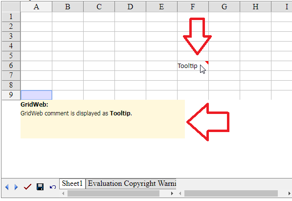

## **Possible Usage Scenarios**
The following article explains how to create, remove, and get GridCell comments inside the GridWeb worksheet. It is worth noting that GridWeb displays comments as tooltips, like MS Excel, when you hover the mouse over the cell, as shown in this screenshot.

## **Create a Comment object inside a Cell**
Please use the GridCell.CreateComment method to create a comment object inside a cell. The following sample code creates a sample comment in cell B4 of the first worksheet of GridWeb.



 // Access first worksheet of GridWeb

GridWorksheet sheet = GridWeb1.getWorkSheets().get(0);

// Access cell B4

GridCell cell = sheet.getCells().get("B4");

// Create comment with these parameters

// i.e. note, author, isVisible

cell.createComment("This is a B4 note.", "Peter", true);



## **Remove a Comment object from a Cell**
Please use the GridCell.RemoveComment method to remove a comment object from a cell. The following sample code removes the comment from cell B4 in the first worksheet of GridWeb.



 // Access first worksheet of GridWeb

GridWorksheet sheet = GridWeb1.getWorkSheets().get(0);

// Access cell B4

GridCell cell = sheet.getCells().get("B4");

// Remove the comment object from this cell.

cell.removeComment();



## **Get a Comment object from a Cell**
Please use the GridCell.GetComment() method to get a comment object from a cell. The following sample code gets the comment object from cell B4 and then accesses its various properties, such as Author, Note, Visibility, etc.



 // Access first worksheet of GridWeb

GridWorksheet sheet = GridWeb1.getWorkSheets().get(0);

// Access cell B4

GridCell cell = sheet.getCells().get("B4");

// Get comment of this cell

GridComment gridComm = cell.getComment();

// Access its various properties

String strAuth = gridComm.getAuthor();

String strNote = gridComm.getNote();

boolean isVis = gridComm.isVisible();


