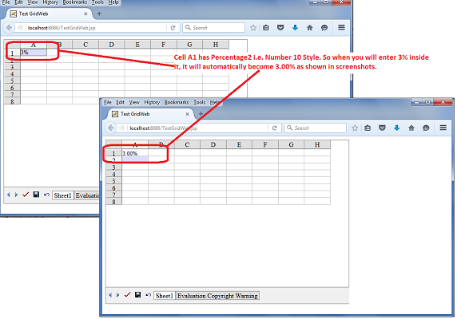

## **Possible Usage Scenarios**
GridWeb now supports users in entering cell data in percentage format, such as 3%, and the data in the cell will automatically be formatted as 3.00%. However, you must set the cell style to Percentage Format, which is either `GridTableItemStyle.NumberType` set to 9 or 10. The value 9 will format 3% as 3%, while the value 10 will format 3% as 3.00%.

{} 

If you have not set the cell style to Percentage Format, then input data 3% will display as 0.03.

{} 

## **Enter Cell Data of GridWeb Worksheet in Percentage Format**
The following sample code sets the `GridTableItemStyle.NumberType` of cell A1 to 10; therefore, the input data 3% is automatically formatted as 3.00% as shown in the screenshot.

## **Sample Code**


