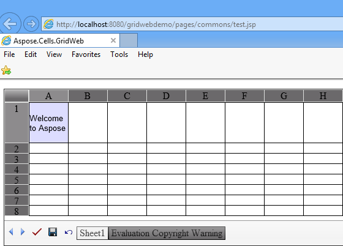
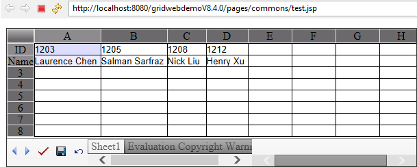
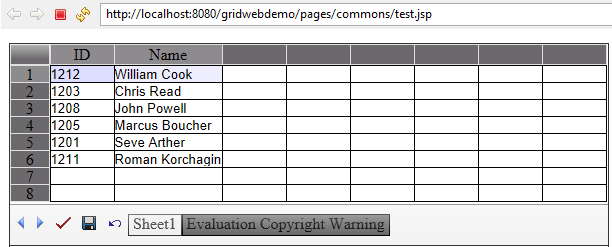
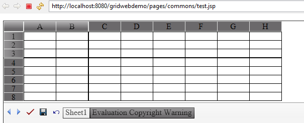
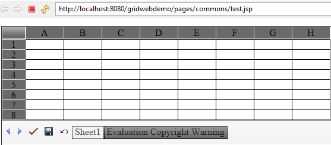
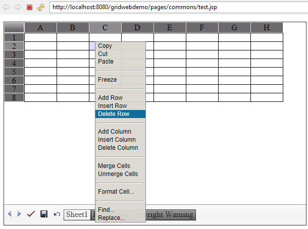
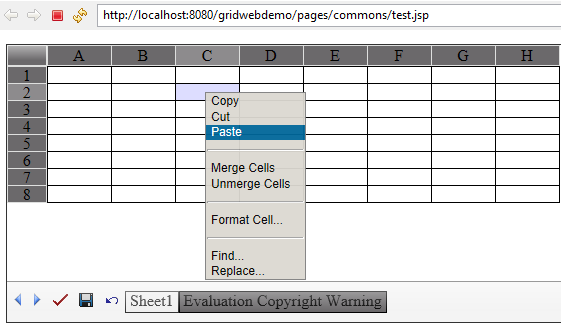

## **Inserting Rows and Columns**
This topic explains how to insert new rows and columns into a worksheet using the Aspose.Cells.GridWeb API. Rows or columns can be inserted at any position in the worksheet.
### **Inserting Rows**
To insert a row at any position in a worksheet:

1. Add the Aspose.Cells.GridWeb control to the Web Form or page.
1. Access the worksheet you're adding rows to.
1. Insert a row by specifying a row index where the row would be inserted.


### **Inserting Columns**
To insert a column at any position in a worksheet:

1. Add the Aspose.Cells.GridWeb control to a Web Form or page.
1. Access the worksheet you're adding columns to.
1. Insert a column by specifying the column index where the column would be inserted.



{} 

You can also use insertRows()/insertColumns() methods to insert multiple rows/columns into the worksheets accordingly.

{} 
## **Deleting Rows and Columns**
This topic demonstrates how to delete rows and columns from a worksheet using the Aspose.Cells.GridWeb API. With the help of this feature, developers can take delete rows or columns at runtime.
### **Deleting Rows**
To delete a row from your worksheet:

1. Add the Aspose.Cells.GridWeb control to a Web Form or page.
1. Access the worksheet you want to delete rows from.
1. Delete a row from the worksheet by specifying its row index.


### **Deleting Columns**
To delete a column from your worksheet:

1. Add the Aspose.Cells.GridWeb control to a Web Form or page.
1. Access the worksheet you want to delete columns from.
1. Delete a column from the worksheet by specifying its column index.


## **Setting Row Height and Column Width**
Sometimes cell values are wider than the cell they are in or are on several lines. Such values are not fully visible to users unless they change the height and width of rows and columns. Aspose.Cells.GridWeb fully supports setting row heights and column width. This topic discusses these features in detail with the help of examples.
### **Working with Row Heights and Column Width**
#### **Setting Row Height**
To set the height of a row:

1. Add the Aspose.Cells.GridWeb control to your Web Form/ page.
1. Access the worksheet's GridCells collection.
1. Set the height of all cells in any specified row.

{} 

Aspose.Cells.GridWeb accepts row height and column width measurements in points, inches, pixels, etc.

{} 

**Output: the height of the 1st row has been set to 50 points** 


#### **Setting Column Width**
To set the width of a column:

1. Add the Aspose.Cells.GridWeb control to your Web Form/ page.
1. Access the worksheet's GridCells collection.
1. Set the width of all cells in any specified column.


## **Customizing Row and Column Headers**
Like Microsoft Excel, Aspose.Cells.GridWeb also uses standard headers or captions for rows (numbers like 1, 2, 3 and so on) and columns (alphabetic like A, B, C and so on). Aspose.Cells.GridWeb also makes it possible to customize captions. This topic discusses customizing row and column headers at runtime using Aspose.Cells.GridWeb API.
### **Customizing Row Header**
To customize the header or caption of a row:

1. Add the Aspose.Cells.GridWeb control to a Web Form/ page.
1. Access the worksheet in the GridWorksheetCollection.
1. Set the caption of any specified row.

**The headers of row 1 and 2 have been customized** 


### **Customizing Column Header**
To customize the header or caption of a column:

1. Add the Aspose.Cells.GridWeb control to a Web Form/ page.
1. Access the worksheet in the GridWorksheetCollection.
1. Set the caption of any specified column.

**The headers of column 1 and 2 have been customized** 


## **Freeze and Unfreeze Rows and Columns**
This topic explains how to freeze and unfreeze rows and columns. Freezing columns or rows allows users to keep the column headings or row titles visible while they scroll to other parts of the worksheet. This feature is very helpful when working with worksheets that contain large volumes of data. When users scroll only data is scrolled down and the headings stay in place, making the date easier to read. The freeze panes feature is only supported in Internet Explorer 6.0 or above.
### **Freezing Rows & Columns**
To freeze a specific number of rows and columns:

1. Add the Aspose.Cells.GridWeb control to a Web Form/ page.
1. Access a worksheet.
1. Freeze a number of rows & columns.

{} 

It is also possible to freeze a specific number of rows & columns using the interface. Right-click a cell where you want to freeze rows & columns and select **Freeze** from the list.

{} 

**Rows & columns in a frozen state** 


### **Unfreezing Rows & Columns**
To unfreeze rows and columns:

1. Add the Aspose.Cells.GridWeb control to a Web Form/ page.
1. Access a worksheet.
1. Unfreeze rows & columns.

**Worksheet after being unfrozen** 


## **Protecting Rows and Columns**
This topic discusses a few techniques for protecting cells in rows and columns from any kind of action performed by end users. Developers can implement this protection using two techniques: by making cells in rows and columns read-only, or by restricting the GridWeb's context menu options.
### **Restricting Context Menu Options**
GridWeb provides a context menu that end users can use to perform operations on the control. The menu provides many options for manipulating cells, rows, and columns.

**Complete contextual options** 

It is possible to restrict any kind of client-side operations on rows and columns by restricting the options available in the context menu. It can be done by setting the EnableClientColumnOperations and EnableClientRowOperations attributes of the GridWeb control to false. It is also possible to restrict users from freezing rows and columns by setting the GridWeb control's EnableClientFreeze attribute to false.

**Context menu after restricting row & column options** 


