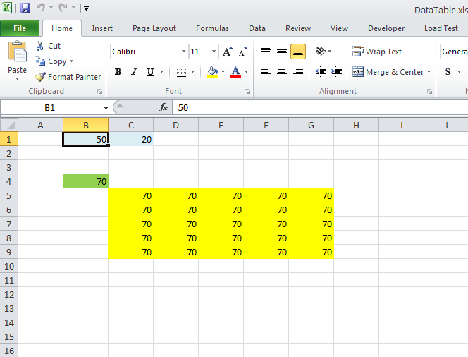

{} 

You can create Data Table in Microsoft Excel using Data > What-If Analysis > Data Table.... Aspose.Cells now allows you to calculate the array formula of the data table. Please use [Workbook.calculateFormula()](https://reference.aspose.com/cells/java/com.aspose.cells/workbook#calculateFormula\(\)) as normal for calculating any type of formulas.

{} 
## **Calculation of Array Formula of Data Tables**
In the following sample code, we used this [source excel file](5472579.xlsx) which is also shown in the following image.

If you change the value of cell B1 to 100, the values of Data Table which are filled with Yellow color will become 120. The sample code generates the [output PDF](5472577.pdf) which shows 120 as values in the Data Table as shown in this image.

Here is the sample code used to generate the [output PDF](5472577.pdf) from the [source excel file](5472579.xlsx). Please read the comments for more information.


