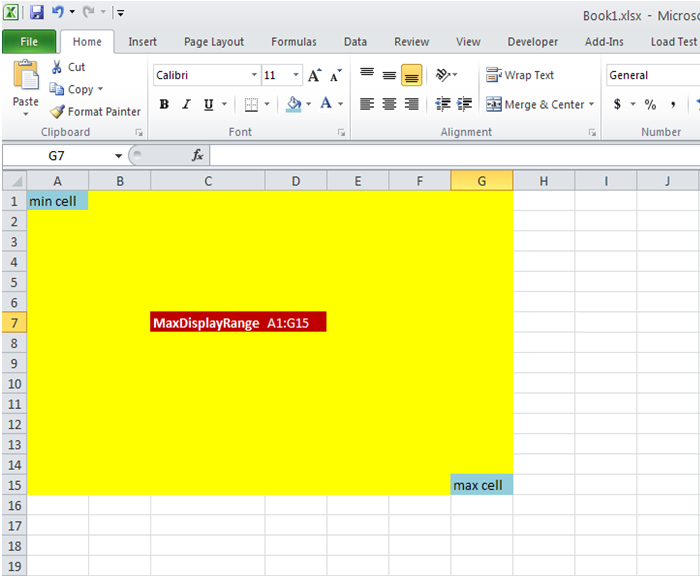

{} 

We know that all worksheets may contain data that is basically stored in cells (with which a worksheet is made up of). A cell is a basic part of a worksheet that is used to construct the whole worksheet as a sequence of rows and columns. Before we try to access data from a worksheet, we would need to get access to its cells. So, in this topic, we will discuss some basic approaches to access worksheet cells at runtime using Aspose.Cells.

{} 
## **Accessing Cells**
Aspose.Cells provides a class, [Workbook](https://reference.aspose.com/cells/java/com.aspose.cells/workbook) that represents a Microsoft Excel file. The [Workbook](https://reference.aspose.com/cells/java/com.aspose.cells/workbook) class contains a [WorksheetCollection](https://reference.aspose.com/cells/java/com.aspose.cells/WorksheetCollection) collection that allows access to each worksheet in the Excel file. A worksheet is represented by the [Worksheet](https://reference.aspose.com/cells/java/com.aspose.cells/Worksheet) class. The [Worksheet](https://reference.aspose.com/cells/java/com.aspose.cells/Worksheet) class provides a [Cells](https://reference.aspose.com/cells/java/com.aspose.cells/Cells) collection that represents all the cells in the worksheet.

We can use the [Cells](https://reference.aspose.com/cells/java/com.aspose.cells/Cells) collection to access cells in a worksheet. Aspose.Cells provides different basic approaches for accessing cells:

1. [Using cell name](/cells/java/accessing-cells-of-a-worksheet/).
1. [Using row & column index](/cells/java/accessing-cells-of-a-worksheet/).
### **Using Cell Name**
Developers can access any specific cell by passing its cell name to the [Cells](https://reference.aspose.com/cells/java/com.aspose.cells/Cells) collection of the [Worksheet](https://reference.aspose.com/cells/java/com.aspose.cells/Worksheet) class.

If you create a blank worksheet at the start, the count of [Cells](https://reference.aspose.com/cells/java/com.aspose.cells/Cells) collection is zero. When you use this approach to access a cell, it will check whether this cell exists in the collection or not. If yes, it returns the cell object in the collection otherwise, it creates a new [Cell](https://reference.aspose.com/cells/java/com.aspose.cells/Cell) object, adds the object to the [Cells](https://reference.aspose.com/cells/java/com.aspose.cells/Cells) collection and then returns the object. This approach is the easiest way to access the cell if you are familiar with Microsoft Excel but it's slower than other approaches.



### **Using Row & Column Index of the Cell**
Developers can access any specific cell by passing the indices of its row and column to the [Cells](https://reference.aspose.com/cells/java/com.aspose.cells/Cells) collection of the [Worksheet](https://reference.aspose.com/cells/java/com.aspose.cells/Worksheet) class.

This approach works in the same way as that of the first approach.


### **Related Articles**
{} 

- [Named Ranges](/cells/java/named-ranges/)

{} 
## **Accessing Maximum Display Range of Worksheet**
Aspose.Cells allows developers to access a worksheet's maximum display range. The maximum display range - the range of cells between the first and last cell with content - is useful when you need to copy, select, or display the entire contents of a worksheet in an image.

You can access a worksheet's maximum display range using [Worksheet.getCells().getMaxDisplayRange()](https://reference.aspose.com/cells/java/com.aspose.cells/cells#MaxDisplayRange).

In the following figure, the selected worksheet' maximum display range is A1:G15.

**Showing the maximum display range of this worksheet** 

The following sample code illustrates how to access the [MaxDisplayRange](https://reference.aspose.com/cells/java/com.aspose.cells/cells#MaxDisplayRange) property. The code generates the following output.



 Maximum Display Range: =Sheet1!$A$1:$G$15




