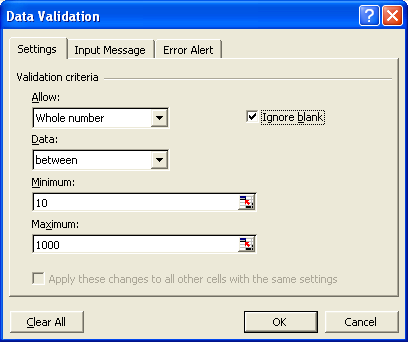

{} 

Microsoft Excel provides some good features to auto-filter or validate worksheet data.

[Data validation](/cells/java/data-validation/) is the ability to set rules pertaining to data entered on a worksheet. For example, use validation to ensure that a column labeled DATE contains only dates, or that another column contains only numbers. You could even ensure that a column labeled DATE contains only dates within a certain range. With data validation, you can control what is entered into cells in the worksheet. Aspose.Cells fully supports Microsoft Excel's data validation and autofilter features. This article explains how to use the features in Microsoft Excel, and how to code them using Aspose.Cells.

{} 
## **Data Validation Types and Execution**
Microsoft Excel supports a number of different types of data validation. Each type is used to control what type of data is entered into a cell, or cell range. Below, code snippets illustrate how to validate that:

- [Numbers are whole](/cells/java/data-validation/), that is, that they don't have a decimal part.
- [Decimal numbers follow the right structure](/cells/java/data-validation/). The code example defines that a range of cells should have two decimal spaces.
- [Values are restricted to a list of values](/cells/java/data-validation/). List validation defines a separate list of values that can be applied to a cell, or cell range.
- [Dates fall within a specific range](/cells/java/data-validation/).
- [Time is within a specific range](/cells/java/data-validation/).
- [A text is within a given character length](/cells/java/data-validation/).
### **Data Validation with Microsoft Excel**
To create validations using Microsoft Excel:

1. In a worksheet, select the cells to which you want to apply validation.
1. From the **Data** menu, select **Validation**.
   The validation dialog is displayed.
1. Click the **Settings** tab and enter settings as shown below. 

   **Data validation settings** 

### **Data Validation with Aspose.Cells**
Data validation is a powerful feature for validating the information entered into worksheets. With data validation, developers can provide users with a list of choices, restrict data entries to a specific type or size, etc.
In Aspose.Cells, each [Worksheet](https://reference.aspose.com/cells/java/com.aspose.cells/worksheet) class has a [Validations](https://reference.aspose.com/cells/java/com.aspose.cells/worksheet#getValidations--) object which represents a collection of [Validation](https://reference.aspose.com/cells/java/com.aspose.cells/Validation) objects. To set up validation, set some of the [Validation](https://reference.aspose.com/cells/java/com.aspose.cells/Validation) class' properties:

- [Type](https://reference.aspose.com/cells/java/com.aspose.cells/Validation#setType-int-): represents the validation type, which may be specified by using one of the predefined values in the [ValidationType](https://reference.aspose.com/cells/java/com.aspose.cells/ValidationType) enumeration.
- [Operator](https://reference.aspose.com/cells/java/com.aspose.cells/Validation#setOperator-int-): represents the operator to be used in the validation, which may be specified by using one of the predefined values in the [OperatorType](https://reference.aspose.com/cells/java/com.aspose.cells/OperatorType) enumeration.
- [Formula1](https://reference.aspose.com/cells/java/com.aspose.cells/Validation#setFormula1-java.lang.String-): represents the value or expression associated with the first part of the data validation.
- [Formula2](https://reference.aspose.com/cells/java/com.aspose.cells/Validation#setFormula2-java.lang.String-): represents the value or expression associated with the second part of the data validation.

When the [Validation](https://reference.aspose.com/cells/java/com.aspose.cells/Validation) object's properties have been configured, developers can use the [CellArea](https://reference.aspose.com/cells/java/com.aspose.cells/CellArea) structure to store information about the cell range that will be validated using the created validation.
#### **Types of Data Validation**
Data validation allows you to build business rules into each cell so that incorrect entries result in error messages. Business rules are the policies and procedures that govern how a business operates. Aspose.Cells supports all the important types of data validation.

The [ValidationType](https://reference.aspose.com/cells/java/com.aspose.cells/ValidationType) enumeration has the following members:

|**Member Name**|**Description**|
| :- | :- |
|[ANY_VALUE](https://reference.aspose.com/cells/java/com.aspose.cells/Validationtype#ANY-VALUE)|Denotes a value of any type.|
|[WHOLE_NUMBER](https://reference.aspose.com/cells/java/com.aspose.cells/Validationtype#WHOLE-NUMBER)|Denotes validation type for whole numbers.|
|[DECIMAL](https://reference.aspose.com/cells/java/com.aspose.cells/Validationtype#DECIMAL)|Denotes validation type for decimal numbers.|
|[LIST](https://reference.aspose.com/cells/java/com.aspose.cells/Validationtype#LIST)|Denotes validation type for drop-down list.|
|[DATE](https://reference.aspose.com/cells/java/com.aspose.cells/Validationtype#DATE)|Denotes validation type for dates.|
|[TIME](https://reference.aspose.com/cells/java/com.aspose.cells/Validationtype#TIME)|Denotes validation type for Time.|
|[TEXT_LENGTH](https://reference.aspose.com/cells/java/com.aspose.cells/Validationtype#TEXT-LENGTH)|Denotes validation type for the length of the text.|
|[CUSTOM](https://reference.aspose.com/cells/java/com.aspose.cells/Validationtype#CUSTOM)|Denotes custom validation type.|
#### **Programming Sample: Whole Number Data Validation**
With this type of validation, users can enter only whole numbers within a specified range into the validated cells. The code examples that follow show how to implement the [WHOLE_NUMBER](https://reference.aspose.com/cells/java/com.aspose.cells/Validationtype#WHOLE-NUMBER) validation type. The example creates the same data validation using Aspose.Cells that we created using Microsoft Excel above.



#### **Programming Sample: Decimal Data Validation**
With this type of validation, the user can enter decimal numbers into the validated cells. In the example, the user is restricted to enter decimal value only and the validation area is A1:A10.



#### **Programming Sample: List Data Validation**
This type of validation allows the user to enter values from a drop-down list. It provides a list: a series of rows that contain data. Users can only select values from the list. The validation area is the cell range A1:A5 in the first worksheet.

It is important here that you set the [Validation.setInCellDropDown](https://reference.aspose.com/cells/java/com.aspose.cells/Validation#setInCellDropDown-boolean-) property to **true**.



#### **Programming Sample: Date Data Validation**
With this type of validation, users enter date values within a specified range, or meeting specific criteria, into the validated cells. In the example, the user is restricted to enter dates between 1970 to 1999. Here, the validation area is the B1 cell.



#### **Programming Samples: Time Data Validation**
With this type of validation, users can enter times within a specified range, or meeting some criteria, into the validated cells. In the example, the user is restricted to enter times between 09:00 to 11:30 AM. Here, the validation area is the B1 cell.



#### **Programming Samples: Text Length Data Validation**
With this type of validation, users can enter text values of a specified length into the validated cells. In the example, the user is restricted to enter string values with no more than 5 characters. The validation area is the B1 cell.


## **Data Validation Rules**
When data validations are implemented, then validation can be checked by assigning different values in the cells. [Cell.GetValidationValue()](https://reference.aspose.com/cells/java/com.aspose.cells/cell#getValidationValue--) can be used to fetch the validation result. The following example demonstrates this feature with different values. The sample file can be downloaded from the following link for testing:

[SampleDataValidationRules.xlsx](77987849.xlsx)

**Sample Code**


## **Check if validation in a cell is dropdown**
As we have seen there are many types of validations that can be implemented within a cell. If you want to check whether validation is dropdown or not, [Validation.InCellDropDown](https://reference.aspose.com/cells/java/com.aspose.cells/Validation#getInCellDropDown--) property can be used to test this. Following sample code demonstrates the usage of this property. The sample file for testing can be downloaded from the following link:

[sampleDataValidationRules.xlsx](77987849.xlsx)


## **Add CellArea to existing Validation**
There might be cases where you might want to add [CellArea](https://reference.aspose.com/cells/java/com.aspose.cells/CellArea) to existing [Validation](https://reference.aspose.com/cells/java/com.aspose.cells/Validation). When you add [CellArea](https://reference.aspose.com/cells/java/com.aspose.cells/CellArea) using [Validation.AddArea(CellArea cellArea)](https://reference.aspose.com/cells/java/com.aspose.cells/Validation#addArea-com.aspose.cells.CellArea-), Aspose.Cells checks all existing areas to see if the new area already exists. If the file has a large number of validations, this takes a performance hit. To overcome this, the API provides the [Validation.AddAreaCellArea cellArea, bool checkIntersection, bool checkEdge)](https://reference.aspose.com/cells/java/com.aspose.cells/Validation#addArea-com.aspose.cells.CellArea-boolean-boolean-) method. The *checkIntersection* parameter indicates whether to check the intersection of a given area with existing validation areas. Setting it to **false** will disable the checking of other areas. The *checkEdge* parameter indicates whether to check the applied areas. If the new area becomes the top-left area, internal settings are rebuilt. If you are sure that the new area is not the top-left area, you may set this parameter as **false**.

The following code snippet demonstrates the use of the [Validation.AddAreaCellArea cellArea, bool checkIntersection, bool checkEdge)](https://reference.aspose.com/cells/java/com.aspose.cells/Validation#addArea-com.aspose.cells.CellArea-boolean-boolean-) method to add new [CellArea](https://reference.aspose.com/cells/java/com.aspose.cells/CellArea) to existing [Validation](https://reference.aspose.com/cells/java/com.aspose.cells/Validation).



The source and output excel files are attached for reference.

[Source File](PivotTableHideAndSortSample.xlsx)

[Output File](ValidationsSample_out.xlsx)

## **Advance topics**
- [Get Cell Validation in ODS Files](/cells/java/get-cell-validation-in-ods-files/)
- [Get Validation Applied on a Cell](/cells/java/get-validation-applied-on-a-cell/)
- [Verify that Cell Value Satisfies Data Validation Rules](/cells/java/verify-that-cell-value-satisfies-data-validation-rules/)

