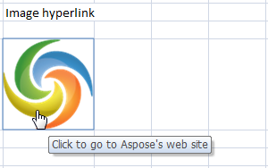

{} 

Hyperlinks are useful for accessing the information on other worksheets, or on websites. Microsoft Excel lets users add hyperlinks to the text in cells, and on images. Image hyperlinks can make navigating a worksheet easier, for example, as next and previous buttons, or logos that link to particular sites. This document explains how to insert image hyperlinks in a worksheet using Aspose.Cells.

{} 

Aspose.Cells allows you to add hyperlinks to images in spreadsheets at runtime. It is possible to set and modify the link's screen tip and address.

The following sample code illustrates how to add an image hyperlink into a worksheet.

When the code runs, it saves an output file with an image hyperlink in it. 

**The output file** 


