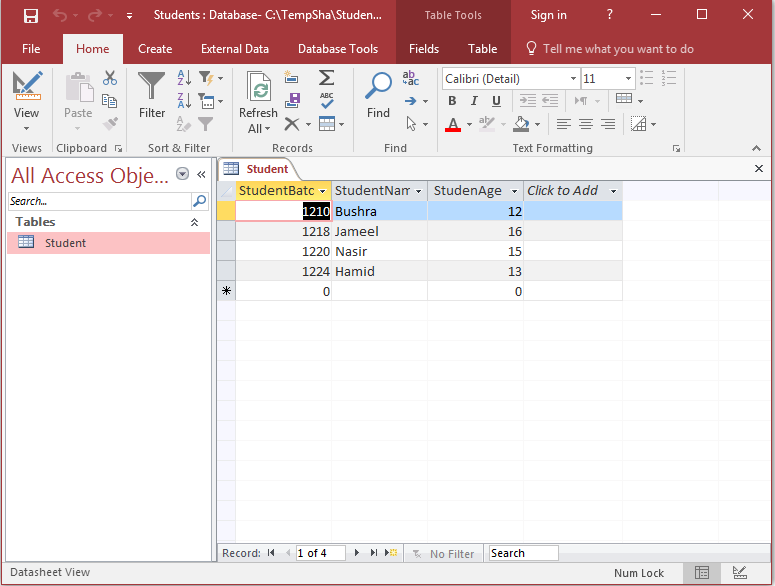
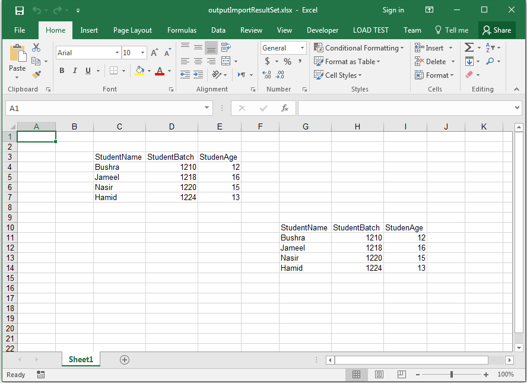

## **Possible Usage Scenarios**
Aspose.Cells can import data into worksheets from a ResultSet object which can be created from any database. However, this article specifically creates a ResultSet object from a Microsoft Access database. Since the code is the same for all types of databases, you can use it in general.

## **UCanAccess - Required to Connect to Microsoft Access Database**
Please download [UCanAccess](http://ucanaccess.sourceforge.net/site.html). It includes the following JAR files. Add all of them to the classpath.

- ucanaccess-4.0.1.jar
- commons-lang-2.6.jar
- commons-logging-1.1.1.jar
- hsqldb.jar
- jackcess-2.1.6.jar

For more help, please visit this Stack Overflow link.

- [Manually adding the JARs to your project](https://stackoverflow.com/questions/21955256/manipulating-an-access-database-from-java-without-odbc/21955257#21955257)

## **Sample Microsoft Access 2016 Database File used inside Sample Code**
The following sample Microsoft Access 2016 database file was used in the sample code. You can use any database file or create your own.

- [Students.accdb](48496712.accdb)

The following screenshot shows the database file when opened in Microsoft Access 2016.

## **Import Data from Microsoft Access Database ResultSet Object to the Worksheet.**
The following sample code executes an SQL query from a Microsoft Access database and creates a ResultSet object. Then it imports data from the ResultSet object into the worksheet using the [Worksheet.getCells().importResultSet()](https://reference.aspose.com/cells/java/com.aspose.cells/cells#importResultSet-java.sql.ResultSet-int-int-boolean-) method. The first time, it uses row and column indices, and then it uses a cell name to import data into the worksheet. Finally, it saves the workbook as an output Excel file. The screenshot shows the result of the sample code on the output Excel file for reference.

## **Sample Code**


