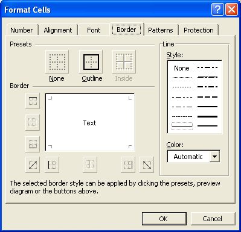
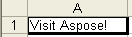
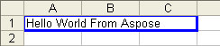
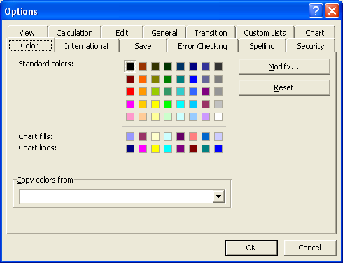
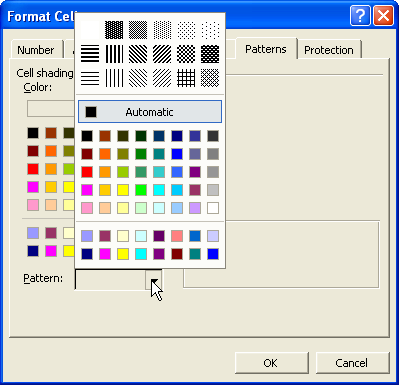
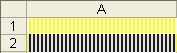

## **Adding Borders to Cells**
Microsoft Excel allows users to format cells by adding borders.

**Borders settings in Microsoft Excel** 

The type of border depends on where it is added. For example, a top border is one added to the top position of a cell. Users can also modify the borders' line style and color.

With Aspose.Cells, developers can add borders and customize what they look like in the same flexible way they can in Microsoft Excel.
### **Adding Borders to Cells**
Aspose.Cells provides a class, [Workbook](https://reference.aspose.com/cells/java/com.aspose.cells/Workbook) that represents a Microsoft Excel file. The [Workbook](https://reference.aspose.com/cells/java/com.aspose.cells/Workbook) class contains a [WorksheetCollection](https://reference.aspose.com/cells/java/com.aspose.cells/WorksheetCollection) that allows access to each worksheet in the Excel file. A worksheet is represented by the [Worksheet](https://reference.aspose.com/cells/java/com.aspose.cells/Worksheet) class. The [Worksheet](https://reference.aspose.com/cells/java/com.aspose.cells/Worksheet) class provides a [Cells](https://reference.aspose.com/cells/java/com.aspose.cells/Cells) collection. Each item in the [Cells](https://reference.aspose.com/cells/java/com.aspose.cells/Cells) collection represents an object of the [Cell](https://reference.aspose.com/cells/java/com.aspose.cells/cell) class.

Aspose.Cells provides the [setStyle](https://reference.aspose.com/cells/java/com.aspose.cells/cell#setStyle-com.aspose.cells.Style-) method in the [Cell](https://reference.aspose.com/cells/java/com.aspose.cells/cell) class used to set a cell's formatting style. Also, the object of the [Style](https://reference.aspose.com/cells/java/com.aspose.cells/Style) class is used and provides properties for configuring font settings.
#### **Adding Borders to a Cell**
Add borders to a cell with the [Style](https://reference.aspose.com/cells/java/com.aspose.cells/Style) object's [setBorder](https://reference.aspose.com/cells/java/com.aspose.cells/style#setBorder-int-int-com.aspose.cells.Color-) method. The border type is passed as a parameter. All border types are pre-defined in the [BorderType](https://reference.aspose.com/cells/java/com.aspose.cells/BorderType) enumeration.

|**Border Types**|**Description**|
| :- | :- |
|[BOTTOM_BORDER](https://reference.aspose.com/cells/java/com.aspose.cells/bordertype#BOTTOM-BORDER)|The bottom border line|
|[DIAGONAL_DOWN](https://reference.aspose.com/cells/java/com.aspose.cells/bordertype#DIAGONAL-DOWN)|A diagonal line from top left to right bottom|
|[DIAGONAL_UP](https://reference.aspose.com/cells/java/com.aspose.cells/bordertype#DIAGONAL-UP)|A diagonal line from bottom left to right top|
|[LEFT_BORDER](https://reference.aspose.com/cells/java/com.aspose.cells/bordertype#LEFT-BORDER)|The left border line|
|[RIGHT_BORDER](https://reference.aspose.com/cells/java/com.aspose.cells/bordertype#RIGHT-BORDER)|The right border line|
|[TOP_BORDER](https://reference.aspose.com/cells/java/com.aspose.cells/bordertype#TOP-BORDER)|The top border line|
|[HORIZONTAL](https://reference.aspose.com/cells/java/com.aspose.cells/bordertype#HORIZONTAL)|Only for dynamic style, such as conditional formatting.|
|[VERTICAL](https://reference.aspose.com/cells/java/com.aspose.cells/bordertype#VERTICAL)|Only for dynamic style, such as conditional formatting.|
To set the line color, select a color using the [Color](https://reference.aspose.com/cells/java/com.aspose.cells/Color) enumeration and pass it to the [Style](https://reference.aspose.com/cells/java/com.aspose.cells/Style) object's [setBorder](https://reference.aspose.com/cells/java/com.aspose.cells/style#setBorder-int-int-com.aspose.cells.Color-) method's Color parameter. The line styles are pre-defined in the [CellBorderType](https://reference.aspose.com/cells/java/com.aspose.cells/CellBorderType) enumeration.

|**Line Styles**|**Description**|
| :- | :- |
|[DASH_DOT](https://reference.aspose.com/cells/java/com.aspose.cells/cellbordertype#DASH-DOT)|Represents thin dash-dotted line|
|[DASH_DOT_DOT](https://reference.aspose.com/cells/java/com.aspose.cells/cellbordertype#DASH-DOT_DOT)|Represents thin dash-dot-dotted line|
|[DASHED](https://reference.aspose.com/cells/java/com.aspose.cells/cellbordertype#DASHED)|Represents dashed line|
|[DOTTED](https://reference.aspose.com/cells/java/com.aspose.cells/cellbordertype#DOTTED)|Represents dotted line|
|[DOUBLE](https://reference.aspose.com/cells/java/com.aspose.cells/cellbordertype#DOUBLE)|Represents double line|
|[HAIR](https://reference.aspose.com/cells/java/com.aspose.cells/cellbordertype#HAIR)|Represents hair line|
|[MEDIUM_DASH_DOT](https://reference.aspose.com/cells/java/com.aspose.cells/cellbordertype#MEDIUM-DASH-DOT)|Represents medium dash-dotted line|
|[MEDIUM_DASH_DOT_DOT](https://reference.aspose.com/cells/java/com.aspose.cells/cellbordertype#MEDIUM-DASH-DOT_DOT)|Represents medium dash-dot-dotted line|
|[MEDIUM_DASHED](https://reference.aspose.com/cells/java/com.aspose.cells/cellbordertype#MEDIUM-DASHED)|Represents medium dashed line|
|[NONE](https://reference.aspose.com/cells/java/com.aspose.cells/cellbordertype#NONE)|Represents no line|
|[MEDIUM](https://reference.aspose.com/cells/java/com.aspose.cells/cellbordertype#MEDIUM)|Represents medium line|
|[SLANTED_DASH_DOT](https://reference.aspose.com/cells/java/com.aspose.cells/cellbordertype#SLANTED-DASH-DOT)|Represents slanted medium dash-dotted line|
|[THICK](https://reference.aspose.com/cells/java/com.aspose.cells/cellbordertype#THICK)|Represents thick line|
|[THIN](https://reference.aspose.com/cells/java/com.aspose.cells/cellbordertype#THIN)|Represents thin line|
Select one of the above line styles and then assign it to the [Style](https://reference.aspose.com/cells/java/com.aspose.cells/Style) object's [setBorder](https://reference.aspose.com/cells/java/com.aspose.cells/style#setBorder-int-int-com.aspose.cells.Color-) method.

The following output is generated when executing the code below.

**Borders applied on all sides of a cell** 


#### **Adding Borders to a Range of Cells**
It is possible to add borders to a range of cells rather than just a single cell. First, create a range of cells by calling the [Cells](https://reference.aspose.com/cells/java/com.aspose.cells/Cells) collection's [createRange](https://reference.aspose.com/cells/java/com.aspose.cells/cells#createRange-int-int-boolean-) method, which takes the following parameters:

- **First Row**, the first row of the range.
- **First Column**, the first column of the range.
- **Number of Rows**, the number of rows in the range.
- **Number of Columns**, the number of columns in the range.

The [createRange](https://reference.aspose.com/cells/java/com.aspose.cells/cells#createRange-int-int-boolean-) method returns a [Range](https://reference.aspose.com/cells/java/com.aspose.cells/Range) object, which contains the specified range. The [Range](https://reference.aspose.com/cells/java/com.aspose.cells/Range) object provides a [setOutlineBorders](https://reference.aspose.com/cells/java/com.aspose.cells/range#setOutlineBorders-int-com.aspose.cells.Color-) method that takes the following parameters:

- **CellBorderType**, the border line style, selected from the [CellBorderType](https://reference.aspose.com/cells/java/com.aspose.cells/CellBorderType) enumeration.
- **Color**, the border line color, selected from the [Color](https://reference.aspose.com/cells/java/com.aspose.cells/Color) enumeration.

The following output is generated when executing the code below.

**Borders applied on a range of cells** 


## **Colors and Palette**
A palette is the number of colors available for use in creating an image. The use of a standardized palette in a presentation allows the user to create a consistent look. Each Microsoft Excel (97-2003) file has a palette of 56 colors that can be applied to cells, fonts, gridlines, graphic objects, fills and lines in a chart.

**Palette settings in Microsoft Excel** 

With Aspose.Cells it is not only possible to use existing colors but also custom colors. Before using a custom color, add it to the palette. This topic explains how to add custom colors to the palette.
### **Adding Custom Colors to Palette**
Aspose.Cells also supports a palette of 56 colors. A standard color palette is shown above. If you want to use a custom color that is not defined in the palette then you will need to add that color to the palette before usage.

{} 

The palette only holds 56 colors. When you add a custom color to the palette, the palette is changed and any element in the file formatted with the previous color is changed. So, when you change the palette, please be very careful. Moreover, this is the limitation in XLS (Excel 97 - 2003) file format only as there is no such limitation for XLSX or other advanced MS Excel (2007/2010) file formats.

{} 

Aspose.Cells provides a class, [Workbook](https://reference.aspose.com/cells/java/com.aspose.cells/Workbook), that represents a Microsoft Excel file. The class provides the [changePalette](https://reference.aspose.com/cells/java/com.aspose.cells/workbook#changePalette-com.aspose.cells.Color-int-) method that takes the following parameters to add a custom color to modify the palette:

- **Custom color**, the custom color to be added to the palette.
- **Index**, the index of the color that will be replaced with the custom color. Should be between 0-55.

The example below adds a custom color to the palette before applying it on a font.


## **Colors and Background Patterns**
Microsoft Excel can set the foreground (outline) and background (fill) colors of cells and background patterns as shown below.

**Setting colors and background Patterns in Microsoft Excel** 

Aspose.Cells also supports these features in a flexible manner. In this topic, we learn to use these features using Aspose.Cells.
### **Setting Colors & Background Patterns**
Aspose.Cells provides a class, [Workbook](https://reference.aspose.com/cells/java/com.aspose.cells/Workbook), that represents a Microsoft Excel file. The [Workbook](https://reference.aspose.com/cells/java/com.aspose.cells/Workbook) class contains a [WorksheetCollection](https://reference.aspose.com/cells/java/com.aspose.cells/WorksheetCollection) that allows access to each worksheet in the Excel file. A worksheet is represented by the [Worksheet](https://reference.aspose.com/cells/java/com.aspose.cells/Worksheet) class. The [Worksheet](https://reference.aspose.com/cells/java/com.aspose.cells/Worksheet) class provides a [Cells](https://reference.aspose.com/cells/java/com.aspose.cells/Cells) collection. Each item in the [Cells](https://reference.aspose.com/cells/java/com.aspose.cells/Cells) collection represents an object of the [Cell](https://reference.aspose.com/cells/java/com.aspose.cells/cell) class.

Aspose.Cells provides the [setStyle](https://reference.aspose.com/cells/java/com.aspose.cells/cell#setStyle-com.aspose.cells.Style-) method in the [Cell](https://reference.aspose.com/cells/java/com.aspose.cells/cell) class that is used to set a cell's formatting. Also, the object of the [Style](https://reference.aspose.com/cells/java/com.aspose.cells/Style) class can be used to configure font settings.

{} 

To set the foreground or background color of a cell, use the [Style](https://reference.aspose.com/cells/java/com.aspose.cells/Style)  object's [setBackgroundColor](https://reference.aspose.com/cells/java/com.aspose.cells/style#BackgroundColor) or [setForegroundColor](https://reference.aspose.com/cells/java/com.aspose.cells/style#ForegroundColor) properties. These properties only come into effect if the [Style](https://reference.aspose.com/cells/java/com.aspose.cells/Style)  object's [setPattern](https://reference.aspose.com/cells/java/com.aspose.cells/style#Pattern) property is configured.

{} 

The [setForegroundColor](https://reference.aspose.com/cells/java/com.aspose.cells/style#ForegroundColor)  property sets the cell's shading color.

The [setPattern](https://reference.aspose.com/cells/java/com.aspose.cells/style#Pattern)   property specifies the background pattern used for the foreground or background color. Aspose.Cells provides the [BackgroundType](https://reference.aspose.com/cells/java/com.aspose.cells/BackgroundType) enumeration which contains a set of pre-defined types of background patterns.

|**Pattern Type**|**Description**|
| :- | :- |
|[DIAGONAL_CROSSHATCH](https://reference.aspose.com/cells/java/com.aspose.cells/backgroundtype#DIAGONAL-CROSSHATCH)|Represents diagonal crosshatch pattern|
|[DIAGONAL_STRIPE](https://reference.aspose.com/cells/java/com.aspose.cells/backgroundtype#DIAGONAL-STRIPE)|Represents diagonal stripe pattern|
|[GRAY_6](https://reference.aspose.com/cells/java/com.aspose.cells/backgroundtype#GRAY-6)|Represents 6.25% gray pattern|
|[GRAY_12](https://reference.aspose.com/cells/java/com.aspose.cells/backgroundtype#GRAY-12)|Represents 12.5% gray pattern|
|[GRAY_25](https://reference.aspose.com/cells/java/com.aspose.cells/backgroundtype#GRAY-25)|Represents 25% gray pattern|
|[GRAY_50](https://reference.aspose.com/cells/java/com.aspose.cells/backgroundtype#GRAY-50)|Represents 50% gray pattern|
|[GRAY_75](https://reference.aspose.com/cells/java/com.aspose.cells/backgroundtype#GRAY-75)|Represents 75% gray pattern|
|[HORIZONTAL_STRIPE](https://reference.aspose.com/cells/java/com.aspose.cells/backgroundtype#HORIZONTAL-STRIPE)|Represents horizontal stripe pattern|
|[NONE](https://reference.aspose.com/cells/java/com.aspose.cells/backgroundtype#NONE)|Represents no background|
|[REVERSE_DIAGONAL_STRIPE](https://reference.aspose.com/cells/java/com.aspose.cells/backgroundtype#REVERSE-DIAGONAL-STRIPE)|Represents reverse diagonal stripe pattern|
|[SOLID](https://reference.aspose.com/cells/java/com.aspose.cells/backgroundtype#SOLID)|Represents solid pattern|
|[THICK_DIAGONAL_CROSSHATCH](https://reference.aspose.com/cells/java/com.aspose.cells/backgroundtype#THICK-DIAGONAL-CROSSHATCH)|Represents thick diagonal crosshatch pattern|
|[THIN_DIAGONAL_CROSSHATCH](https://reference.aspose.com/cells/java/com.aspose.cells/backgroundtype#THIN-DIAGONAL-CROSSHATCH)|Represents thin diagonal crosshatch pattern|
|[THIN_DIAGONAL_STRIPE](https://reference.aspose.com/cells/java/com.aspose.cells/backgroundtype#THIN-DIAGONAL-STRIPE)|Represents thin diagonal stripe pattern|
|[THIN_HORIZONTAL_CROSSHATCH](https://reference.aspose.com/cells/java/com.aspose.cells/backgroundtype#THIN-HORIZONTAL-CROSSHATCH)|Represents thin horizontal crosshatch pattern|
|[THIN_HORIZONTAL_STRIPE](https://reference.aspose.com/cells/java/com.aspose.cells/backgroundtype#THIN-HORIZONTAL-STRIPE)|Represents thin horizontal stripe pattern|
|[THIN_REVERSE_DIAGONAL_STRIPE](https://reference.aspose.com/cells/java/com.aspose.cells/backgroundtype#THIN-REVERSE-DIAGONAL-STRIPE)|Represents thin reverse diagonal stripe pattern|
|[THIN_VERTICAL_STRIPE](https://reference.aspose.com/cells/java/com.aspose.cells/backgroundtype#THIN-VERTICAL-STRIPE)|Represents thin vertical stripe pattern|
|[VERTICAL_STRIPE](https://reference.aspose.com/cells/java/com.aspose.cells/backgroundtype#VERTICAL-STRIPE)|Represents vertical stripe pattern|
In the example below, the foreground color of the A1 cell is set but A2 is configured to have both foreground and background colors with a vertical stripe background pattern.

The following output is generated when executing the code.

**Foreground and background colors applied on cells with background patterns** 


### **Important to Know**
{} 

- To set a cell's foreground or background color, use the [Style](https://reference.aspose.com/cells/java/com.aspose.cells/Style)  object's [ForegroundColor](https://reference.aspose.com/cells/java/com.aspose.cells/style#ForegroundColor) or [BackgroundColor](https://reference.aspose.com/cells/java/com.aspose.cells/style#BackgroundColor) properties. Both properties will take effect only if the [Style](https://reference.aspose.com/cells/java/com.aspose.cells/Style)  object's [Pattern](https://reference.aspose.com/cells/java/com.aspose.cells/style#Pattern) property is configured.
- The [ForegroundColor](https://reference.aspose.com/cells/java/com.aspose.cells/style#ForegroundColor) property sets the cell's shade color.
  The [Pattern](https://reference.aspose.com/cells/java/com.aspose.cells/style#Pattern) property specifies the type of background pattern used for the foreground or background color. Aspose.Cells provides an enumeration, [BackgroundType](https://reference.aspose.com/cells/java/com.aspose.cells/BackgroundType). that contains a set of pre-defined types of background patterns.
- If you select [BackgroundType.NONE](https://reference.aspose.com/cells/java/com.aspose.cells/backgroundtype#NONE) value from the [BackgroundType](https://reference.aspose.com/cells/java/com.aspose.cells/BackgroundType) enumeration, the foreground color is not applied.
  Likewise, the background color is not applied if you select the [BackgroundType.NONE](https://reference.aspose.com/cells/java/com.aspose.cells/backgroundtype#NONE) or [BackgroundType.SOLID](https://reference.aspose.com/cells/java/com.aspose.cells/backgroundtype#SOLID) values.
- When retrieving cell's shading/fill color, if [Style.Pattern](https://reference.aspose.com/cells/java/com.aspose.cells/style#Pattern) is [BackgroundType.NONE](https://reference.aspose.com/cells/java/com.aspose.cells/backgroundtype#NONE), [Style.ForegroundColor](https://reference.aspose.com/cells/java/com.aspose.cells/style#ForegroundColor) will return *Color.Empty*.

{} 
## **Formatting Selected Characters in a Cell**
[Dealing with Font Settings](/cells/java/dealing-with-font-settings/) explained how to format cells but only how to format the content of the entire cells. What if you want to format only selected characters?

Aspose.Cells supports this feature. This topic explains how to use this feature.
### **Formatting Selected Characters**
Aspose.Cells provides a class, [Workbook](https://reference.aspose.com/cells/java/com.aspose.cells/Workbook), that represents a Microsoft Excel file. The [Workbook](https://reference.aspose.com/cells/java/com.aspose.cells/Workbook) class contains a [WorksheetCollection](https://reference.aspose.com/cells/java/com.aspose.cells/WorksheetCollection) that allows access to each worksheet in the Excel file. A worksheet is represented by the [Worksheet](https://reference.aspose.com/cells/java/com.aspose.cells/Worksheet) class. The [Worksheet](https://reference.aspose.com/cells/java/com.aspose.cells/Worksheet) class provides a [Cells](https://reference.aspose.com/cells/java/com.aspose.cells/Cells) collection. Each item in the [Cells](https://reference.aspose.com/cells/java/com.aspose.cells/Cells) collection represents an object of the [Cell](https://reference.aspose.com/cells/java/com.aspose.cells/cell) class.

The [Cell](https://reference.aspose.com/cells/java/com.aspose.cells/cell) class provides [characters](https://reference.aspose.com/cells/java/com.aspose.cells/cell#characters-int-int-) method that takes the following parameters to select a range of characters in a cell:

- **Start Index**, the index of the character to start the selection from.
- **Number of Characters**, the number of characters to select.

In the output file, in the A1" cell, the word 'Visit' is formatted with the default font but 'Aspose!' is bold and blue.

**Formatting selected characters** 



{} 

If you are interested in [formatting a portion of Rich Text in a cell](/cells/java/access-and-update-the-portions-of-rich-text-of-cell/), consider using the [Cell.getCharacters](https://reference.aspose.com/cells/java/com.aspose.cells/cell#getCharacters--) & Cell.setCharacters methods. The [Cell.getCharacters](https://reference.aspose.com/cells/java/com.aspose.cells/cell#getCharacters--) method is to be used to access the portions of the text and then amendments can be done using the Cell.setCharacters method whereas the **get** method returns an array of [FontSetting](https://reference.aspose.com/cells/java/com.aspose.cells/FontSetting) objects which can be manipulated to set various properties such as font name, font color, boldness, etc and **set** method can be used to apply the changes.

{}

## **Advance topics**
- [Alignment Settings](/cells/java/cells-alignment-settings/)
- [Conditional Formatting](/cells/java/conditional-formatting/)
- [Data Formatting](/cells/java/data-formatting/)
- [Excel Themes and Colors](/cells/java/excel-2007-themes-and-colors/)
- [Dealing with Font Settings](/cells/java/dealing-with-font-settings/)
- [Format Worksheet Cells in a Workbook](/cells/java/format-worksheet-cells-in-a-workbook/)
- [Implement 1904 Date System](/cells/java/implement-1904-date-system/)
- [Merging and Unmerging Cells](/cells/java/merging-and-unmerging-cells/)
- [Number Settings](/cells/java/cells-number-settings/)
- [Preserve Single Quote Prefix of Cell Value or Range](/cells/java/preserve-single-quote-prefix-of-cell-value-or-range/)
- [Styling and Data Formatting](/cells/java/styling-and-data-formatting/)
