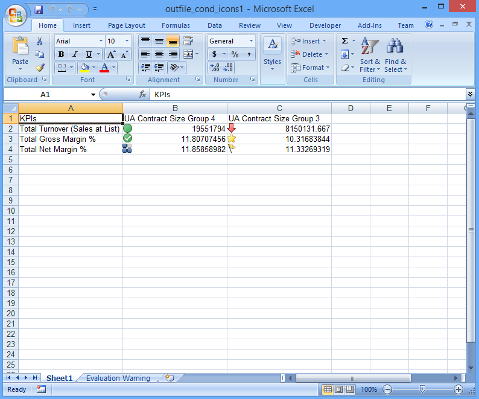

{} 

Sometimes, you want to add conditional icons next to the text in a cell to make the data more meaningful to readers. You may want to use some of the conditional formatting icon types without applying conditional formatting to the cells. Aspose.Cells supports this feature.

{} 

The following sample creates an XLSX file from scratch, adding conditional icons to cells with text without applying conditional formatting.

When the code is executed, images from the conditional icon set are added to the cell area **B2:C4** as shown below.

**Output file** 



