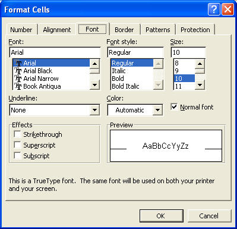

{} 

The look and feel of the text can be controlled by changing its font settings. These font settings may include the name, style, size, color and other effects of the fonts as shown below in the figure:

**Font settings in Microsoft Excel** 

Just like Microsoft Excel, Aspose.Cells also supports configuring the font settings of the cells.

{} 
## **Configuring Font Settings**
Aspose.Cells provides a class, [Workbook](https://reference.aspose.com/cells/java/com.aspose.cells/Workbook) that represents a Microsoft Excel file. The [Workbook](https://reference.aspose.com/cells/java/com.aspose.cells/Workbook) class contains a [WorksheetCollection](https://reference.aspose.com/cells/java/com.aspose.cells/WorksheetCollection) that allows access to each worksheet in an Excel file. A worksheet is represented by the [Worksheet](https://reference.aspose.com/cells/java/com.aspose.cells/Worksheet) class. The [Worksheet](https://reference.aspose.com/cells/java/com.aspose.cells/Worksheet) class provides a [Cells](https://reference.aspose.com/cells/java/com.aspose.cells/Cells) collection. Each item in the [Cells](https://reference.aspose.com/cells/java/com.aspose.cells/Cells) collection represents an object of the [Cell](https://reference.aspose.com/cells/java/com.aspose.cells/cell) class.

Aspose.Cells provides the [Cell](https://reference.aspose.com/cells/java/com.aspose.cells/cell) class' [setStyle](https://reference.aspose.com/cells/java/com.aspose.cells/cell#setStyle\(com.aspose.cells.Style\)) method, used to set a cell's formatting. Also, the object of the [Style](https://reference.aspose.com/cells/java/com.aspose.cells/Style) class provides properties for configuring font settings.

This article shows how to:

- [Apply a specific font to text.](/cells/java/dealing-with-font-settings/)
- [Set text to bold](/cells/java/dealing-with-font-settings/).
- [Set the font size](/cells/java/dealing-with-font-settings/).
- [Set the font color](/cells/java/dealing-with-font-settings/).
- [Underline text](/cells/java/dealing-with-font-settings/).
- [Strikeout text](/cells/java/dealing-with-font-settings/).
- [Set text to subscript](/cells/java/dealing-with-font-settings/).
- [Set text to superscript](/cells/java/dealing-with-font-settings/).
### **Setting Font Name**
Apply a specific font to text in cells using the [Font](https://reference.aspose.com/cells/java/com.aspose.cells/Font) object's [setName](https://reference.aspose.com/cells/java/com.aspose.cells/font#Name) property.


### **Setting Font Style to Bold**
Set text to bold by setting the [Font](https://reference.aspose.com/cells/java/com.aspose.cells/Font) object's [setBold](https://reference.aspose.com/cells/java/com.aspose.cells/font#IsBold) property to **true**.


### **Setting Font Size**
Set the font size using the [Font](https://reference.aspose.com/cells/java/com.aspose.cells/Font) object's [setSize](https://reference.aspose.com/cells/java/com.aspose.cells/font#Size) property.


### **Setting Font Underline Type**
Underline text with the [Font](https://reference.aspose.com/cells/java/com.aspose.cells/Font) object's [setUnderline](https://reference.aspose.com/cells/java/com.aspose.cells/font#Underline) property. Aspose.Cells offers various pre-defined font underline types in the [FontUnderlineType](https://reference.aspose.com/cells/java/com.aspose.cells/FontUnderlineType) enumeration.

|**Font Underline Types**|**Description**|
| :- | :- |
|[NONE](https://reference.aspose.com/cells/java/com.aspose.cells/fontunderlinetype#NONE)|No underline|
|[SINGLE](https://reference.aspose.com/cells/java/com.aspose.cells/fontunderlinetype#SINGLE)|A single underline|
|[DOUBLE](https://reference.aspose.com/cells/java/com.aspose.cells/fontunderlinetype#DOUBLE)|Double underline|
|[ACCOUNTING](https://reference.aspose.com/cells/java/com.aspose.cells/fontunderlinetype#ACCOUNTING)|A single accounting underline|
|[DOUBLE_ACCOUNTING](https://reference.aspose.com/cells/java/com.aspose.cells/fontunderlinetype#DOUBLE_ACCOUNTING)|Double accounting underline|
|[DASH](https://reference.aspose.com/cells/java/com.aspose.cells/fontunderlinetype#DASH)|Dashed Underline|
|[DASH_DOT_DOT_HEAVY](https://reference.aspose.com/cells/java/com.aspose.cells/fontunderlinetype#DASH_DOT_DOT_HEAVY)|Thick Dash-Dot-Dot Underline|
|[DASH_DOT_HEAVY](https://reference.aspose.com/cells/java/com.aspose.cells/fontunderlinetype#DASH_DOT_HEAVY)|Thick Dash-Dot Underline|
|[DASHED_HEAVY](https://reference.aspose.com/cells/java/com.aspose.cells/fontunderlinetype#DASHED_HEAVY)|Thick Dashed Underline|
|[DASH_LONG](https://reference.aspose.com/cells/java/com.aspose.cells/fontunderlinetype#DASH_LONG)|Long Dashed Underline|
|[DASH_LONG_HEAVY](https://reference.aspose.com/cells/java/com.aspose.cells/fontunderlinetype#DASH_LONG_HEAVY)|Thick Long Dashed Underline|
|[DOT_DASH](https://reference.aspose.com/cells/java/com.aspose.cells/fontunderlinetype#DOT_DASH)|Dash-Dot Underline|
|[DOT_DOT_DASH](https://reference.aspose.com/cells/java/com.aspose.cells/fontunderlinetype#DOT_DOT_DASH)|Dash-Dot-Dot Underline|
|[DOTTED](https://reference.aspose.com/cells/java/com.aspose.cells/fontunderlinetype#DOTTED)|Dotted Underline|
|[DOTTED_HEAVY](https://reference.aspose.com/cells/java/com.aspose.cells/fontunderlinetype#DOTTED_HEAVY)|Thick Dotted Underline|
|[HEAVY](https://reference.aspose.com/cells/java/com.aspose.cells/fontunderlinetype#HEAVY)|Thick Underline|
|[WAVE](https://reference.aspose.com/cells/java/com.aspose.cells/fontunderlinetype#WAVE)|Wave Underline|
|[WAVY_DOUBLE](https://reference.aspose.com/cells/java/com.aspose.cells/fontunderlinetype#WAVY_DOUBLE)|Double Wave Underline|
|[WAVY_HEAVY](https://reference.aspose.com/cells/java/com.aspose.cells/fontunderlinetype#WAVY_HEAVY)|Heavy Wave Underline|
|[WORDS](https://reference.aspose.com/cells/java/com.aspose.cells/fontunderlinetype#WORDS)|Underline Non-Space Characters Only|


### **Setting Font Color**
Set the font color with the [Font](https://reference.aspose.com/cells/java/com.aspose.cells/Font) object's [setColor](https://reference.aspose.com/cells/java/com.aspose.cells/font#Color) property. Select any color from the [Color](https://reference.aspose.com/cells/java/com.aspose.cells/Color) enumeration and assign the selected color to the [Font](https://reference.aspose.com/cells/java/com.aspose.cells/Font) object's [setColor](https://reference.aspose.com/cells/java/com.aspose.cells/font#Color).



### **Setting Strikeout Effect on Text**
Strikeout text with the [Font](https://reference.aspose.com/cells/java/com.aspose.cells/Font) object's [setStrikeout](https://reference.aspose.com/cells/java/com.aspose.cells/font#IsStrikeout) property.



### **Setting Subscript**
Make text superscript by using the [Font](https://reference.aspose.com/cells/java/com.aspose.cells/Font) object's [setSubscript](https://reference.aspose.com/cells/java/com.aspose.cells/font#IsSubscript) property.



### **Setting Superscript**
Apply superscript to text with the [Font](https://reference.aspose.com/cells/java/com.aspose.cells/Font) object's [setSuperscript](https://reference.aspose.com/cells/java/com.aspose.cells/font#IsSuperscript) property.



## **Advance topics**
- [Apply Superscript and Subscript Effects on Fonts](/cells/java/apply-superscript-and-subscript-effects-on-fonts/)
- [Get a List of Fonts used in a Spreadsheet or Workbook](/cells/java/get-a-list-of-fonts-used-in-a-spreadsheet-or-workbook/)
