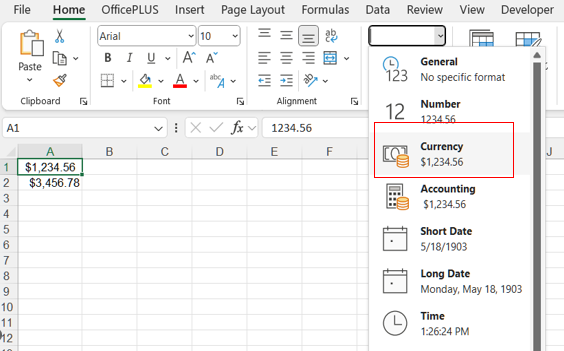

## **Possible Usage Scenarios**
Formatting numbers to currency in Excel is important for several reasons, particularly when working with financial data. Here's why currency formatting is beneficial:

1. **Clarifies Financial Values:** Formatting a number as currency makes it clear that the value represents money. For example, instead of seeing 1000, which could mean anything, $1,000 clearly indicates that the value is a monetary amount.  
2. **Includes Currency Symbols:** When dealing with international or multiple currencies, formatting numbers with the appropriate currency symbol (e.g., $, €, £) clarifies the type of currency being used, reducing confusion in multi‑national financial reports or transactions.  
3. **Enhances Professional Presentation:** Well‑formatted currency values appear polished and professional, which is especially important for reports, presentations, and business documents. $10,000.00 looks more credible and organized than a plain 10000.  
4. **Improves Readability:** Currency formatting adds commas as thousands separators and decimal places, making large numbers easier to read. For example, 1000000 becomes $1,000,000.00, which is more legible and easier to understand at a glance.  
5. **Ensures Consistency:** By applying consistent currency formatting, you ensure all monetary values in a dataset are displayed in the same format. This consistency is important for financial accuracy and for professional communication, especially in large spreadsheets with many numbers.  
6. **Shows Precision:** Currency formatting typically includes two decimal places, making it easy to see exact monetary amounts. For example, $100.50 is clearly different from $100.00, which is important in financial reports where precision matters.  
7. **Simplifies Financial Calculations:** When performing financial calculations (like adding totals or averaging costs), currency formatting helps Excel and users understand that the data is in monetary terms. It helps Excel apply appropriate formatting in formulas and functions, ensuring the results stay consistent.  
8. **Reduces Misinterpretation:** Without currency formatting, numbers could be misinterpreted as general numerical values rather than amounts of money. For example, 500 could be mistaken as a count of items or units, while $500.00 clearly represents a financial amount.  
9. **Works with Accounting Features:** Currency formatting aligns well with accounting functions in Excel, such as balance sheets or cash flow reports. It makes the values easier to use in financial statements where money is the primary focus.  

In summary, formatting numbers as currency helps distinguish monetary values from other types of numbers, increases clarity, and makes data easier to interpret, especially in financial contexts.

## **How to Format Number to Currency in Excel**
To format numbers as currency in Excel, follow these steps:

### **Using the Currency Format Option**
1. Select the cells that you want to format as currency.  
2. Go to the **Home** tab on the ribbon.  
3. In the **Number** group, click the dropdown arrow next to the number format box (this might display “General” by default).  
    
   
4. Choose **Currency** from the list.

### **Using the Format Cells Dialog Box**
1. Select the cells you want to format.  
2. Right‑click on the selected cells and choose **Format Cells** to open the Format Cells dialog box.  
3. In the **Number** tab, select **Currency** from the list on the left.  
    
   
4. You can customize the following: decimal places, symbol, and negative numbers.  
5. Click **OK** to apply the formatting.

## **How to Format Number to Currency in Aspose.Cells**

To format numbers as currency using the Aspose.Cells for Java library, which works with Excel files, you can apply currency formatting to cells programmatically. Here's how you can do it using Aspose.Cells for Java:



