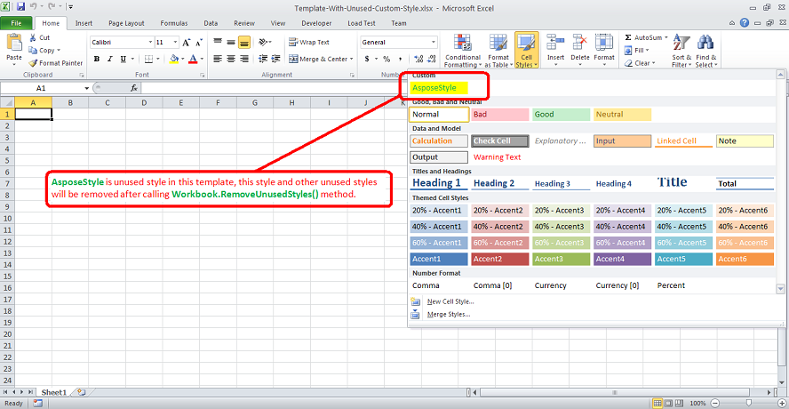

{} 

Unused styles in an Excel file not only take up space but also cause performance issues when converting to different formats such as PDF, HTML, etc. Aspose.Cells provides the [Workbook.removeUnusedStyles()](https://reference.aspose.com/cells/java/com.aspose.cells/workbook#removeUnusedStyles--) to remove all the unused styles inside the workbook.

{} 
## **Remove Unused Styles inside the Workbook**
The following code explains the usage of [Workbook.removeUnusedStyles()](https://reference.aspose.com/cells/java/com.aspose.cells/workbook#removeUnusedStyles--). The code loads the [template Excel file](5473451.xlsx) which you can download from the provided link. It contains an unused style named **AsposeStyle**. This style and all other unused styles will be removed after the execution of the code. Please see the following screenshot for further illustration.



