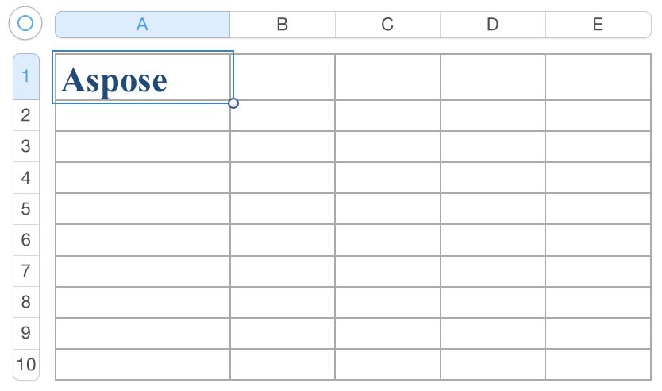

{} 

Aspose.Cells provides a vast collection of re-usable styles to format a cell in a spreadsheet document. We can use built-in styles in our workbook and also create custom styles.

{} 
## **How to use Built-in Styles**
The method [Workbook.createBuiltinStyle](https://reference.aspose.com/cells/java/com.aspose.cells/workbook#createBuiltinStyle-int-) and class [BuiltinStyleType](https://reference.aspose.com/cells/java/com.aspose.cells/BuiltinStyleType) make it convenient to create re-usable styles. Here is a list of all possible built-in styles:

- [TWENTY_PERCENT_ACCENT_1](https://reference.aspose.com/cells/java/com.aspose.cells/builtinstyletype#TWENTY-PERCENT-ACCENT-1)
- [TWENTY_PERCENT_ACCENT_2](https://reference.aspose.com/cells/java/com.aspose.cells/builtinstyletype#TWENTY-PERCENT-ACCENT-2)
- [TWENTY_PERCENT_ACCENT_3](https://reference.aspose.com/cells/java/com.aspose.cells/builtinstyletype#TWENTY-PERCENT-ACCENT-3)
- [TWENTY_PERCENT_ACCENT_4](https://reference.aspose.com/cells/java/com.aspose.cells/builtinstyletype#TWENTY-PERCENT-ACCENT-4)
- [TWENTY_PERCENT_ACCENT_5](https://reference.aspose.com/cells/java/com.aspose.cells/builtinstyletype#TWENTY-PERCENT-ACCENT-5)
- [TWENTY_PERCENT_ACCENT_6](https://reference.aspose.com/cells/java/com.aspose.cells/builtinstyletype#TWENTY-PERCENT-ACCENT-6)
- [FORTY_PERCENT_ACCENT_1](https://reference.aspose.com/cells/java/com.aspose.cells/builtinstyletype#FORTY-PERCENT-ACCENT-1)
- [FORTY_PERCENT_ACCENT_2](https://reference.aspose.com/cells/java/com.aspose.cells/builtinstyletype#FORTY-PERCENT-ACCENT-2)
- [FORTY_PERCENT_ACCENT_3](https://reference.aspose.com/cells/java/com.aspose.cells/builtinstyletype#FORTY-PERCENT-ACCENT-3)
- [FORTY_PERCENT_ACCENT_4](https://reference.aspose.com/cells/java/com.aspose.cells/builtinstyletype#FORTY-PERCENT-ACCENT-4)
- [FORTY_PERCENT_ACCENT_5](https://reference.aspose.com/cells/java/com.aspose.cells/builtinstyletype#FORTY-PERCENT-ACCENT-5)
- [FORTY_PERCENT_ACCENT_6](https://reference.aspose.com/cells/java/com.aspose.cells/builtinstyletype#FORTY-PERCENT-ACCENT-6)
- [SIXTY_PERCENT_ACCENT_1](https://reference.aspose.com/cells/java/com.aspose.cells/builtinstyletype#SIXTY-PERCENT-ACCENT-1)
- [SIXTY_PERCENT_ACCENT_2](https://reference.aspose.com/cells/java/com.aspose.cells/builtinstyletype#SIXTY-PERCENT-ACCENT-2)
- [SIXTY_PERCENT_ACCENT_3](https://reference.aspose.com/cells/java/com.aspose.cells/builtinstyletype#SIXTY-PERCENT-ACCENT-3)
- [SIXTY_PERCENT_ACCENT_4](https://reference.aspose.com/cells/java/com.aspose.cells/builtinstyletype#SIXTY-PERCENT-ACCENT-4)
- [SIXTY_PERCENT_ACCENT_5](https://reference.aspose.com/cells/java/com.aspose.cells/builtinstyletype#SIXTY-PERCENT-ACCENT-5)
- [SIXTY_PERCENT_ACCENT_6](https://reference.aspose.com/cells/java/com.aspose.cells/builtinstyletype#SIXTY-PERCENT-ACCENT-6)
- [ACCENT_1](https://reference.aspose.com/cells/java/com.aspose.cells/builtinstyletype#ACCENT-1)
- [ACCENT_2](https://reference.aspose.com/cells/java/com.aspose.cells/builtinstyletype#ACCENT-2)
- [ACCENT_3](https://reference.aspose.com/cells/java/com.aspose.cells/builtinstyletype#ACCENT-3)
- [ACCENT_4](https://reference.aspose.com/cells/java/com.aspose.cells/builtinstyletype#ACCENT-4)
- [ACCENT_5](https://reference.aspose.com/cells/java/com.aspose.cells/builtinstyletype#ACCENT-5)
- [ACCENT_6](https://reference.aspose.com/cells/java/com.aspose.cells/builtinstyletype#ACCENT-6)
- [BAD](https://reference.aspose.com/cells/java/com.aspose.cells/builtinstyletype#BAD)
- [CALCULATION](https://reference.aspose.com/cells/java/com.aspose.cells/builtinstyletype#CALCULATION)
- [CHECK_CELL](https://reference.aspose.com/cells/java/com.aspose.cells/builtinstyletype#CHECK-CELL)
- [COMMA](https://reference.aspose.com/cells/java/com.aspose.cells/builtinstyletype#COMMA)
- [COMMA_1](https://reference.aspose.com/cells/java/com.aspose.cells/builtinstyletype#COMMA-1)
- [CURRENCY](https://reference.aspose.com/cells/java/com.aspose.cells/builtinstyletype#CURRENCY)
- [CURRENCY_1](https://reference.aspose.com/cells/java/com.aspose.cells/builtinstyletype#CURRENCY-1)
- [EXPLANATORY_TEXT](https://reference.aspose.com/cells/java/com.aspose.cells/builtinstyletype#EXPLANATORY-TEXT)
- [GOOD](https://reference.aspose.com/cells/java/com.aspose.cells/builtinstyletype#GOOD)
- [HEADER_1](https://reference.aspose.com/cells/java/com.aspose.cells/builtinstyletype#HEADER-1)
- [HEADER_2](https://reference.aspose.com/cells/java/com.aspose.cells/builtinstyletype#HEADER-2)
- [HEADER_3](https://reference.aspose.com/cells/java/com.aspose.cells/builtinstyletype#HEADER-3)
- [HEADER_4](https://reference.aspose.com/cells/java/com.aspose.cells/builtinstyletype#HEADER-4)
- [HYPERLINK](https://reference.aspose.com/cells/java/com.aspose.cells/builtinstyletype#HYPERLINK)
- [FOLLOWED_HYPERLINK](https://reference.aspose.com/cells/java/com.aspose.cells/builtinstyletype#FOLLOWED-HYPERLINK)
- [INPUT](https://reference.aspose.com/cells/java/com.aspose.cells/builtinstyletype#INPUT)
- [LINKED_CELL](https://reference.aspose.com/cells/java/com.aspose.cells/builtinstyletype#LINKED-CELL)
- [NEUTRAL](https://reference.aspose.com/cells/java/com.aspose.cells/builtinstyletype#NEUTRAL)
- [NORMAL](https://reference.aspose.com/cells/java/com.aspose.cells/builtinstyletype#NORMAL)
- [NOTE](https://reference.aspose.com/cells/java/com.aspose.cells/builtinstyletype#NOTE)
- [OUTPUT](https://reference.aspose.com/cells/java/com.aspose.cells/builtinstyletype#OUTPUT)
- [PERCENT](https://reference.aspose.com/cells/java/com.aspose.cells/builtinstyletype#PERCENT)
- [TITLE](https://reference.aspose.com/cells/java/com.aspose.cells/builtinstyletype#TITLE)
- [TOTAL](https://reference.aspose.com/cells/java/com.aspose.cells/builtinstyletype#TOTAL)
- [WARNING_TEXT](https://reference.aspose.com/cells/java/com.aspose.cells/builtinstyletype#WARNING-TEXT)
- [ROW_LEVEL](https://reference.aspose.com/cells/java/com.aspose.cells/builtinstyletype#ROW-LEVEL)
- [COLUMN_LEVEL](https://reference.aspose.com/cells/java/com.aspose.cells/builtinstyletype#COLUMN-LEVEL)

The following code demonstrates how to use built-in styles.



